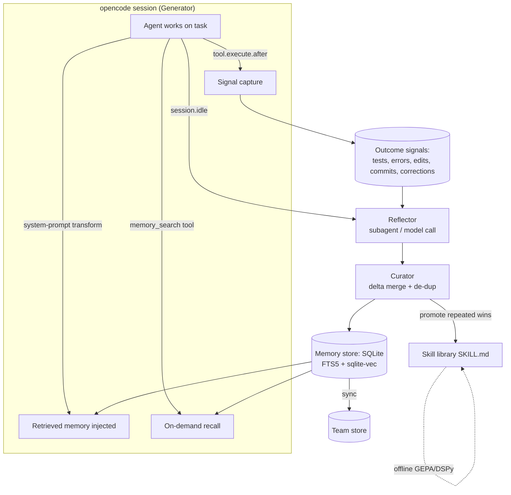

# Building a Hermes-style Self-Evolving Agent on opencode

A practical design guide for making an opencode-backed agent that learns from every
session and shares those learnings across all future sessions — getting measurably
better over time, the way Nous Research's **Hermes Agent** does.

---

## TL;DR

| | **Fastest solution** | **Most robust solution** |
|---|---|---|
| **Core store** | One markdown "playbook" file + `SKILL.md` files opencode already auto-loads | SQLite (FTS5 + `sqlite-vec`) with 4 memory tiers + skill library |
| **How memory gets in** | opencode reads `AGENTS.md` / skills for free; plugin only writes | Plugin injects hybrid-retrieved memory via system-prompt transform + a `memory_search` tool |
| **Learning loop** | On `session.idle`, distill 1–3 lessons → append (delta) | ACE-style Generator → Reflector → Curator with outcome signals, de-dup, helpful/harmful tracking, skill promotion + offline GEPA evolution |
| **Sharing scope** | Project file (commit to git) | Tiered: session → project → global → team, keyed by `project.id` |
| **Build time** | An afternoon (~1 plugin, ~150 LOC) | 1–3 weeks |
| **Best for** | Single dev, one repo, "just make it remember" | Teams, many repos, production, real "evolution" |

Both are built the same way: **an opencode plugin** (TypeScript) using the
**`@opencode-ai/sdk`** + **`@opencode-ai/plugin`** packages. opencode's client/server
design and 25–32 lifecycle hooks are exactly the seams you need.

---

## 1. What "Hermes-style self-evolution" actually is

Hermes solves the "amnesia problem" with three mechanisms, which map cleanly onto the
standard **CoALA** memory taxonomy (episodic / semantic / procedural / working):

| Hermes mechanism | Memory type | What it stores |
|---|---|---|
| **FTS5 session search + LLM summarization** | Episodic | Searchable, summarized record of past sessions (not raw logs) |
| **Honcho user modeling** | Semantic | Evolving model of the user: preferences, work style, domain facts |
| **Autonomous skill creation** | Procedural | Human-readable, reusable skills the agent writes for itself |
| (separate `hermes-agent-self-evolution` repo) | — | Offline optimization of skills/prompts/code via **DSPy + GEPA** |

The single most important research finding to internalize:

> **Agents get smarter by *consolidating* what they store, not by storing more.**
> Episodic reflection + consolidation — turning raw events into compact, reusable
> representations — is the mechanism. (CoALA; "Episodic Memory is the Missing Piece,"
> arXiv:2502.06975)

The current state-of-the-art way to do that consolidation is **ACE (Agentic Context
Engineering, arXiv:2510.04618, ICLR 2026)**: treat the agent's accumulated knowledge as
an **evolving "playbook"** updated by three roles —

- **Generator** — does the task (this is just your opencode agent).
- **Reflector** — analyzes the trace afterward: what worked, what failed, why.
- **Curator** — merges the lesson into the playbook as a small **delta update**.

ACE beats GEPA by ~12% on AppWorld with 82% lower adaptation latency, and a smaller
open model + ACE matched a production GPT-4.1 agent. Critically it learns from **natural
execution feedback (no labels)** — perfect for a coding agent where "did the tests pass?"
is a free reward signal.

Two failure modes ACE was built to prevent — **design against both**:
- **Brevity bias** — over-summarizing throws away the edge cases that made the lesson useful.
- **Context collapse** — repeatedly rewriting the whole memory erodes detail. Fix: **append/merge granular items, don't rewrite the blob.**

---

## 2. The opencode surfaces you'll build on

opencode runs a **server** (Bun + Hono HTTP) that owns sessions/agents/config; clients
talk to it through the **type-safe SDK** (generated from its OpenAPI spec). A **plugin**
is an async function that receives a context and returns hooks:

```ts
import type { Plugin } from "@opencode-ai/plugin"

export const SelfEvolve: Plugin = async (ctx) => {
  // ctx = { client, project, directory, worktree, serverUrl, $ }
  //   ctx.client      -> OpencodeClient (in-process, no network)
  //   ctx.project.id  -> git hash, or "global" for non-git dirs  <-- your scope key
  //   ctx.$           -> Bun shell
  return {
    /* hooks below */
  }
}
```

The hooks that matter for memory + evolution:

| Hook | Use it for |
|---|---|
| `event` (`session.created`, `session.idle`, `session.deleted`, `message.updated`, `file.edited`) | Trigger reflection when the agent finishes (`session.idle`); init/cleanup state |
| `tool.execute.before` / `tool.execute.after` | Capture **outcome signals**: test runs, tool errors, edits, commits |
| `chat.message` / `chat.params` | Intercept user turns / tune params |
| `experimental.chat.system.transform` (system-prompt transform) | **Inject retrieved memory into the system prompt every turn** (this is the clean read path; the Daytona plugin uses it) |
| `experimental.session.compacting` | Preserve distilled state across context compaction instead of losing it |
| `tool: { ... }` via the `tool()` helper | Expose **`memory_search` / `memory_save`** so the agent can recall/record on demand (Letta-style out-of-context retrieval) |

Useful SDK calls: `client.session.list()`, `client.session.get()`,
`client.session.messages()` (read a transcript), and
`client.session.prompt({ path:{id}, body:{ parts, noReply:true } })` — `noReply:true`
lets you run a Reflector LLM call or inject text **without** kicking off a user-visible reply.

> Verify exact method names against your installed SDK version — the API moves fast
> (older/third-party docs show `session.chat`; current official docs use `session.prompt`).

**Where opencode already keeps session data** (you can mine it for free, read-only):
```
~/.local/share/opencode/storage/        # override: $OPENCODE_DATA_DIR
├── session/<projectID>/<sessionID>.json   # session metadata
├── message/<sessionID>/<messageID>.json   # messages
├── part/<messageID>/<partID>.json         # tool calls / parts
├── tool-output/tool_<id>                  # tool results
└── session_diff/<sessionID>.json          # file diffs
```

**Skills are portable.** opencode's Agent Skills follow the same `SKILL.md` /
agentskills.io standard Hermes uses — so procedural memory you grow here is shareable
with Hermes, Claude Code, Cursor, etc., and vice-versa.

---

## 3. The core requirement: sharing experience across sessions

A "session" in opencode is ephemeral. To make experience cross-session you need a store
that lives **outside** any session, plus a **scope key** that decides who shares with whom:

```
session  ⊂  project (ctx.project.id = git hash)  ⊂  global  ⊂  team (synced)
```

- **Project scope** (default): key everything by `ctx.project.id`. All sessions in the
  same repo share memory. Commit the store (or just `AGENTS.md` + `skills/`) to git and
  it travels with the repo and the team.
- **Global scope**: a single store under `~/.local/share/opencode/` for cross-repo habits
  ("this user always wants conventional commits").
- **Team scope**: sync the SQLite DB / skills via a git remote, object store, or a small
  remote service. (opencode's own "session sharing" uploads to a public URL — *not* a
  private team-memory mechanism; don't rely on it for this.)

Write on `session.idle`, read on the system-prompt transform (every turn) and via the
`memory_search` tool (on demand). That write→consolidate→retrieve cycle *is* the loop.

---

## 4. Fastest solution (an afternoon)

**Idea:** lean on what opencode already does. It auto-loads `AGENTS.md` and `SKILL.md`
files into context, so you get the *read/injection* path for free. Your plugin only has
to handle the *write* path: after each session, distill a couple of durable lessons and
**append** them (delta-style) to a project playbook, and let the agent author skills.

```ts
import type { Plugin } from "@opencode-ai/plugin"
import { readFile, writeFile, mkdir } from "node:fs/promises"
import { join } from "node:path"

export const FastEvolve: Plugin = async ({ client, project, directory }) => {
  const playbook = join(directory, "AGENTS.md") // opencode loads this automatically

  return {
    event: async ({ event }) => {
      if (event.type !== "session.idle") return
      const sessionId = (event as any).properties?.sessionID ?? (event as any).sessionID
      if (!sessionId) return

      // 1. Read the transcript of the session that just finished.
      const msgs = await client.session.messages({ path: { id: sessionId } })
      const transcript = JSON.stringify(msgs.data ?? msgs).slice(0, 60_000)

      // 2. Reflect: ask the model for durable, reusable lessons (delta, not a rewrite).
      const scratch = await client.session.create({ body: { title: "reflect" } })
      const reflection = await client.session.prompt({
        path: { id: scratch.data.id },
        body: {
          // pick a cheap/fast model for reflection
          model: { providerID: "anthropic", modelID: "claude-haiku-4-5-20251001" },
          parts: [{ type: "text", text:
            `From this coding session, extract 0-3 GENERIC, reusable lessons that would ` +
            `help on FUTURE tasks in this repo (conventions discovered, gotchas, fixes that ` +
            `worked, user preferences). Skip anything task-specific. Each lesson: one ` +
            `imperative bullet, <=25 words, keep concrete details (file paths, flags, errors).` +
            `\n\nReturn only bullets, or "NONE".\n\nSESSION:\n${transcript}` }],
        },
      })
      const lessons = extractText(reflection).trim()
      if (!lessons || lessons === "NONE") return

      // 3. Curate: append under a stable heading, de-duped (collapse-safe).
      let doc = await readFile(playbook, "utf8").catch(() => "")
      if (!doc.includes("## Learned lessons")) doc += "\n\n## Learned lessons\n"
      const existing = new Set(doc.split("\n").map((l) => l.trim()))
      const fresh = lessons.split("\n")
        .map((l) => l.trim()).filter((l) => l.startsWith("-") && !existing.has(l))
      if (fresh.length) {
        await writeFile(playbook, doc.replace(/(## Learned lessons\n)/, `$1${fresh.join("\n")}\n`))
        await client.app.log({ body: { service: "fast-evolve", level: "info",
          message: `+${fresh.length} lessons` } })
      }
    },
  }
}

function extractText(res: any): string {
  const parts = res?.data?.parts ?? res?.parts ?? []
  return parts.filter((p: any) => p.type === "text").map((p: any) => p.text).join("\n")
}
```

Add to `opencode.json` (or drop the file in `.opencode/plugins/`):

```json
{ "$schema": "https://opencode.ai/config.json",
  "plugin": ["file:///abs/path/to/fast-evolve.js"] }
```

Then tell the agent (in `AGENTS.md`) it may **author skills**: *"When you discover a
repeatable multi-step procedure, write it as `.opencode/skills/<name>/SKILL.md`."*
opencode picks those up automatically — that's procedural memory + an autonomous skill
library with zero extra infra.

**Why this is legitimately "Hermes-style," cheaply:**
- Episodic/semantic memory → the appended lessons (a flat ACE playbook).
- Procedural memory → agent-authored `SKILL.md` files.
- Cross-session sharing → it's a committed repo file; every future session loads it.
- Delta updates + de-dup → guards against context collapse.

**Limits:** no semantic retrieval (everything is always in-context, so it bloats and
eventually needs pruning), no real outcome signal (it trusts the model's self-report), no
helpful/harmful tracking, project-scoped only. Good enough for one dev on one repo.

---

## 5. Most robust solution (1–3 weeks)

A faithful, production-grade ACE + Hermes architecture. Five components:



### 5.1 Storage — SQLite, mirroring Hermes's FTS5 choice
One embedded DB, four tiers, hybrid search. SQLite is portable, requires no server, and
`FTS5` (keyword/BM25) + `sqlite-vec` (vectors) give you hybrid retrieval in one file.

```sql
-- episodic: what happened (summarized, never raw logs)
CREATE TABLE episodes(id, project_id, session_id, summary, outcome, ts);
CREATE VIRTUAL TABLE episodes_fts USING fts5(summary, content='episodes');

-- playbook: ACE-style granular strategy bullets (the heart of evolution)
CREATE TABLE bullets(
  id, project_id, scope,            -- 'project' | 'global'
  text, section,                    -- e.g. 'testing', 'build', 'style'
  helpful_count INT DEFAULT 0,      -- ACE helpful/harmful bookkeeping
  harmful_count INT DEFAULT 0,
  embedding BLOB, ts);

-- semantic: user/domain model (Honcho-equivalent)
CREATE TABLE facts(id, scope, key, value, confidence, ts);

-- procedural skills are files (SKILL.md); track usage here
CREATE TABLE skills(id, name, path, uses INT, win_rate REAL, version, ts);
```

### 5.2 Signal capture — the free reward (Generator → signals)
This is what the fast version lacks and what makes evolution *real*. In
`tool.execute.after` and `event`, record objective outcomes:

- test command exit code (pass/fail), build success, lint results;
- tool errors / retries;
- `file.edited` churn and whether edits were later reverted;
- git commits after a session (a strong success proxy);
- **user corrections** ("no, do it this way") — the highest-value negative signal.

Tag each episode with an outcome so the Reflector knows whether to learn a success
pattern or a failure-avoidance rule.

### 5.3 Reflector (on `session.idle`)
A dedicated subagent or a separate model call that ingests *transcript + signals* and
emits structured, itemized insights — tagging which existing bullets **helped or harmed**
this session. Run it with `noReply:true` so it's invisible to the user. Use a cheaper
model than the main agent; reflection doesn't need the frontier model.

### 5.4 Curator (deterministic merge — collapse-safe)
**Do not** let an LLM rewrite the whole memory (that's how context collapses). Instead:
- insert genuinely new bullets;
- **de-duplicate** semantically (embed, drop near-duplicates);
- increment `helpful_count` / `harmful_count`;
- **prune** bullets whose `harmful_count` dominates;
- **promote**: when a multi-step procedure recurs with high `win_rate`, the Curator (or
  agent) writes it into the `skills/` library as a `SKILL.md` and tracks its usage.

### 5.5 Retrieval / injection (signals → smarter Generator)
- **Always-on, lean:** in the system-prompt transform, inject the top-K bullets for this
  `project_id` (hybrid FTS5+vector ranked by relevance × `helpful_count`) plus the
  user/domain facts. Keep it tight — bullets, not prose — to dodge brevity bias *and*
  bloat.
- **On-demand, deep:** a `memory_search` custom tool lets the agent pull full past
  episodes when it wants them (Letta-style out-of-context recall), so the hot context
  stays small.

```ts
import { tool } from "@opencode-ai/plugin"
// inside the returned hooks object:
tool: {
  memory_search: tool({
    description: "Search prior sessions, lessons, and decisions for this project.",
    args: { query: tool.schema.string(), k: tool.schema.number().optional() },
    async execute({ query, k = 5 }) {
      const rows = await hybridSearch(project.id, query, k) // FTS5 ∪ vector, re-ranked
      return rows.map(r => `- ${r.text}`).join("\n") || "No relevant memory."
    },
  }),
}
```

### 5.6 Offline skill/prompt evolution (the "self-evolution" repo idea)
On a schedule (nightly/weekly), run **DSPy + GEPA** over your highest-traffic skills and
prompts using real session history as eval data — exactly what
`NousResearch/hermes-agent-self-evolution` does (API calls only, no GPU). GEPA reads
execution traces to learn *why* things failed and works with as few as 3 examples.
**Gate every evolved skill or code change behind human review** — code mutation is the
highest-risk tier; review before merge, version, and keep rollback.

### 5.7 Scope & team sharing
Store `scope` on every row. Inject `project` ∪ `global` bullets. For teams, sync the
SQLite file and `skills/` via git or an object store; or stand up a tiny remote service
the plugin talks to through the SDK client. Keep secrets and PII out of shared memory
(scrub during curation).

---

## 6. Best practices (distilled)

1. **Consolidate, don't hoard.** Store summarized episodes + granular lessons, never raw
   transcripts in context. Smarter = better-consolidated, not bigger.
2. **Delta updates, never blob rewrites.** Append/merge itemized bullets; this is the
   single biggest defense against context collapse.
3. **Keep granular detail.** Resist brevity bias — keep the file path, the flag, the exact
   error. Those specifics are *why* a lesson helps later.
4. **Learn from execution feedback.** Tests, build status, reverts, and user corrections
   are free, label-free reward signals — wire them in. (This is the robust version's edge.)
5. **Track helpful vs harmful per item.** Reinforce what works, prune what misleads.
   Without this, memory rots.
6. **Separate the roles.** Generator (agent) ≠ Reflector (cheap model) ≠ Curator
   (deterministic). Don't make one model do all three.
7. **Two-speed retrieval.** Lean always-on injection + a `memory_search` tool for depth.
   Selective retrieval cut tokens ~90% vs context-stuffing in benchmarks for a small
   accuracy trade — usually worth it.
8. **Skills are the procedural tier.** Use the portable `SKILL.md` standard; promote
   proven procedures into it; share across tools.
9. **Scope deliberately.** session ⊂ project ⊂ global ⊂ team. Default to project
   (`ctx.project.id`), commit it to git, expand only when needed.
10. **Gate self-modification.** Auto-write notes and skills freely; **human-review evolved
    code/skills**. Version everything; keep rollback.
11. **Don't reinvent injection.** opencode already loads `AGENTS.md` + skills — use the
    system-prompt transform and those files instead of fighting the framework.
12. **Watch the cost/latency.** Reflection on every idle adds calls; use a cheap model,
    batch, or sample. Cap injected memory size.

---

## 7. Fastest vs robust — when to pick which

- **Pick fastest if:** one developer, one repo, you mainly want "stop forgetting my
  conventions," and you're fine pruning a markdown file occasionally. It's ~150 LOC and
  genuinely useful same-day.
- **Pick robust if:** multiple repos or a team, you want *measurable* improvement
  (win-rate tracking, real reward signals), large history where retrieval beats stuffing,
  or you intend to evolve skills/prompts over time. It's the true Hermes analog.
- **Recommended path:** ship the fastest version first (the playbook + skills also become
  your eval data), then graduate piece-by-piece — add signal capture, then the
  SQLite/Reflector/Curator loop, then offline GEPA. Each step is independently valuable.

A pragmatic middle option: use an existing memory framework as the store (**Mem0** for
semantic recall — ~91% lower p95 latency vs context-stuffing in its benchmarks; **Letta**
for tiered episodic/recall; **Zep/Graphiti** for temporal queries) wired through a custom
tool + the system-prompt transform, and keep skills as `SKILL.md`. That buys you the
robust store without building retrieval yourself — at the cost of an external dependency
and less control over the consolidation logic (procedural memory is the weakest area
across all of these frameworks, so you'll still own the skill loop).

---

## References / further reading

- opencode — SDK (`opencode.ai/docs/sdk`), Plugins (`opencode.ai/docs/plugins`), Agents,
  Agent Skills; storage layout under `~/.local/share/opencode/storage/`.
- Building a coding agent with the opencode SDK (Daytona guide) — client/server + plugin
  patterns, incl. `systemPromptTransform`.
- Nous Research — Hermes Agent (`hermes-agent.nousresearch.com`) and
  `github.com/NousResearch/hermes-agent-self-evolution` (DSPy + GEPA).
- ACE: *Agentic Context Engineering* — arXiv:2510.04618 (Generator/Reflector/Curator,
  delta updates, brevity bias & context collapse).
- GEPA: *Reflective Prompt Evolution Can Outperform RL* — Agrawal et al.
- Reflexion (verbal self-reflection → episodic buffer); TextGrad (textual gradients).
- *Episodic Memory is the Missing Piece for Long-Term LLM Agents* — arXiv:2502.06975.
- CoALA: *Cognitive Architectures for Language Agents* — arXiv:2309.02427 (memory taxonomy).
- Agent-memory framework comparisons (2026): Mem0, Letta/MemGPT, Zep/Graphiti, LangMem,
  Cognee.

*Verify SDK method names and hook signatures against your installed opencode version;
the API evolves quickly.*
