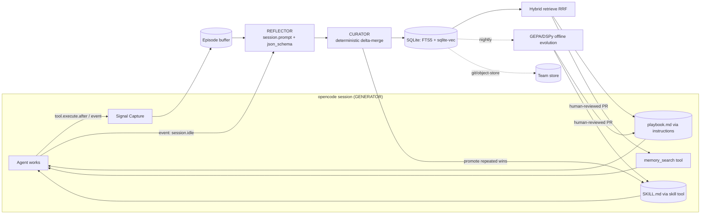

# Implementation Spec — Self-Evolving opencode Agent ("opencode-evolve")

**Status:** Draft v1.0 · **Target:** opencode ≥ 1.2.26, `@opencode-ai/sdk` + `@opencode-ai/plugin` ≥ 1.2.x · **Runtime:** Bun (opencode's plugin runtime)

A single opencode **plugin** that gives an opencode-backed agent persistent, cross-session
memory and a closed self-improvement loop (ACE-style Generator→Reflector→Curator), plus an
offline GEPA/DSPy evolution job. Mirrors Nous Research's Hermes (FTS5 episodic recall +
user model + autonomous skills) with current best practices.

---

## 0. Goals / Non-Goals

**Goals**
1. Every session's useful experience is **consolidated** and **available to all future
   sessions** in the same scope.
2. The agent measurably improves over time on repeated task types (tracked via win-rate).
3. Zero new always-on infra: one embedded SQLite file + opencode-native files. No external DB.
4. Offline, human-gated evolution of prompts/skills/tool descriptions.

**Non-Goals**
- Model weight fine-tuning (text/context adaptation only — the ACE/GEPA thesis).
- Replacing opencode's agents/tools; we extend, not fork.
- A hosted multi-tenant service (team sync is file/git-based in v1).

---

## 1. Background constraints that shape the design

These are verified against current opencode and **drive non-obvious decisions**:

| Constraint | Source | Consequence for this spec |
|---|---|---|
| `experimental.chat.system.transform` **mutations are silently discarded** by the runtime (open bug) and the hook also lacks the user message | opencode issues #17100, #17637, #27401 | **Do NOT inject memory via the system-transform hook.** Use the reliable path: write a file registered in `instructions`, which opencode re-reads each turn. |
| `instructions` files + `AGENTS.md` are combined into context and re-read | opencode Rules docs | Primary always-on injection = rewrite `.opencode/memory/playbook.md`, registered via `instructions`. |
| Skills load **on-demand** via the native `skill` tool (progressive disclosure); `SKILL.md` supports a `metadata` string map | opencode Skills docs | Procedural tier = `SKILL.md` files; store `uses`/`win_rate`/`version` in `metadata`. Cheap on tokens. |
| `session.prompt` supports `noReply:true` (inject context, no AI reply) and `format: json_schema` (validated structured output, with retries) | opencode SDK docs | Reflector uses an in-process `session.prompt` with a JSON schema → structured insights, reusing opencode's configured providers. No extra API keys. |
| `tool.execute.after` fires with `(input, output)` where `input.tool`, `input.sessionID`, `input.args` are readable (mutating output may not propagate — same class of bug as #17100) | opencode plugin docs + #17100 | We only **read** tool I/O for signal capture. Never depend on mutating tool output. |
| `project.id` is the git hash, or `"global"` for non-git dirs | opencode plugin context | Natural **scope key**. |
| sqlite-vec does not generate embeddings | sqlite-vec docs | Embedding service is a separate component (local ONNX or provider API). |

---

## 2. Architecture



**The loop:** Generator (the agent, with playbook+skills+search) → Signal Capture (objective
outcomes) → Reflector (structured lessons from trace+signals) → Curator (delta-merge into
store, promote skills) → Retrieval (hybrid, scoped) → back into the Generator's context.
Offline, GEPA evolves the artifacts.

---

## 3. Component specification

### 3.1 Storage layer

One SQLite DB per **scope**. Default location, overridable:
- Project scope: `<worktree>/.opencode/memory/evolve.db` (committable, travels with repo)
- Global scope: `~/.local/share/opencode/evolve/global.db`

Extensions/driver: `bun:sqlite` (Bun built-in) + the **`sqlite-vec`** loadable extension
(`db.loadExtension(...)`). FTS5 ships with SQLite. WAL mode on. One writer (the plugin), so
last-write-wins is acceptable; wrap multi-row writes in transactions.

**DDL (authoritative):**

```sql
PRAGMA journal_mode=WAL;

-- EPISODIC: one row per finished session, summarized (never raw logs)
CREATE TABLE IF NOT EXISTS episodes (
  id TEXT PRIMARY KEY,            -- ses id
  scope TEXT NOT NULL,            -- project.id or 'global'
  title TEXT,
  task TEXT,                      -- distilled task statement (Reflector)
  summary TEXT,                   -- what happened (Reflector)
  outcome TEXT,                   -- 'success' | 'failure' | 'mixed' | 'unknown'
  signals_json TEXT,              -- raw captured signals (tests, errors, commits…)
  ts INTEGER NOT NULL
);
CREATE VIRTUAL TABLE IF NOT EXISTS episodes_fts
  USING fts5(task, summary, content='episodes', content_rowid='rowid');

-- PLAYBOOK: ACE-style granular strategy bullets (the heart of evolution)
CREATE TABLE IF NOT EXISTS bullets (
  id TEXT PRIMARY KEY,
  scope TEXT NOT NULL,
  section TEXT NOT NULL,          -- 'build'|'test'|'style'|'arch'|'gotcha'|'pref'…
  text TEXT NOT NULL,             -- imperative, <=30 words, keeps concrete detail
  helpful INTEGER DEFAULT 0,      -- ACE helpful/harmful bookkeeping
  harmful INTEGER DEFAULT 0,
  uses INTEGER DEFAULT 0,         -- times injected/retrieved
  source_ep TEXT,                 -- originating episode
  status TEXT DEFAULT 'active',   -- 'active'|'archived'
  ts INTEGER NOT NULL,
  updated_ts INTEGER NOT NULL
);
CREATE VIRTUAL TABLE IF NOT EXISTS bullets_fts
  USING fts5(text, content='bullets', content_rowid='rowid');
CREATE VIRTUAL TABLE IF NOT EXISTS bullets_vec
  USING vec0(embedding float[384]);   -- match your embedder's dims

-- SEMANTIC: user/domain model (Honcho-equivalent), key/value with confidence
CREATE TABLE IF NOT EXISTS facts (
  id TEXT PRIMARY KEY,
  scope TEXT NOT NULL,
  key TEXT NOT NULL,             -- 'pref.commit_style', 'domain.pkg_manager'…
  value TEXT NOT NULL,
  confidence REAL DEFAULT 0.5,
  source_ep TEXT,
  updated_ts INTEGER NOT NULL,
  UNIQUE(scope, key)
);

-- PROCEDURAL index (skills themselves are SKILL.md files on disk)
CREATE TABLE IF NOT EXISTS skills (
  name TEXT PRIMARY KEY,         -- matches dir name + frontmatter name
  path TEXT NOT NULL,
  scope TEXT NOT NULL,
  uses INTEGER DEFAULT 0,
  wins INTEGER DEFAULT 0,
  version INTEGER DEFAULT 1,
  ts INTEGER NOT NULL
);

-- Triggers keep FTS shadow tables in sync (standard FTS5 external-content pattern)
CREATE TRIGGER IF NOT EXISTS bullets_ai AFTER INSERT ON bullets BEGIN
  INSERT INTO bullets_fts(rowid, text) VALUES (new.rowid, new.text);
END;
CREATE TRIGGER IF NOT EXISTS bullets_ad AFTER DELETE ON bullets BEGIN
  INSERT INTO bullets_fts(bullets_fts, rowid, text) VALUES('delete', old.rowid, old.text);
END;
CREATE TRIGGER IF NOT EXISTS bullets_au AFTER UPDATE ON bullets BEGIN
  INSERT INTO bullets_fts(bullets_fts, rowid, text) VALUES('delete', old.rowid, old.text);
  INSERT INTO bullets_fts(rowid, text) VALUES (new.rowid, new.text);
END;
-- (analogous triggers for episodes_fts)
```

Notes: keep the vector table row id aligned with `bullets.rowid` (insert into `bullets_vec`
with explicit `rowid`). Brute-force KNN in sqlite-vec is fine to ~30K rows; beyond that adopt
quantized two-pass. A coding-memory store rarely exceeds that.

### 3.2 Embedding service

Pluggable `embed(texts: string[]) => Float32Array[]`. Two supported backends:

- **Local (default, private/offline):** ONNX MiniLM (`all-MiniLM-L6-v2`, **384-d**) via
  `fastembed`/`@huggingface/transformers` in Bun. Keep the model **warm** in the plugin
  process (load once at plugin init) so `session.idle` reflection and `memory_search` stay
  well under any hook timeout. (Pattern proven by local-first memory projects that run a
  warm embedding daemon.)
- **Provider API (simplest):** e.g. OpenAI `text-embedding-3-small` (1536-d, set
  `vec0 float[1536]`). Requires an embeddings key; do not assume the opencode SDK exposes an
  embed endpoint — call the provider directly.

Dimensions must match the `bullets_vec` declaration. Config selects backend (§5).

### 3.3 Retrieval (hybrid, scoped)

Keyword (FTS5/BM25) ∪ vector (sqlite-vec KNN) fused by **Reciprocal Rank Fusion**, then
biased by `helpful` count. Scope filter = `(scope = :scope OR scope = 'global')`.

```sql
-- :q = query text, :qv = query embedding blob, :k = candidate depth, RRF_K = 60
WITH vec_matches AS (
  SELECT b.id, ROW_NUMBER() OVER (ORDER BY v.distance) AS r
  FROM bullets_vec v JOIN bullets b ON b.rowid = v.rowid
  WHERE v.embedding MATCH :qv AND k = :k AND b.status='active'
),
fts_matches AS (
  SELECT b.id, ROW_NUMBER() OVER (ORDER BY f.rank) AS r
  FROM bullets_fts f JOIN bullets b ON b.rowid = f.rowid
  WHERE bullets_fts MATCH :q AND b.status='active' LIMIT :k
)
SELECT b.id, b.text, b.section,
  ( COALESCE(:w_fts/(60.0+fts.r),0) + COALESCE(:w_vec/(60.0+vec.r),0)
    + 0.02*b.helpful - 0.05*b.harmful ) AS score
FROM bullets b
LEFT JOIN fts_matches fts ON fts.id=b.id
LEFT JOIN vec_matches vec ON vec.id=b.id
WHERE (fts.id IS NOT NULL OR vec.id IS NOT NULL)
  AND (b.scope=:scope OR b.scope='global')
ORDER BY score DESC LIMIT :n;
```

Defaults: `w_fts=1.0`, `w_vec=1.0`, `RRF_K=60`, candidate `k=30`, return `n=12` for
always-on injection. (Optional later: adaptive RRF weighting by query IDF.)

**Two read paths:**
- **Always-on (lean):** top-`n` bullets + high-confidence facts → rendered into
  `playbook.md` (§3.7). Keep it bullet-form, capped (~2–4 KB) to avoid context bloat and
  brevity bias.
- **On-demand (deep):** `memory_search` tool returns top episodes + bullets for an explicit
  query (out-of-context recall; keeps hot context small).

### 3.4 Signal Capture (the objective reward)

In-memory `Map<sessionID, EpisodeBuffer>` populated by hooks; flushed on `session.idle`.

Capture:
- **Test/build/lint outcomes** — in `tool.execute.after`, when `input.tool === 'bash'`,
  inspect `input.args.command` for test/build/lint invocations and record exit status from
  `output`. (Tune matchers per project; or read `session_diff` and LSP diagnostics events.)
- **Tool errors / retries** — non-zero results, repeated identical calls.
- **Edit churn** — `file.edited` events; files later reverted (via `session.revert`) ⇒ negative.
- **Commits** — on `session.idle`, `$\`git log --oneline -5 --since=<session_start>\`` (strong
  success proxy).
- **User corrections** — heuristic on `message.updated` user turns containing negation/redo
  cues ("no", "actually", "undo", "that's wrong") ⇒ high-value negative signal.

Derive `outcome ∈ {success, failure, mixed, unknown}` from the aggregate.

### 3.5 Reflector

Triggered on `event.type === 'session.idle'`. Reads the transcript via
`client.session.messages({ path: { id } })` + the EpisodeBuffer signals. Calls a **cheaper
model** in a scratch session with **structured output** so parsing is safe:

```ts
const scratch = await client.session.create({ body: { title: "reflector" } })
const res = await client.session.prompt({
  path: { id: scratch.data.id },
  body: {
    model: { providerID: CFG.reflectModel.provider, modelID: CFG.reflectModel.model },
    parts: [{ type: "text", text: REFLECTOR_PROMPT(transcript, signals) }],
    format: { type: "json_schema", schema: REFLECTION_SCHEMA, retryCount: 2 },
  },
})
const insight = res.data.info.structured_output as Reflection
await client.session.delete({ path: { id: scratch.data.id } })
```

`REFLECTION_SCHEMA` (see Appendix A). It returns: `task`, `summary`, `outcome`,
`bullets[]` (each `{text, section, kind: 'add'|'reinforce'|'contradict'}`),
`facts[]` (`{key,value,confidence}`), `bullets_helpful[]` / `bullets_harmful[]` (ids of
already-injected bullets this session, for credit assignment), and
`skill_candidate?` (`{name, when_to_use, steps[]}` when a repeatable procedure is detected).

Reflector rules baked into the prompt: extract only **generic, reusable** lessons; **keep
concrete detail** (paths, flags, exact errors) — explicitly resist brevity bias; emit
**deltas**, never a rewrite of existing memory.

### 3.6 Curator (deterministic — collapse-safe)

Pure function of `(Reflection, store)`. **No LLM rewrites of the whole memory** (prevents
context collapse). Steps:

1. **Insert episode** (+ FTS).
2. **Credit assignment:** `helpful += 1` for ids in `bullets_helpful`; `harmful += 1` for
   `bullets_harmful`.
3. **Add bullets:** for each `kind:'add'`, embed → **dedup**: if cosine ≥ `DEDUP_T` (0.92) to
   an existing active bullet in scope, treat as `reinforce` (`helpful += 1`, refresh
   `updated_ts`) instead of inserting. Else insert (+FTS, +vec).
4. **Contradictions:** `kind:'contradict'` ⇒ `harmful += 1` on the referenced bullet; if a
   replacement is supplied, insert it.
5. **Upsert facts** by `(scope,key)`; on conflict keep higher `confidence`, update value, bump
   `confidence` toward agreement.
6. **Decay/prune (GC):** archive bullets where `harmful ≥ 3 AND harmful > helpful`, or
   `uses=0 AND age > 90d AND helpful=0`. Archived rows leave FTS/vec (set `status='archived'`,
   delete from shadow tables).
7. **Skill promotion:** if a `skill_candidate` recurs (same normalized name seen in ≥
   `PROMOTE_N`=3 episodes with `outcome=success`), **write/refresh** a `SKILL.md` (§3.7) and
   upsert `skills` (bump `version`).
8. **Re-render** `playbook.md` from the current top bullets+facts (§3.7).

All in one transaction.

### 3.7 Injection (reliable, opencode-native)

**(a) Always-on playbook file.** Render top-`n` bullets (grouped by `section`) + top facts to
`<worktree>/.opencode/memory/playbook.md`. Register once in `opencode.json`:

```json
{ "$schema": "https://opencode.ai/config.json",
  "instructions": [".opencode/memory/playbook.md"],
  "plugin": ["./.opencode/plugins/evolve.ts"] }
```

opencode combines `instructions` files into context and re-reads them, so the freshly
re-rendered playbook is present on the next turn/session. Header the file: *"Learned project
memory — auto-maintained. Treat as project conventions."*

**(b) Procedural skills.** Promoted skills are written to
`<worktree>/.opencode/skills/<name>/SKILL.md` with valid frontmatter (name regex
`^[a-z0-9]+(-[a-z0-9]+)*$`, description ≤1024 chars) and `metadata` carrying stats:

```yaml
---
name: run-integration-tests
description: How to run this repo's integration suite and interpret failures
metadata:
  uses: "7"
  win_rate: "0.86"
  version: "3"
  origin: "auto-evolved"
---
## When to use me
…
## Steps
…
```

The agent discovers these via the native `skill` tool and loads on demand (token-efficient).

**(c) On-demand recall tool.** Register a `memory_search` custom tool:

```ts
import { tool } from "@opencode-ai/plugin"
tool: {
  memory_search: tool({
    description: "Search this project's accumulated memory (past sessions, lessons, decisions). Use before re-deriving project conventions or when you hit something that feels previously solved.",
    args: { query: tool.schema.string(), k: tool.schema.number().min(1).max(20).optional() },
    async execute({ query, k = 6 }) {
      const rows = await store.hybridSearch(scope, query, k)  // §3.3
      const eps  = await store.searchEpisodes(scope, query, 3)
      return render(rows, eps) || "No relevant memory found."
    },
  }),
}
```

**(d) Future:** when bug #17100 is fixed, optionally also push lean, query-aware context via
`experimental.chat.system.transform`. Until then, (a)+(c) are the contract.

### 3.8 Offline evolution (GEPA / DSPy) — human-gated

A standalone Python job (not in the hot path), run nightly/weekly or manually. Mirrors
`NousResearch/hermes-agent-self-evolution`: it operates **on** the artifacts, isn't part of
the live agent. **API calls only, no GPU.**

Pipeline:
1. **Export** trainset/valset from `episodes` (inputs = `task` + relevant context; gold =
   `outcome`/signals). Maximize train; keep val just representative; never overlap.
2. **Targets** (lowest risk → highest): (i) `playbook.md` section text, (ii) custom **tool
   descriptions** (GEPA ships an MCP adapter that optimizes tool descriptions + system
   prompts), (iii) individual **SKILL.md** bodies, (iv) agent system prompt / `AGENTS.md`.
3. **Optimize** with `dspy.GEPA`. The metric **must** return `dspy.Prediction(score, feedback)`
   — rich textual feedback is the load-bearing input (a score-only metric makes GEPA ≈ MIPRO):

```python
import dspy
def metric(gold, pred, trace=None, pred_name=None, pred_trace=None):
    score = outcome_score(gold, pred)         # from real signals: tests passed, no revert…
    fb = build_feedback(gold, pred)           # why it failed + what good looks like (specific!)
    return dspy.Prediction(score=score, feedback=fb)

gepa = dspy.GEPA(
    metric=metric,
    reflection_lm=dspy.LM("openai/gpt-5", temperature=1.0, max_tokens=32000),  # strong reflector
    auto="light",            # ~6 candidates; raise to medium/heavy as budget allows
    num_threads=2,
    candidate_selection_strategy="pareto",
)
optimized = gepa.compile(student=AgentProgram(), trainset=train, valset=val)
# optimized.detailed_results holds the Pareto frontier + best candidate text
```

4. **Gate:** every evolved artifact is emitted as a **diff for human review** (a PR against the
   repo's `.opencode/`), never auto-merged. Code-touching changes get the strictest review.
   Version + keep rollback (skill `version`, git history of `playbook.md`).
5. **Promote** approved artifacts back into `.opencode/`.

> "GEPA" = **Genetic-Pareto** (arxiv:2507.19457). It evolves *text* (prompts/instructions/
> few-shots/code), maintaining a Pareto frontier; effective in few rollouts because it reflects
> on execution traces, not just scores.

### 3.9 Scoping & team sync

- Every row carries `scope`. Retrieval injects `project ∪ global`.
- **Team sharing (v1):** commit `.opencode/memory/playbook.md` + `.opencode/skills/**` to git
  (human-reviewed, mergeable text). Optionally commit `evolve.db` too, or keep it local and
  treat the files as the shareable surface.
- **Privacy:** Curator scrubs secrets/PII (regex denylist + skip rows from `.env`-touching
  contexts) before any write that could be shared.

---

## 4. Plugin wiring (single entry point)

`.opencode/plugins/evolve.ts` — skeleton mapping verified hooks to components:

```ts
import type { Plugin } from "@opencode-ai/plugin"
import { tool } from "@opencode-ai/plugin"
import { Store } from "./lib/store"            // §3.1/3.3 SQLite + sqlite-vec + RRF
import { Embedder } from "./lib/embed"         // §3.2
import { reflect } from "./lib/reflector"      // §3.5
import { curate } from "./lib/curator"         // §3.6
import { renderPlaybook } from "./lib/render"  // §3.7a
import { Buffers, onTool, onMessage, onFile, deriveOutcome } from "./lib/signals" // §3.4

export const Evolve: Plugin = async ({ client, project, worktree, directory, $ }) => {
  const scope = project.id ?? "global"
  const embed = await Embedder.init(CFG)            // warm model once
  const store = await Store.open(worktree, scope, embed)
  const buffers = new Buffers()

  return {
    event: async ({ event }) => {
      const sid = sessionIdOf(event)                // defensive: event.properties.* (verify vs types.gen.ts)
      switch (event.type) {
        case "session.created": buffers.start(sid, Date.now()); break
        case "message.updated": onMessage(buffers, event); break
        case "file.edited":     onFile(buffers, event); break
        case "session.error":   buffers.markError(sid); break
        case "session.idle": {
          const buf = buffers.flush(sid); if (!buf) return
          const { info, parts } = await collectTranscript(client, sid)
          const signals = await deriveOutcome(buf, $, worktree)
          const reflection = await reflect(client, CFG, { info, parts }, signals)
          await curate(store, embed, scope, reflection, signals, sid)
          await renderPlaybook(store, scope, `${worktree}/.opencode/memory/playbook.md`)
          await client.app.log({ body: { service: "evolve", level: "info",
            message: `consolidated ${sid}: +${reflection.bullets.length} bullets, outcome=${signals.outcome}` } })
          break
        }
      }
    },

    "tool.execute.after": async (input /*, output */) => onTool(buffers, input),

    tool: {
      memory_search: tool({
        description: "Search this project's accumulated memory (past sessions, lessons, decisions).",
        args: { query: tool.schema.string(), k: tool.schema.number().min(1).max(20).optional() },
        async execute({ query, k = 6 }) { return store.recall(query, k) },
      }),
    },

    "experimental.session.compacting": async (_input, output) => {
      // Preserve distilled state across compaction instead of losing it
      output.context.push(await store.compactionDigest(scope))
    },
  }
}
```

`.opencode/package.json` declares deps (`sqlite-vec`, embedder lib); opencode runs
`bun install` at startup.

---

## 5. Configuration

`evolve.config.ts` (or `metadata` in opencode.json), with env overrides:

| Key | Default | Notes |
|---|---|---|
| `reflectModel` | cheap model (e.g. `anthropic/claude-haiku-*`) | Reflector; structured output |
| `embed.backend` | `local` | `local` (MiniLM 384-d) \| `api` |
| `embed.dims` | `384` | Must match `vec0 float[N]` |
| `retrieve.n` | `12` | Bullets injected into playbook |
| `retrieve.k` | `30` | Candidate depth before RRF |
| `dedupThreshold` | `0.92` | Cosine for reinforce-vs-insert |
| `promoteN` | `3` | Successful recurrences → skill |
| `playbookMaxKB` | `4` | Cap to avoid bloat/brevity bias |
| `scopeMode` | `project` | `project` \| `global` \| `both` |
| `OPENCODE_DATA_DIR` | xdg default | DB location for global scope |

---

## 6. Algorithms (reference)

- **RRF:** `score = Σ_s w_s / (RRF_K + rank_s)` over `s ∈ {fts, vec}`, `RRF_K=60`; add
  `+α·helpful − β·harmful` (`α=0.02, β=0.05`).
- **Dedup:** new bullet is a duplicate iff `max cosine(new, active_in_scope) ≥ 0.92` → reinforce.
- **Promotion:** group `skill_candidate` by normalized name; promote when
  `count(outcome=success) ≥ promoteN`.
- **Decay (GC, on idle):** archive if `(harmful≥3 ∧ harmful>helpful)` ∨ `(uses=0 ∧ age>90d ∧ helpful=0)`.
- **Outcome:** `success` if commit made ∧ tests passed ∧ no revert; `failure` if tests failed ∨ reverted ∨ user correction dominates; else `mixed`/`unknown`.

---

## 7. Build plan (milestones, each independently shippable)

1. **M0 — Capture + episodic store.** SQLite (episodes+FTS), Signal Capture, Reflector
   (summary/outcome only), write episodes. *Exit:* every session produces a searchable episode.
2. **M1 — Recall tool.** `memory_search` over episodes (FTS only). *Exit:* agent can recall past sessions.
3. **M2 — Playbook + bullets + injection.** bullets table, Curator add/dedup, `renderPlaybook`,
   `instructions` wiring. *Exit:* lessons appear in context next session; de-dup works.
4. **M3 — Vector + hybrid.** Embedder (local), `bullets_vec`, RRF retrieval. *Exit:* semantic recall.
5. **M4 — Credit + facts + decay.** helpful/harmful tracking, facts upsert, GC. *Exit:* memory self-cleans; win signals reinforce.
6. **M5 — Skill promotion.** auto-write `SKILL.md` + stats in `metadata`. *Exit:* procedural memory grows.
7. **M6 — Offline GEPA.** export → `dspy.GEPA` → human-gated PRs. *Exit:* artifacts measurably improve on held-out tasks.
8. **M7 — Team sync + privacy scrub.** git-based sharing, PII denylist.

---

## 8. Testing & evaluation

- **Unit:** Curator is a pure function — golden tests for add/dedup/contradict/promote/decay;
  RRF SQL on a fixture DB; embedder determinism; playbook render size cap.
- **Integration:** drive a real opencode server via `createOpencodeClient`, run scripted
  sessions, assert episodes/bullets written and `playbook.md` updated. Mock the model for
  determinism where needed; use `session.prompt` structured output in a live smoke test.
- **"Is it getting smarter?" (the real metric):** maintain a **fixed eval set** of repeated
  task types. Run each cold (memory off) vs warm (memory on) across N iterations; track
  **win-rate, tokens, turns-to-success, revert-rate** over time. Improvement on warm vs cold,
  trending up across iterations, is the acceptance signal. (Mirrors how ACE/GEPA are measured —
  learning from execution feedback, no labels required.)
- **Regression guard for evolution:** every GEPA-proposed artifact must beat the incumbent on
  the held-out valset before a human approves the PR.

---

## 9. Risks & mitigations

| Risk | Mitigation |
|---|---|
| System-prompt injection hook broken (#17100) | Use `instructions` file path (verified working); treat system-transform as future-only. |
| Reflection latency on `session.idle` | Cheap model; warm embedder; cap transcript size; run async, never block the user. |
| Memory bloat / brevity bias | Bullet-form, size cap, decay GC, granular-detail rule in Reflector prompt. |
| Context collapse | Curator does deterministic **delta-merge**, never whole-memory LLM rewrites (ACE principle). |
| Bad lessons poisoning context | helpful/harmful credit + GC + human-gated evolution; never auto-merge code changes. |
| event payload shape drift across versions | Centralize `sessionIdOf()`/`collectTranscript()`; verify field names against `packages/sdk/js/src/gen/types.gen.ts` for the installed version. |
| `tool.execute.after` mutation not propagating | We only read for signals; no dependence on mutation. |
| Secrets in shared memory | Curator PII/secret scrub before any shareable write; skip `.env`-derived context. |
| sqlite-vec scale | Brute force <30K rows; adopt quantized two-pass beyond. |

---

## 10. Verification checklist (do before/at M0)

- [ ] Confirm `event` payload shape for `session.*` (where is the session id?) against `types.gen.ts`.
- [ ] Confirm `session.prompt` structured-output field name in your version (`format` vs `outputFormat`) and result path (`data.info.structured_output`).
- [ ] Confirm `tool.execute.after` `input` fields (`tool`, `sessionID`, `args`).
- [ ] Confirm `bun:sqlite` + `sqlite-vec` `loadExtension` works in opencode's Bun; FTS5 present.
- [ ] Confirm `instructions` file is re-read per turn (vs per session) in your version.
- [ ] Pick embedder + lock dims = `vec0 float[N]`.

---

## Appendix A — Reflector JSON schema (sketch)

```json
{
  "type": "object",
  "required": ["task", "summary", "outcome", "bullets"],
  "properties": {
    "task":    { "type": "string", "description": "Generic restatement of the task" },
    "summary": { "type": "string", "description": "What happened, concise" },
    "outcome": { "type": "string", "enum": ["success","failure","mixed","unknown"] },
    "bullets": { "type": "array", "items": { "type": "object",
      "required": ["text","section","kind"],
      "properties": {
        "text":    { "type": "string", "description": "Imperative, <=30 words, keep concrete detail (paths, flags, errors)" },
        "section": { "type": "string", "enum": ["build","test","style","arch","gotcha","pref","tooling"] },
        "kind":    { "type": "string", "enum": ["add","reinforce","contradict"] }
      } } },
    "facts": { "type": "array", "items": { "type": "object",
      "required": ["key","value"],
      "properties": { "key": {"type":"string"}, "value": {"type":"string"},
                      "confidence": {"type":"number"} } } },
    "bullets_helpful": { "type": "array", "items": { "type": "string" } },
    "bullets_harmful": { "type": "array", "items": { "type": "string" } },
    "skill_candidate": { "type": "object",
      "properties": { "name": {"type":"string"}, "when_to_use": {"type":"string"},
                      "steps": {"type":"array","items":{"type":"string"}} } }
  }
}
```

## Appendix B — Reflector prompt rules (verbatim into the prompt)

- Extract only **generic, reusable** lessons useful on FUTURE tasks in this repo; skip one-offs.
- **Keep concrete specifics** (exact file paths, commands, flags, error strings) — do NOT
  generalize them away.
- Emit **deltas only**. Reference existing injected bullets by id for reinforce/contradict;
  never restate the whole memory.
- Mark `bullets_helpful`/`bullets_harmful` from the bullets that were present in context this
  session, based on whether following them helped.
- Propose a `skill_candidate` only for a clearly repeatable multi-step procedure.

## References
- opencode: SDK, Plugins, Agent Skills, Rules, Custom Tools, Server docs; storage under `~/.local/share/opencode/storage/`. Bugs: #17100 (system.transform discarded), #17637/#27401 (no user msg in hook).
- ACE — *Agentic Context Engineering*, arXiv:2510.04618 (Generator/Reflector/Curator; delta updates; brevity bias & context collapse).
- GEPA — Agrawal et al., arXiv:2507.19457; `dspy.GEPA` + `gepa-ai/gepa` (MCP/RAG/DSPy adapters; `optimize_anything`).
- Hermes Agent (Nous Research) + `NousResearch/hermes-agent-self-evolution` (DSPy+GEPA, API-only).
- Hybrid SQLite search: Alex Garcia (sqlite-vec) FTS5+vec+RRF; local-first memory prior art (AIngram, vstash, ZeroClaw, BrainDB).
- CoALA — arXiv:2309.02427 (memory taxonomy); "Episodic Memory is the Missing Piece" arXiv:2502.06975.

*Verify all opencode hook/SDK field names against the installed version's `types.gen.ts`; the API moves fast.*
