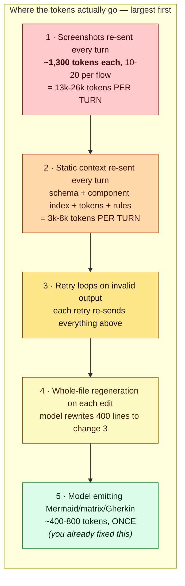
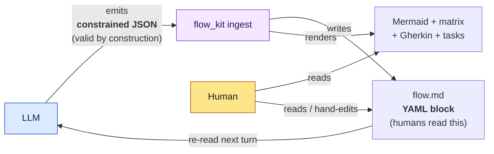
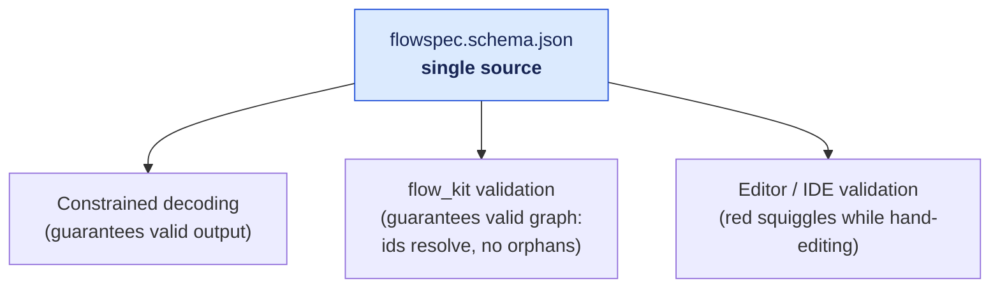
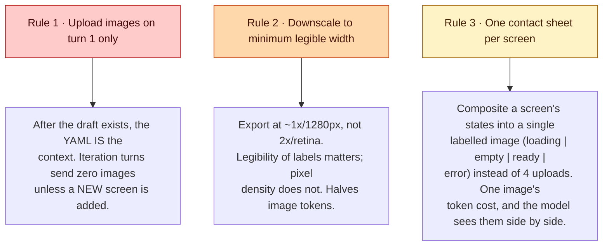
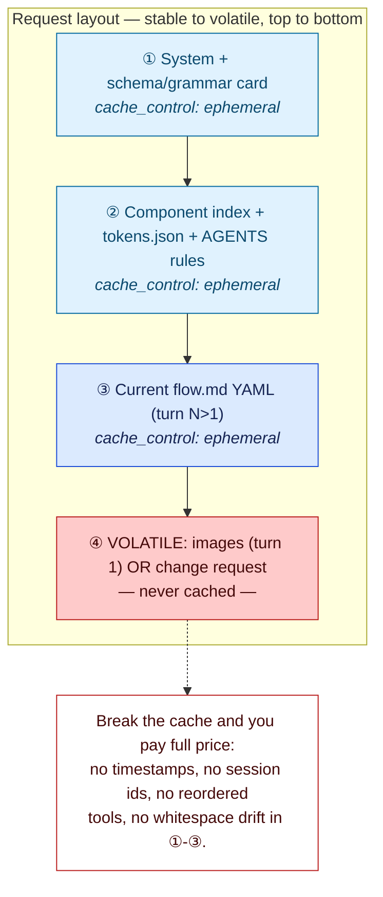
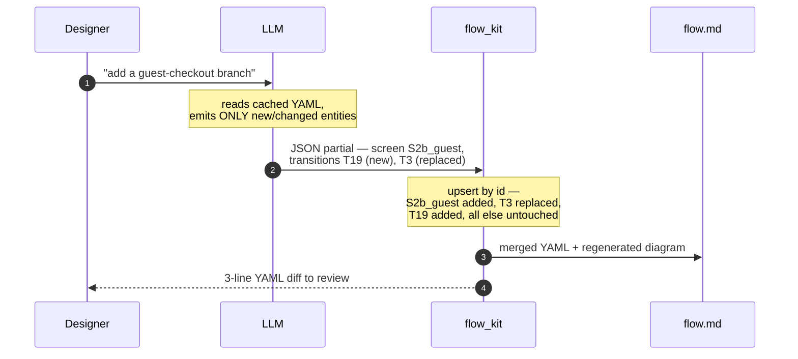
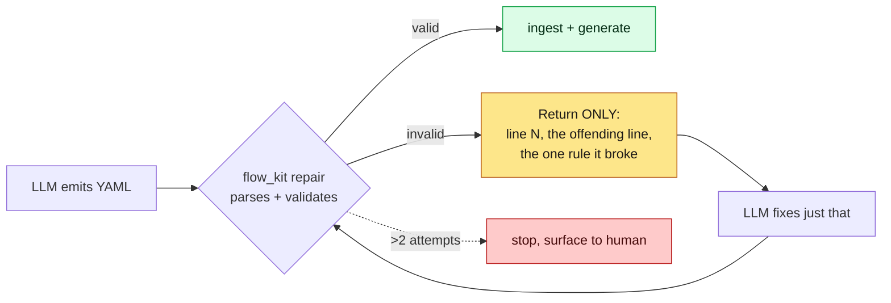
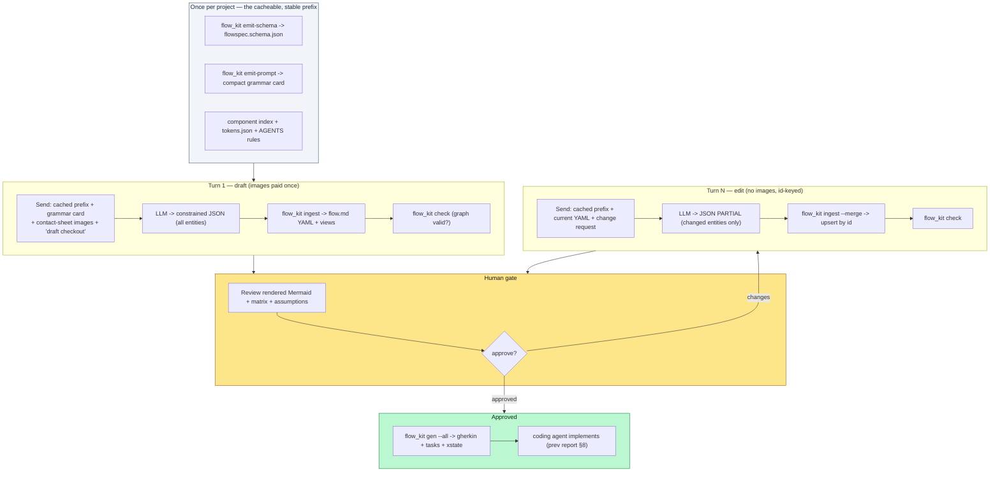

# Making the harness token-efficient and seamless

### A complement to *Design → Flow → Code*

*Report date: 12 August 2026 · sources in Appendix. Anthropic pricing/behaviour verified against platform.claude.com docs.*

---

## 0. First, the honest reframing

Your instinct is right and you've already acted on it: the LLM should emit **only** the source, and a deterministic script should render every view. `validate_flow.py` from the previous deliverable already does that — the model never spends a token drawing Mermaid, and the conversion is "without mistake" by construction because no probabilistic step is involved.

But the Mermaid you stopped the model from writing was only ~400–800 tokens, produced **once**. If token cost is the goal, that is the smallest of five sinks. Here is where the tokens in this specific pipeline actually go, largest first:



So the seamless, token-lean harness is built from four moves that attack sinks 1–4, with your existing fix handling 5:

| Move | Kills sink | Mechanism | Verified saving |
|---|---|---|---|
| **Images once, downscaled, composited** | 1 | Upload screenshots on turn 1 only; the YAML is the context thereafter | Images bill at the text rate on Claude, ≈ (w×h)/750 tokens — so this is the single biggest lever |
| **Prompt-cache the static prefix** | 2 | `cache_control` on schema + component index + tokens + rules | cache read = **10%** of base input; write = 1.25× once |
| **Structured output → valid first try** | 3 | Constrain generation to the JSON Schema; no parse-and-retry | eliminates the 39%-of-errors malformed-output class |
| **id-keyed partial updates** | 4 | Model emits only changed entities by id; the script upserts | ~31% fewer tokens on edits, without the array-index bug patches cause |

Everything below is the engineering to make those four automatic, so the loop feels like one command rather than a checklist.

---

## 1. The one design change that makes it all click: JSON on the wire, YAML on disk

There is a tension you can feel already. YAML is the most token-efficient *and* the most human-readable serialisation — the previous report chose it for exactly that. But **YAML is not a structured-output target**: every provider's constrained-decoding mode (OpenAI, Anthropic as of Feb 2026, Gemini, and the local vLLM/SGLang stack via XGrammar) constrains to a **JSON Schema**, not a YAML grammar. If you ask for YAML directly you are back in "parse-and-pray," which reintroduces sink #3.

Resolve it by separating **transport** from **storage**:



- The **model produces JSON**, constrained by `flowspec.schema.json`. It cannot emit a trailing comma, a hallucinated enum, or a missing required field — the token that would break the schema is masked at generation time. That closes "convert without mistake" from both ends: the previous report guaranteed the YAML→Mermaid step was deterministic; this guarantees the LLM→spec step is *valid*, so the deterministic step always has something legal to consume.
- `flow_kit ingest` immediately serialises that JSON into the **YAML block inside `flow.md`** and regenerates the diagram. Humans never see the JSON. On disk you keep the readable, diffable, token-lean YAML the last report argued for.
- On the next turn, the model reads the **YAML** back (fewer input tokens than JSON, and it's the cached prefix), and emits **JSON** again.

You get JSON's generation guarantee and YAML's read/review economy at the same time, because they're used at different moments.

> The JSON is a rounding error on output tokens (the entities for one flow are small). The guarantee it buys — zero retries — saves far more than its ~28% wire overhead versus YAML would ever cost. If you run a **local model without structured outputs**, fall back to YAML-on-the-wire plus the bounded repair loop in §5; everywhere else, JSON transport is the reliable default.

One JSON Schema now drives three things at once, which is what makes the harness feel unified rather than bolted-together:



---

## 2. Move 1 — images once, and small (the biggest lever by far)

On Claude, image input is billed at the **same per-token rate as text**, at roughly **(width × height) / 750** tokens, and images are internally resized so the long edge is ≤ ~1,568 px. A 1000×1000 reference is about 1,334 tokens; a full retina screen is capped near ~1,500. Multiply by 10–20 screen×state captures and re-send them on every conversational turn, and images dwarf everything else in the pipeline.

Three rules, in order of impact:



Rule 1 is the whole game. The naive multi-turn loop re-sends the full screenshot set every time the designer asks for a change; the efficient loop pays for images exactly once because after turn 1 the model reasons over the YAML it already produced, not the pixels.

Rule 3 also *improves* quality, not just cost: a labelled contact sheet (`S1_cart: [loading][empty][ready][error]`) makes the state set explicit in one glance, which is exactly the empty/loading/error blind spot the matrix exists to catch.

---

## 3. Move 2 — cache the static prefix

Every turn otherwise re-pays for the schema, the component index, the token file, and the house rules — 3k–8k tokens of content that never changes within a session. Anthropic prompt caching bills a cache **read at 10% of the base input price**; the one-time **write costs 1.25×** (5-minute TTL, which **resets on every hit**, so an active session keeps the cache warm; a 1-hour TTL exists at a higher write premium). Cache reads are also excluded from the input-tokens-per-minute rate limit — a free throughput bonus.

The only requirement is **prefix stability**: the cached blocks must be byte-identical and come *first*, with everything volatile at the end.



Practical notes that decide whether you get a 7% or an 84% hit rate: caching only pays off past ~1.3 reads per write, so it's for sessions, not one-shots; the cache is model-specific (a cache written for one model can't be read by another, so plan a cold period on model upgrades); and keep the boundary **before** any live/volatile content.

---

## 4. Move 4 — iterate by id, never by regeneration or positional patch

When the designer says "add a guest-checkout branch," the wrong-but-common behaviour is the model rewriting all 400 lines. The obvious fix — RFC-6902 positional patches — is a documented trap: it saves ~31% of tokens but LLMs reliably miscalculate array indices and conflate 0- vs 1-based indexing, and they miss some occurrences of a repeated change. For a spec whose transitions are a list, that's a correctness hazard.

Use **id-keyed upsert** instead. The model emits only the entities that changed, addressed by their stable ids; the script merges by id, so there is no index arithmetic and nothing positional to get wrong:



Output tokens for an edit drop from "the whole file" to "three objects," and the review is a three-line diff of the diagram source rather than a re-read of the document. `flow_kit ingest --merge` implements exactly this upsert.

---

## 5. Move 3 — first-try validity, with a bounded repair fallback

With structured outputs the JSON is schema-valid by construction, so the retry loop disappears. Two residual gaps to close for a truly seamless harness:

**Structural validity ≠ semantic validity.** Constrained decoding guarantees the shape (ids present, enums legal) but not the *graph* (no dangling `to`, no orphan state, exhaustive guards). That's what `flow_kit check` is for — it runs after ingest and is the same validation the previous report described. So the pipeline is: constrained decoding guarantees *parseable and well-shaped*; `flow_kit` guarantees *a valid graph*; the human gate guarantees *correct intent*.

**Local models without structured outputs** fall back to YAML-on-the-wire and can emit malformed output. Don't re-send the whole context to fix it — feed back only a **line-anchored error**, which is reported to cut edit-feedback tokens by more than half:



Bound it at 2 attempts — auto-repair can loop forever on a fundamentally broken request, and a human is cheaper than an infinite retry.

One caution worth stating plainly: constrained decoding can slightly distort a model's token distribution (masked high-probability tokens get renormalised), and at least one 2026 extraction benchmark found structured-output mode *lowered* accuracy versus prompting for very complex schemas. Mitigate by keeping the schema shallow (≤ 3–4 nesting levels), putting a short `reasoning` or `notes` field *before* the committed fields so the model "thinks" before it commits, and giving every field a description. Our schema is deliberately flat for this reason.

---

## 6. The end-to-end loop, assembled

Everything above composes into a single flow where the human runs commands and the model only ever produces JSON entities:



The seams that used to require judgement are now commands:

| Old manual step | New command | What it removes |
|---|---|---|
| Paste schema into the prompt | `flow_kit emit-prompt` | Hand-maintained, un-cacheable prompt text |
| Hope the YAML parses | structured output + `ingest` | The retry loop |
| Regenerate the diagram by asking the model | `ingest` (automatic) | Sink #5, re-verified |
| Model rewrites the whole file | `ingest --merge` | Sink #4 + index-arithmetic bugs |
| Eyeball the graph for dead ends | `check` | Silent unreachable/dangling states |
| Write Gherkin + tasks by hand | `gen --all` | Drift between spec and tests |

---

## 7. Illustrative token budget

A 6-screen checkout flow with ~16 screen×state captures, taken through 8 conversational turns (1 draft + 7 edits). Figures use Claude's image ≈ (w×h)/750 and cache-read = 0.10× base; treat them as an order-of-magnitude illustration, not a benchmark — your tokeniser and image sizes will shift the absolute numbers, not the ratio.

**Naive loop** — images and full context re-sent every turn, whole-file regeneration:

| Per turn | Tokens |
|---|---|
| 16 images @ ~1,300 | ~20,800 |
| static context (schema+index+tokens+rules) | ~6,000 |
| conversation history | ~2,000 (growing) |
| **input per turn** | **~28,800** |
| × 8 turns | **~230,000 input tokens** |
| + model rewriting ~400-line spec each edit | ~7 × ~4,000 output |

**Efficient loop** — images once, prefix cached, id-keyed partials:

| Item | Tokens (billed) |
|---|---|
| Turn 1 images @ ~1,300 × 16 | ~20,800 (once) |
| Prefix cache write (turn 1) | ~6,000 × 1.25 = 7,500 (once) |
| Prefix cache reads (turns 2-8) | ~6,000 × 0.10 × 7 = 4,200 |
| Current YAML re-read, cached (turns 2-8) | ~2,000 × 0.10 × 7 = 1,400 |
| Change requests | ~7 × ~150 = 1,050 |
| **≈ effective input total** | **~35,000** |
| + model emitting id-keyed partials | ~7 × ~300 output |

Roughly a **6–7× reduction in billed input**, and the output side shrinks from "rewrite the file seven times" to "emit three objects seven times." Note what dominates: the win is overwhelmingly **images-once** and **prefix-caching**, not the YAML-vs-Mermaid question you started from. Your original move is real and worth keeping — it just isn't where the tokens were.

---

## 8. What ships

Alongside this report:

- **`flowspec.schema.json`** — the single JSON Schema. Feed it to your provider's structured-output / constrained-decoding mode, to `flow_kit`, and to your editor. Pattern constraints (`S<n>_...`, `T<n>`, `SCREEN#state`) are included; a few strict structured-output modes ignore `pattern`, so `flow_kit check` re-enforces them regardless.
- **`flow_kit.py`** — supersedes `validate_flow.py`. One CLI: `emit-schema`, `emit-prompt`, `ingest` (JSON→YAML, `--merge` for id-keyed upsert), `gen` (mermaid, matrix, gherkin, tasks, xstate), `check` (CI, idempotent), `repair` (line-anchored error). Stdlib + PyYAML only.
- **`driver.py`** — a reference showing the correct request wiring: cacheable prefix first, images last, structured-output config, and the id-keyed edit turn. Reference only; it is not run here.

### How to drive it, minimally

```bash
# once per project
python flow_kit.py emit-schema  > flowspec.schema.json
python flow_kit.py emit-prompt  > .flowkit/grammar-card.md   # paste-free, cacheable

# turn 1: LLM returns constrained JSON in draft.json
python flow_kit.py ingest specs/flows/checkout/flow.md --from draft.json
python flow_kit.py check  specs/flows/checkout/flow.md

# turn N: LLM returns a PARTIAL (changed entities only) in edit.json
python flow_kit.py ingest specs/flows/checkout/flow.md --from edit.json --merge
python flow_kit.py check  specs/flows/checkout/flow.md

# on approval
python flow_kit.py gen    specs/flows/checkout/flow.md --all
```

---

## Appendix — sources

**Prompt caching (Anthropic specifics verified against docs)**
- Prompt caching — Claude Platform Docs (5-min/1-hour TTL, automatic vs explicit breakpoints, mixed-TTL billing) · https://platform.claude.com/docs/en/build-with-claude/prompt-caching
- Tool use with prompt caching — Claude Platform Docs (cache_control on the last tool) · https://platform.claude.com/docs/en/agents-and-tools/tool-use/tool-use-with-prompt-caching
- Cache read = 10% of base input, write = 1.25× (5-min), TTL resets on hit, ≤4 breakpoints, reads excluded from ITPM · https://www.respan.ai/articles/claude-prompt-caching
- Prefix-stability and invalidation gotchas (timestamps, reordered tools, whitespace) · https://arxiv.org/pdf/2601.06007
- Cross-provider caching playbook (up to 90% off, byte-identical output, breakeven math) · https://www.digitalapplied.com/blog/prompt-caching-2026-cut-llm-costs-engineering-guide
- Cache write premium, model-specific cache entries, keep boundary before live data · https://unscriptedcoding.medium.com/prompt-caching-in-agentic-ai-systems-1f4b78c65ea5

**Structured output / constrained decoding**
- Anthropic Structured Outputs GA 4 Feb 2026; per-provider comparison; constrained decoding at the token level · https://devtoollab.com/blog/llm-structured-outputs-guide-2026
- Three levels (prompt → tool use → native structured output); XGrammar/llguidance backends · https://dev.to/pockit_tools/llm-structured-output-in-2026-stop-parsing-json-with-regex-and-do-it-right-34pk
- Mechanism + distribution-distortion caveat (Park et al., NeurIPS 2024; ASAp) · https://letsdatascience.com/blog/structured-outputs-making-llms-return-reliable-json
- Schema-design pitfalls: nesting depth, field ordering (reasoning before answer), descriptions · https://techsy.io/en/blog/llm-structured-outputs-guide
- Constrained decoding eliminates trailing-comma/truncation errors (39% of prompt-mode errors) but can reduce accuracy on very complex schemas · https://arxiv.org/pdf/2602.12247

**Image / multimodal token cost**
- Claude ≈ same per-token rate as text, ~1,334 tokens per 1000×1000px; vision cheaper on Claude/Gemini than GPT image variants · https://benchlm.ai/blog/posts/llm-token-pricing
- Per-provider multimodal token counting; cache-aggressively guidance · https://www.thepromptindex.com/what-are-llm-tokens-2026.html
- Resolution matters more than token count; tiling multiplies tokens · https://arxiv.org/pdf/2312.07533

**Incremental / diff-based editing**
- JSON Whisperer — RFC-6902 patches cut ~31% tokens but LLMs miscalculate array indices and miss occurrences · https://arxiv.org/pdf/2510.04717
- Line-anchored edit feedback cuts tokens ~58%; minimal-diff edit tactics · https://arxiv.org/pdf/2604.12301
- Patch/diff as the native edit language for coding agents; id/context anchors over line numbers · https://wuu73.org/aiguide/infoblogs/coding_file_edits/agents.html

**Format efficiency (carried from the prior report)**
- YAML most token-efficient among structured formats for file-native agents; JSON +28% · https://arxiv.org/pdf/2602.05447
- Format effects small vs model capability (9,649 trials) · https://arxiv.org/pdf/2605.29676
