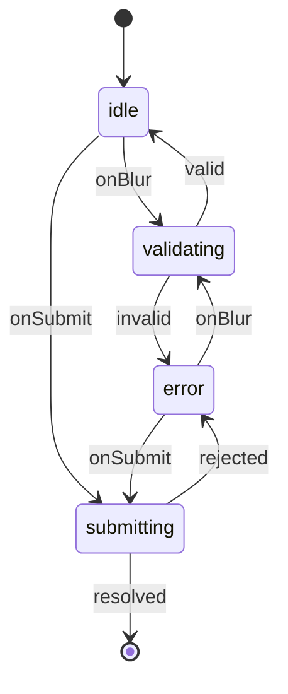
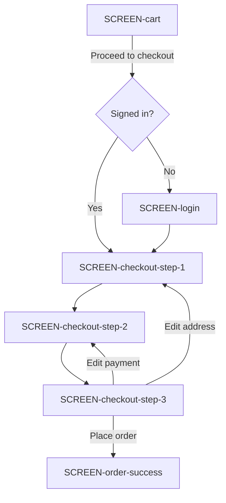
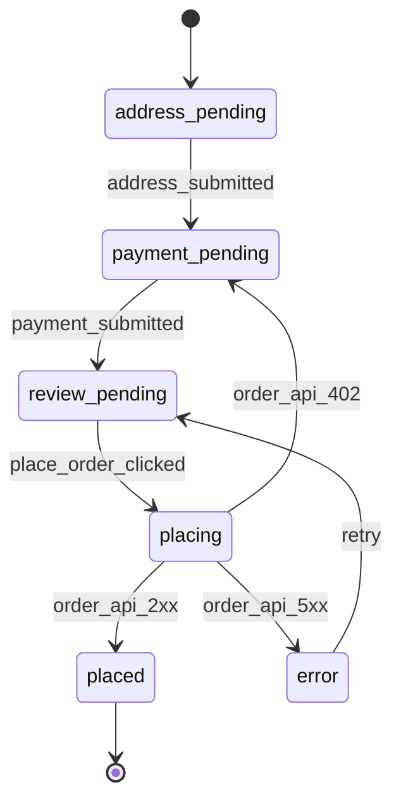
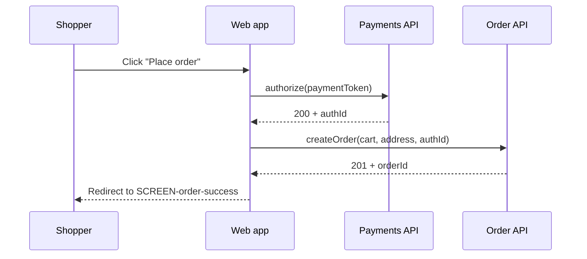
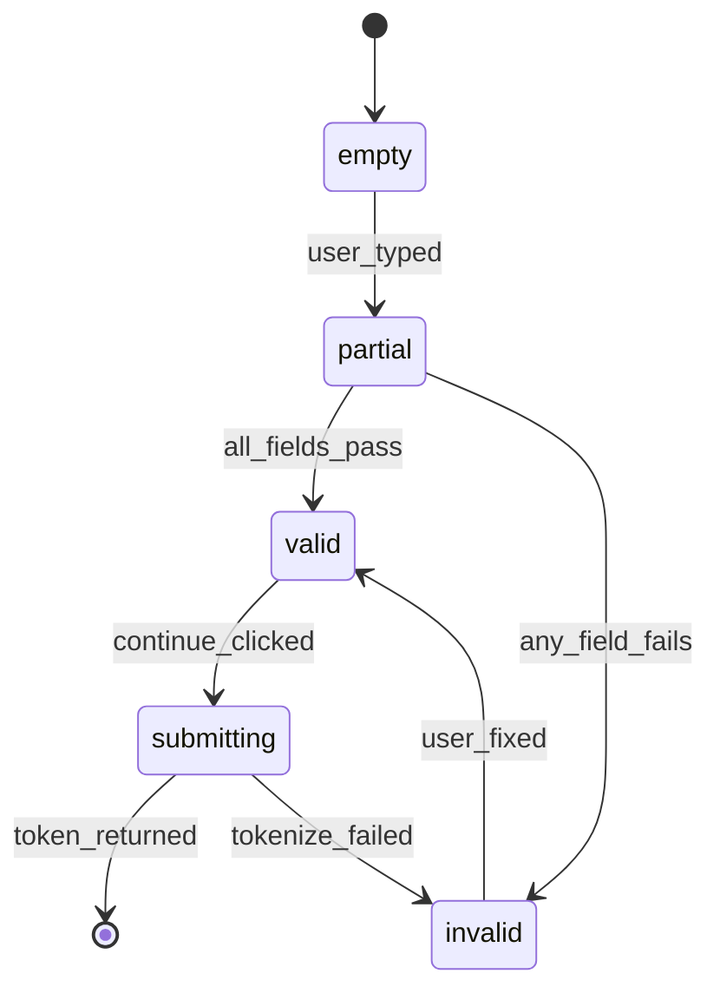

# Design‑Bridge for Figma × pi coding agent

**Research report + revised spec (v0.1)**

Written for a workflow that layers on top of Matt Pocock's engineering skills (`grill‑with‑docs` → `to‑spec` → `to‑tickets` → `implement` → `code‑review`), inside a corporate network with **no Figma CLI / no Figma MCP** — only screenshots and copied CSS.

The goal of the design‑bridge is a single, git‑committed folder that turns raw design evidence (screenshots, CSS) into a small set of self‑contained files that both a human and pi can read, so every `/implement` and `/code‑review` session can achieve high‑fidelity output while staying inside pi's "smart zone" (~120–140 k tokens before quality drops).

---

## Part I — Deep research

### 1. The five moving parts you're combining

**pi coding agent (Earendil Works).** Terminal‑native, minimal core, extended via skills, prompt templates, extensions, and packages. Sessions are the primary unit of work: `/new`, `/resume`, `/fork`, `/clone`, `/compact`. Skills follow the [Agent Skills spec](https://agentskills.io/specification) — a `SKILL.md` + free‑form directory, loaded progressively (name + description in system prompt, full body on demand). Context files: `AGENTS.md` (or `CLAUDE.md`) walk up from cwd; `AGENTS.override.md` replaces per directory. The important recent change: **v0.84.0 (Nov 2026) added native Mermaid rendering in the TUI**, streaming diagrams as ASCII while the agent writes them. That single fact makes Mermaid the correct medium for anything you want both the human and the agent to reason about.

**Matt Pocock's skills (v1.1+).** The main flow is a fixed sequence — `grill‑with‑docs` → `to‑spec` → `to‑tickets` → `implement` → `code‑review`, with `wayfinder` on top for multi‑session planning. Key operational rules from his docs, video (Jul 9 2026), and the community write‑ups:

- Keep **grilling, spec‑writing, ticket‑splitting in one unbroken session**; start `/implement` fresh per ticket. `/handoff` is the escape hatch when the planning session approaches the smart‑zone ceiling.
- `to‑spec` synthesises the discussion into a PRD published to the tracker (GitHub/Linear/Jira/local file). It sketches **seams** — the smallest possible number of test seams, ideally one, at the highest level possible.
- `to‑tickets` slices into **tracer‑bullet vertical tickets** (schema → API → UI → tests in one thin path), each declaring its blocking edges, each sized to fit in a single fresh context.
- `implement` picks one ticket, drives `/tdd` at pre‑agreed seams, and closes with `/code‑review` **in fresh sub‑agents** — because the agent that just wrote the code will approve its own work.
- `code‑review` is **dual‑axis**: (1) repo standards + Fowler smells, (2) spec conformance. Two parallel sub‑agents so neither pollutes the other.
- Everything is plain files owned by the repo; `setup-matt-pocock-skills` writes tracker + label + docs paths into `CLAUDE.md`.

**DTCG (Design Tokens Community Group) format v2025.10.** First stable version shipped October 2025; adopted by Figma, Sketch, Penpot, Tokens Studio, Style Dictionary, Terrazzo, and others. Key facts you care about: JSON with `.tokens` / `.tokens.json` extension; tokens are objects with `$value` and `$type`; groups are objects **without** `$value`; references use `{group.token}` curly syntax (targets whole tokens) or JSON‑Pointer `$ref` (targets any location, including sub‑properties). Composite types cover typography, shadow, border, transition, gradient. **This is the only design‑token format worth building on today** — pick a proprietary one and you're the glue vendor forever.

**DESIGN.md (Google Labs).** Apache‑2.0. YAML frontmatter of DTCG‑style tokens + Markdown body with a fixed section order (Overview, Colors, Typography, Layout, Elevation & Depth, Shapes, Components, Do's and Don'ts). It's a *brand‑and‑system* file — one per product, not one per component. Useful as **the top‑level design language file**, but too coarse for per‑component/per‑flow specs; those live under it.

**Design‑system contracts (Southleft, Nathan Curtis, Christine Vallaure).** Small per‑component data file (JSON/YAML) whose sole job is to be **matched**, not read. Both Figma and code are compiled from it; a checker byte‑compares the three (contract, Figma, code) and flags drift. In Southleft's A/B test, the same agent scored 69/100 without the contract and 100/100 with it — and, importantly, said "I can't" instead of faking when the system truly lacked something. This is the reference for what a component file inside our bridge should look like.

### 2. Why the bridge exists, in one paragraph

Raw screenshots and raw CSS are the two worst inputs for an implementation session. Screenshots waste tokens on pixels the model must re‑derive (spacing, hierarchy, tokens) and vary between attempts because reasoning from pixels is stochastic. Raw CSS is worse — it's a compiled artefact whose selectors, resets, framework prefixes, and dead rules drown the semantic content that would actually help. Figma's own MCP server exists precisely because the same team at Figma independently concluded that a *third representation between the design and the code* is what you need: "structured data that preserves exact values but strips the noise" (Figma engineering interview, Apr 2026). Without Figma MCP you must build that layer by hand once, then reap the benefits across every downstream session.

### 3. What "understandable for both human and coding agents" actually means

Three format research findings, cross‑verified across the ArXiv Structured Context Engineering paper, TianPan's format decision essay, and the JSON/YAML/Markdown benchmarks:

- **Markdown wins for prose the agent must reason about** — highest density in training data, ~30–40 % fewer tokens than JSON for equivalent content, heading‑based chunking improves RAG retrieval up to 35 %.
- **YAML wins for compact structured data with comments** — ~18 % fewer tokens than formatted JSON, safe for hand‑editing, but fragile under LLM generation (indentation drift, implicit typing pitfalls). Prefer for **files the agent reads**, avoid for **files the agent writes**.
- **JSON wins for machine round‑tripping with tools** — DTCG uses JSON precisely because Figma, Style Dictionary, and the browser all speak it losslessly.
- **Mermaid wins for anything with topology** — flows, states, sequences. It's structured (agents write it correctly), compact, and now renders live in pi's TUI as ASCII, so the human sees it too.

So the bridge is *hybrid on purpose*: JSON for tokens (DTCG round‑trip), YAML for contracts and indexes (dense look‑ups), Markdown for flows/screens/decisions (prose the agent reasons about), Mermaid inside the Markdown for topology (the visual layer).

### 4. Session‑first design principles

This is the non‑negotiable set that drops out of Matt Pocock's flow + pi's context reality:

1. **One file family per session type.** Grill sessions read broadly; implement sessions read a *bundle* (a single index file that lists only the bridge files needed for one ticket). Code‑review sub‑agents read the same bundle plus the diff. Anything else you make the agent read in a per‑ticket session is entropy you'll pay for.
2. **Bundles are self‑contained by construction, not by discipline.** A bundle enumerates the exact bridge file paths a ticket needs — one screen, its component contracts, one flow, N screenshots by ID, and the token file. If you find yourself hand‑waving "and also look at X.md", X belongs in the bundle.
3. **Tracer bullets in frontend are vertical slices through the design bridge too.** A "checkout step 2" ticket touches one flow file, one screen file, ~3 component contracts, ~4 screenshots. Not "all of components/", not "all of flows/". If your bundle needs half the bridge, you sliced wrong.
4. **Evidence is loaded on demand, always through a manifest.** Screenshots are heavy; the manifest lists `SCR‑*` IDs with one‑sentence captions so the agent knows *what a screenshot is of* without loading the image. The agent only pulls the image bytes when it actually can't proceed without them.
5. **Every implement session gets a fresh context.** No re‑using the grill session for implement. No re‑using the implement session for review. Code‑review runs in a subagent with its own context that has never seen the "writer's" reasoning — this is the single largest quality lever Matt Pocock's flow uses, and it works exactly as advertised.
6. **The bridge is not the source of truth for code.** Figma is the source of truth for design; code is the source of truth for behaviour; the bridge is a **contract in the middle** whose whole value is being *matched*, not read. When code and Figma disagree, you fix the bridge first, then rebuild both sides from it. Christine Vallaure's line is exactly right: "*a contract only has to match, and matching is deterministic.*"

### 5. What Mermaid inside pi 0.84 changes about your workflow

Before v0.84 the argument for Mermaid in flow files was speculative — "the agent could render it somewhere else, the human could paste it into a viewer". After v0.84 the argument is operational:

- Every ```mermaid fenced block in your `flows/*/flow.md` **renders as ASCII in the terminal** while the agent streams the response. The human sees the current understanding *of the flow* while the agent reasons through it. There is no other format with that property in a TUI.
- Because Mermaid is a **compact structured DSL** rather than prose, the agent generates it more accurately than free‑text descriptions of the same flow. Matt Pocock's own writing pushes toward "structure over prose" for exactly this reason; Mermaid is a natural fit for the flow layer.
- You get four diagram types that map cleanly to what "software flow in Figma" actually means:

| Figma reality                                                     | Mermaid diagram              | When to use                                                                                                                                                                                                                                                                              |
| ----------------------------------------------------------------- | ---------------------------- | ---------------------------------------------------------------------------------------------------------------------------------------------------------------------------------------------------------------------------------------------------------------------------------------- |
| Screen‑to‑screen navigation (login → dashboard → detail)          | `flowchart TD`               | The default for "user goes here, then here"                                                                                                                                                                                                                                              |
| A single screen's state machine (empty → loading → data → error)  | `stateDiagram‑v2`            | Multi‑state UIs, wizards, forms with validation. Composite states nest wizard steps inside an outer open/closed state — the pattern from SimpleMermaid's "State Diagrams for UI Design" post is the reference. |
| An interaction crossing the client / server boundary              | `sequenceDiagram`            | Login handshake, checkout submit, anything where the "flow" is really a conversation with an API                                                                                                                                                                                         |
| A user's overall satisfaction across a scenario                   | `journey`                    | Rare at implementation time; useful at grill time to explain "why this flow exists"                                                                                                                                                                                                      |

- One caveat from the community releases: pi renders a **subset** of Mermaid faithfully — notes, activation boxes, colour blocks, and complex `alt/else` groupings drop silently. Keep flow diagrams honest: one flow per diagram; draw two rather than one with alt/else; label every arrow.

### 6. Traceability model that survives the whole loop

Adopt one ID discipline for the bridge and reuse the IDs everywhere — spec, tickets, code comments, PR descriptions, code‑review outputs. Requirement‑ID studies (Panda, Jun 2026; ZenChAIne agent‑skills; asdlc.io spec) all converge on the same lesson: **artefact‑level traceability beats per‑line citation for cost, and beats no‑ID at all for correctness**. IDs are the glue between the fresh sub‑agent doing review and the fresh sub‑agent that wrote the code.

The bridge uses five ID prefixes:

| Prefix     | Meaning                                                                              | File                                              |
| ---------- | ------------------------------------------------------------------------------------ | ------------------------------------------------- |
| `COMP‑*`   | A component (button, address‑form, table)                                            | `components/COMP‑*/contract.yaml`                 |
| `SCREEN‑*` | A composed page/screen                                                               | `screens/SCREEN‑*/screen.md`                      |
| `FLOW‑*`   | A navigation / state / sequence flow                                                 | `flows/FLOW‑*/flow.md`                            |
| `SCR‑*`    | A single screenshot (evidence)                                                       | `evidence/screenshots/SCR‑*.png` + index entry    |
| `DEC‑*`    | A design decision or unresolved point                                                | `decisions/DEC‑*.md`                              |

Grill sessions cite `SCR‑*` and `DEC‑*` as they narrow. `to‑spec` uses `COMP‑*`, `SCREEN‑*`, `FLOW‑*` throughout its Implementation Decisions section. `to‑tickets` produces one bundle per ticket at `bundles/<ticket‑id>.md` that lists exact bridge paths. `implement` reads only that bundle. `code‑review` reads that bundle plus the diff. Because the ID vocabulary is stable, an agent that gets confused mid‑flow can `read evidence/screenshots/SCR-checkout-002-error.png` and immediately locate the visual evidence for the point it's stuck on.

### 7. What this means for your corporate‑network constraint

You lose the *automated* extract of tokens/components from Figma, and you keep everything else. In fact the manual step becomes a **forcing function** — the bridge only exists because a human once looked at a screenshot and CSS file and made deliberate decisions about what to promote into which contract. Every tool team that has tried automated Figma → code (Anima, Locofy, Builder.io, even Figma MCP) reports that the output is "reference‑grade, not ship‑grade" (Hannah Goodridge's Cursor + Figma MCP test, cited in the Superdesign write‑up). Your handmade bridge, done once at grill time, is likely to be *higher fidelity* than automated extraction — because a designer/dev chose which spacing values matter and which are visual accidents.

The workflow becomes:

1. **Once at grill time:** paste screenshots and copied CSS into the grill session. The grill skill (plus a lightweight custom skill described in Part III) produces the bridge files.
2. **Once at spec time:** `/to‑spec` references bridge IDs in its Implementation Decisions.
3. **Once at ticketing time:** `/to‑tickets` produces bundles that reference bridge IDs.
4. **Per ticket at implement time:** `/implement` reads the bundle.
5. **Per ticket at review time:** `/code‑review` sub‑agents read the bundle + diff.

Screenshots stay as evidence; CSS stays as a fallback under `evidence/css/`; neither is a primary input during `/implement`.

---

## Part II — Corrections and completions to your original list

Working from what you already had, in order:

**On session decomposition.** ✅ Correct that grill, spec, tickets each belong in the same session, and each ticket's implement belongs in its own AFK session. Two additions Matt Pocock is emphatic about that are worth pulling into your own model: **`/code‑review` runs as fresh sub‑agents** (not in the implement session), and it runs on **two axes in parallel** — repo standards and spec conformance — so neither polls the other. If your pi setup can't spawn sub‑agents (pi core doesn't include them; you'd use tmux, containers, or a small extension), the practical equivalent is `/new` after implement, hand the new session only the diff + the same bundle used to build it, and run review there. Same effect.

**On raw screenshots + CSS being too inefficient.** ✅ Correct, and stronger than you framed it — the problem isn't just token cost, it's *variance*. A screenshot and a CSS file will produce a slightly different implementation on every attempt because pixel reasoning is stochastic. The bridge collapses that variance to zero for the parts it covers (tokens, component contracts) and reduces it dramatically for the parts it can't fully cover (visual craft). Add one thing to your framing: the bridge is built **once at grill time**, and touched again only when Figma changes. It's not a per‑ticket artefact; it's a shared repo asset.

**On flows being the hard part.** ✅ Correct and this is where the highest ROI is. Figma has no equivalent of `tokens.json` for a flow — no serialisation of "when the user clicks here, that happens". Your best options today, in order: (a) `stateDiagram‑v2` for state machines *inside* a screen; (b) `flowchart TD` for navigation *between* screens; (c) `sequenceDiagram` for interactions that cross into the API. All three fit inside one `flows/FLOW‑*/flow.md`; pi renders them; the human reviews them; the agent generates them. Please **do not** try to encode flows in YAML; you'll invent a proprietary DSL that no tooling reads. Mermaid is the correct floor.

**On self‑contained files for implement sessions.** ✅ Correct, and the mechanism is a **bundle** — a single Markdown file per ticket that lists exact bridge paths. `/implement` reads the bundle; the bundle points at ~5–10 bridge files; those bridge files reference each other through IDs. Progressive disclosure like an Agent Skill: bundle in system context, one file at a time loaded when the agent hits it. Anti‑pattern: pasting every screen and every component into one giant `implementation‑context.md`. The whole point is that the *agent chooses what to load* based on the bundle's index, not that everything is upfront.

**On tracing (screenshot lookup by ID).** ✅ Correct, and the missing piece is a **captioned index**: `evidence/screenshots/index.yaml` maps every `SCR‑*` ID to a one‑sentence caption plus filename. The agent reads the index during any session and knows what each screenshot *is of* without loading the image. It loads the image only when a component contract or screen file cites it. That's the "if agent is confused, it can get related screenshots by ID" property you asked for — and it works because captions travel with the ID.

**On your original folder structure.** Solid foundation, but four things I'd change:

1. **`tokens/` should be one DTCG JSON file, not three YAMLs.** DTCG's whole point is one file (or a small set) any downstream tool consumes losslessly. Colors/typography/spacing are *groups within a single file*, not separate files. Style Dictionary, Terrazzo, Tailwind config generators, and Figma variables importers all expect this.
2. **`components/*.yaml` should be `components/COMP‑*/` directories.** Each with a `contract.yaml`, a `README.md` (Mermaid state diagram + notes), and optional local evidence. A directory is self‑contained; a flat YAML forces you to hunt around for related evidence.
3. **`flows/*.yaml` and `screens/*.yaml` should be Markdown, not YAML.** Flows are prose‑and‑topology; YAML is the wrong shape. Same for screens — Markdown lets you interleave anatomy, states, evidence citations, and Mermaid diagrams.
4. **Add `bundles/`, `AGENTS.md`, and `glossary.md`.** `bundles/` is the session‑level unit of work (one file per ticket). `AGENTS.md` at the bridge root is how *any* agent — pi, Claude Code, Codex — knows what this folder is and how to read it. `glossary.md` is the shared visual/interaction vocabulary that keeps everyone speaking the same language (Matt Pocock's `CONTEXT.md` insight, applied to design).

**On Mermaid.** ✅ pi v0.84.0 renders Mermaid natively; the right question is *where* to use it, not *whether*. Use it inside `flows/FLOW‑*/flow.md` (primary), inside `screens/SCREEN‑*/screen.md` for state machines (secondary), and inside `components/COMP‑*/README.md` for the component's own state diagram (tertiary). Do not use Mermaid for tokens, contracts, or manifests — those want structured data.

**One thing missing from your list.** **Decisions and unresolved‑decisions must be per‑file, not collected in one `unresolved.yaml`.** Matt Pocock's `grill‑with‑docs` writes ADRs inline as decisions are made. Copy that: `decisions/DEC‑0001‑checkout‑button‑stays‑focused‑on‑error.md`, etc. One decision per file, prefixed with `DEC‑*`, cited from wherever it's relevant. This lets you cite the decision from a component contract or a flow file without dragging the whole "unresolved" file along.

---

## Part III — Revised design‑bridge spec (v0.1)

### 3.1 Folder structure

```text
/design-bridge
├── README.md                          # for humans opening the folder
├── AGENTS.md                          # how agents should read this bundle
├── manifest.yaml                      # ID conventions, version, index of top-level artefacts
├── glossary.md                        # shared visual/interaction vocabulary
│
├── tokens/
│   └── tokens.json                    # single DTCG v2025.10 file (colors, typography, spacing, radii, shadows, motion)
│
├── components/
│   ├── COMP-button/
│   │   ├── contract.yaml              # props, variants, states, tokens_used, evidence
│   │   ├── README.md                  # brief notes + Mermaid state diagram
│   │   └── notes.md                   # optional edge cases, deviations
│   ├── COMP-address-form/
│   │   ├── contract.yaml
│   │   └── README.md
│   └── COMP-data-table/
│       └── ...
│
├── flows/
│   ├── FLOW-login/
│   │   └── flow.md                    # Mermaid flowchart + sequenceDiagram + prose
│   ├── FLOW-checkout/
│   │   └── flow.md
│   └── FLOW-dashboard-filter/
│       └── flow.md
│
├── screens/
│   ├── SCREEN-dashboard/
│   │   └── screen.md                  # anatomy (COMP-* refs), state machine, evidence
│   └── SCREEN-checkout-step-2/
│       └── screen.md
│
├── evidence/
│   ├── screenshots/
│   │   ├── index.yaml                 # SCR-* → caption + file (agent reads this, not the images)
│   │   ├── SCR-dashboard-001.png
│   │   ├── SCR-dashboard-002.png
│   │   └── SCR-checkout-002-error.png
│   └── css/
│       └── raw-dashboard.css          # fallback only; not primary input
│
├── decisions/
│   ├── DEC-0001-checkout-button-focus-after-error.md
│   ├── DEC-0002-dashboard-empty-state-copy.md
│   └── DEC-0003-unresolved-mobile-nav-collapse-breakpoint.md
│
└── bundles/                           # one file per ticket; the /implement session reads exactly this
    ├── T-005-checkout-address-form.md
    ├── T-006-checkout-payment-form.md
    └── T-014-dashboard-filter-chip.md
```

### 3.2 File format matrix and rationale

| File                             | Format               | Why                                                                                                                              |
| -------------------------------- | -------------------- | -------------------------------------------------------------------------------------------------------------------------------- |
| `manifest.yaml`                  | YAML                 | Dense look‑up, comments, hand‑maintainable                                                                                       |
| `AGENTS.md`, `README.md`, `glossary.md` | Markdown       | Prose the agent reads and reasons about; loaded on session start                                                                |
| `tokens/tokens.json`             | JSON (DTCG v2025.10) | Interop with Style Dictionary, Terrazzo, Tailwind config, Figma variables; strict for machines                                   |
| `components/COMP‑*/contract.yaml`| YAML                 | Deterministic contract (matched, not "understood"); compact                                                                      |
| `components/COMP‑*/README.md`    | Markdown + Mermaid   | Human context + state diagram; renders in pi TUI                                                                                 |
| `flows/FLOW‑*/flow.md`           | Markdown + Mermaid   | Topology + prose; renders in pi TUI                                                                                              |
| `screens/SCREEN‑*/screen.md`     | Markdown + Mermaid + inline YAML anatomy | Composed unit; anatomy is structured, rationale is prose                                                     |
| `evidence/screenshots/index.yaml`| YAML                 | Captioned index — reason about `SCR‑*` IDs without loading images                                                                |
| `decisions/DEC‑*.md`             | Markdown             | One decision per file; short prose + status                                                                                      |
| `bundles/<ticket>.md`            | Markdown             | Human‑readable ticket context; ordered list of bridge paths the agent will read                                                  |

### 3.3 `manifest.yaml` — the index

```yaml
version: 0.1
spec: design-bridge/0.1
generated: 2026-08-17
generated_by: pi + grill-with-docs
figma_source:
  file_key: null                     # you don't have Figma MCP; leave null
  last_synced: 2026-08-14
  synced_by: manual (screenshots + css paste)

id_conventions:
  COMP:   "components/COMP-<kebab-name>/"
  SCREEN: "screens/SCREEN-<kebab-name>/"
  FLOW:   "flows/FLOW-<kebab-name>/"
  SCR:    "evidence/screenshots/SCR-<screen>-<nnn>[-<state>].png"
  DEC:    "decisions/DEC-<nnnn>-<kebab-title>.md"

top_level:
  tokens: tokens/tokens.json
  glossary: glossary.md
  agents_readme: AGENTS.md
  human_readme: README.md

# high-level index for humans; the agent uses filesystem + IDs directly
components: [COMP-button, COMP-address-form, COMP-data-table]
flows:      [FLOW-login, FLOW-checkout, FLOW-dashboard-filter]
screens:    [SCREEN-dashboard, SCREEN-checkout-step-2]
```

### 3.4 `AGENTS.md` at the bridge root

Short by design — Matt Pocock's rule (~20–30 lines at project root) applies here too:

```markdown
# Design‑Bridge — agent reading guide

This folder is a **contract in the middle** between Figma designs and the frontend code.
It is not a source of truth for either side. It is what both sides must match.

## When you are asked to implement or review a frontend ticket
1. Read only the bundle at `bundles/<ticket-id>.md`. It lists exact files.
2. Follow ID references (`COMP-*`, `SCREEN-*`, `FLOW-*`, `SCR-*`, `DEC-*`) into their files as needed.
3. Do not load screenshots (`SCR-*.png`) unless the caption in `evidence/screenshots/index.yaml`
   suggests you need the pixels. The caption is usually enough.
4. Tokens are in `tokens/tokens.json` (DTCG v2025.10). Never hardcode a hex, size, or spacing.
5. If something is unclear, check `decisions/DEC-*.md` and `glossary.md` first.

## When you are asked to update the bridge itself
1. Do it from a grill session only.
2. Any new decision writes a new `decisions/DEC-*.md`.
3. Any structural change bumps `manifest.yaml:version`.

## What this bridge does not carry
- Motion timing beyond the tokens (defer to code + evidence screenshots)
- Interactive edge cases like drag / focus trap / typeahead (defer to code + prose in `decisions/`)
- Framework decisions (React / Vue / etc.) — those belong in the repo's own AGENTS.md
```

### 3.5 A component contract (`components/COMP-address-form/contract.yaml`)

```yaml
id: COMP-address-form
name: AddressForm
version: 0.1
status: documented          # documented | pattern | proposed | new
description: >
  Two-column form for a shipping address. Used inside checkout and account settings.
  Not to be used for billing address (see COMP-billing-form).

props:
  - name: initial
    type: Address | null
    description: Pre-filled values; null renders empty fields.
  - name: onSubmit
    type: (Address) => Promise<void>
  - name: submitLabel
    type: string
    default: "Continue"

variants:
  - name: layout
    values: [two-column, stacked]
    default: two-column

states:
  - name: idle
  - name: validating
    trigger: onBlur of any required field
  - name: submitting
    trigger: onSubmit fired
  - name: error
    trigger: validation failed or onSubmit rejected

anatomy:
  - COMP-text-input        # first name, last name, street, city, postcode
  - COMP-select            # country
  - COMP-button            # submit

tokens_used:
  spacing:  ["{spacing.md}", "{spacing.lg}"]
  radius:   ["{rounded.sm}"]
  typography: ["{typography.body-md}", "{typography.label-md}"]
  colors:   ["{colors.surface}", "{colors.on-surface}", "{colors.error}"]

a11y:
  aria_role: form
  aria_labelledby: "form title id"
  required_fields_announce_on_blur: true
  submit_button_disabled_while_submitting: true

evidence:
  - SCR-checkout-002              # happy path
  - SCR-checkout-002-error        # validation error
  - SCR-checkout-002-loading      # submitting

decisions:
  - DEC-0001                      # submit button stays focused on error
  - DEC-0007                      # postcode format is validated client-side only

do_not:
  - "Do not use this for billing address; that has different validation rules."
  - "Do not add a 'save address' checkbox here; see DEC-0011."
```

Companion `README.md` in the same directory holds a state diagram plus notes:

````markdown
# COMP-address-form — AddressForm

Two-column shipping address form. See `contract.yaml` for the precise contract.

## State machine



## Notes on visual craft not captured by the contract

- Field labels sit above their inputs (not left-aligned) at all breakpoints.
- Error messages appear beneath the offending field in `{colors.error}`, with a subtle 100ms fade-in — see `evidence/css/raw-checkout.css:.field-error` for the exact rule.
- Country select is a native `<select>` — see `DEC-0004` for why.
````

### 3.6 A flow file (`flows/FLOW-checkout/flow.md`)

Split into: purpose, actors, navigation, state, sequence(s), evidence, decisions. Each Mermaid block does one job.

````markdown
# FLOW-checkout — Checkout flow

**Purpose.** User with a full cart converts to a paid order in ≤3 screens.

**Actors.** Shopper (unauthenticated OK), Web app, Payments API, Order API.

## Screen-to-screen navigation



## State of the checkout as a whole



## Place-order interaction across the boundary



## Evidence
- SCR-checkout-001 through SCR-checkout-004 — happy path
- SCR-checkout-002-error — invalid postcode
- SCR-checkout-003-decline — payment declined path

## Related decisions
- DEC-0001 — submit stays focused on error
- DEC-0008 — payment decline returns to payment step, not review
````

### 3.7 A screen file (`screens/SCREEN-checkout-step-2/screen.md`)

````markdown
# SCREEN-checkout-step-2 — Payment

**Purpose.** Collect and validate payment details, hand off a `paymentToken` to `FLOW-checkout`.

## Anatomy

```yaml
layout: single-column
max_width: "{spacing.container-md}"
regions:
  header:
    components: [COMP-checkout-progress]     # shows step 2 of 3
  main:
    components:
      - COMP-payment-form                    # card number, expiry, CVC, name
      - COMP-order-summary-mini              # collapsible on mobile
  footer:
    components: [COMP-button]                # "Continue to review"
```

## State machine



## Evidence
- SCR-checkout-002 — happy path (valid)
- SCR-checkout-002-error — invalid state, expiry
- SCR-checkout-002-loading — submitting

## Related decisions
- DEC-0001 — submit stays focused on error
- DEC-0007 — postcode / expiry validated client-side only
````

### 3.8 The screenshot index (`evidence/screenshots/index.yaml`)

The single most important file for token efficiency. Every image, one line of caption, so any session can decide *without* loading pixels whether it needs to load pixels.

```yaml
version: 0.1
screenshots:
  SCR-checkout-001:
    file: SCR-checkout-001.png
    screen: SCREEN-checkout-step-1
    caption: "Empty address form, two-column layout, desktop 1440px."
    viewport: {w: 1440, h: 900}
  SCR-checkout-002:
    file: SCR-checkout-002.png
    screen: SCREEN-checkout-step-2
    caption: "Payment form in valid state, order summary collapsed."
    viewport: {w: 1440, h: 900}
  SCR-checkout-002-error:
    file: SCR-checkout-002-error.png
    screen: SCREEN-checkout-step-2
    caption: "Payment form after invalid expiry submit — inline error under field, submit button remains focused (DEC-0001)."
    viewport: {w: 1440, h: 900}
  SCR-checkout-002-loading:
    file: SCR-checkout-002-loading.png
    screen: SCREEN-checkout-step-2
    caption: "Payment form during tokenize call — submit shows spinner, form disabled."
    viewport: {w: 1440, h: 900}
```

### 3.9 A decision file (`decisions/DEC-0001-checkout-button-focus-after-error.md`)

```markdown
# DEC-0001 — Submit button remains focused after validation error

**Status.** Decided, 2026-08-14.

**Context.** During grill session for FLOW-checkout, question arose: after submit
triggers a validation error, does focus jump to the first invalid field, or stay on
the submit button?

**Decision.** Focus **stays on the submit button**; the first invalid field is
announced to screen readers via aria-live=polite; a visual indicator (red border +
inline error) highlights the invalid field.

**Rationale.** Users who tab-navigate reported disorientation when focus jumped
back into the form. The aria-live announcement provides the same information for
assistive tech without moving focus.

**Consequences.** COMP-address-form and COMP-payment-form both implement this.
Any new form component should follow the same pattern unless it opens DEC- of its own.

**Affects.** COMP-address-form, COMP-payment-form, SCREEN-checkout-step-1, SCREEN-checkout-step-2.
```

### 3.10 A ticket bundle (`bundles/T-005-checkout-address-form.md`)

The whole point of this file is to be **the only thing** the `/implement` session and the `/code-review` sub‑agent load from the bridge — everything else is loaded on demand through the paths this file lists.

````markdown
---
ticket: T-005
tracker_url: https://github.com/acme/shop/issues/512
parent_spec: SPEC-checkout
generated_by: to-tickets, 2026-08-15
---

# T-005 — Checkout: address form

## What to build (from the ticket)
Render and submit the address form on checkout step 1. When the user submits a valid
address, transition the checkout state machine to `payment_pending` and navigate to
step 2. Handle validation errors per DEC-0001.

## Design bridge references (read in this order)

Load first (always):
- `screens/SCREEN-checkout-step-1/screen.md`
- `components/COMP-address-form/contract.yaml`
- `components/COMP-address-form/README.md`
- `flows/FLOW-checkout/flow.md`  (only the navigation and state diagrams — skip the sequenceDiagram, that's for T-007)
- `tokens/tokens.json`  (already in AGENTS.md as a project asset)

Load on demand:
- `components/COMP-text-input/contract.yaml`   — reused for each field
- `components/COMP-select/contract.yaml`       — used for country
- `components/COMP-button/contract.yaml`       — used for submit
- `decisions/DEC-0001-checkout-button-focus-after-error.md`
- `decisions/DEC-0007-postcode-validation-client-side.md`

## Screenshot evidence (via `evidence/screenshots/index.yaml`)
- SCR-checkout-001 — empty form, layout reference
- SCR-checkout-001-error — validation error state (postcode invalid)
- SCR-checkout-001-loading — submitting state

Load the PNG bytes only if the contract + caption don't tell you what you need.

## Testing seams (from spec)
- Unit: address validation pure function
- Integration: form submits, state machine transitions, navigation fires (agreed at spec time — one seam at the form's public API)

## Explicit out-of-scope
- Address autocomplete (T-013)
- International address formats (T-014)
````

### 3.11 The glossary (`glossary.md`)

Short, alphabetised, cited from every other file when a term first appears. Copies Matt Pocock's `CONTEXT.md` pattern almost verbatim, applied to the design domain.

```markdown
# Design‑Bridge glossary

Terms used by both design and code. When you touch a term, add it here.

- **anatomy** — the ordered list of components a screen composes, with their region assignment. Encoded in `screen.md` under `## Anatomy`.
- **bundle** — a per‑ticket Markdown file at `bundles/<ticket>.md`; the single entry point for one `/implement` or `/code‑review` session.
- **contract** — a component's declarative interface (`contract.yaml`), designed to be matched byte‑for‑byte, not read for interpretation.
- **evidence** — screenshots and raw CSS retained as reference, indexed by `SCR‑*` IDs; loaded on demand, not by default.
- **flow** — a topology of navigation, state, and/or interaction, expressed as Mermaid in `flows/FLOW‑*/flow.md`.
- **screen** — a composed page, expressed as anatomy + state machine + evidence in `screens/SCREEN‑*/screen.md`.
- **token** — a design decision expressed as a name → value pair, defined once in `tokens/tokens.json` per DTCG v2025.10; referenced from contracts and code via `{group.name}`.
```

### 3.12 Integration with Matt Pocock's flow (does not interfere with his native workflow)

The bridge is a **project asset**, not a competitor to Matt's skills. Each of his skills touches the bridge in one specific way, and none of them are modified.

- **`/grill‑with‑docs`.** During grilling, paste your screenshots (drag into pi TUI) and the CSS you copied. Add a lightweight custom skill `design‑bridge‑capture` (SKILL.md described below) that guides the grill session to write to the bridge folder — a new/updated `SCREEN‑*`, updated `COMP‑*` contracts, updated `flows/FLOW‑*/flow.md` (with Mermaid), and new `DEC‑*` decisions for any point that couldn't be resolved. The grill continues to update the repo's `CONTEXT.md` as it normally would.
- **`/to‑spec`.** Uses bridge IDs (`COMP‑*`, `SCREEN‑*`, `FLOW‑*`, `SCR‑*`, `DEC‑*`) as the domain glossary. Matt's template's `## Implementation Decisions` section becomes far denser and less ambiguous — e.g., "Implement `SCREEN-checkout-step-2` per its anatomy, wiring to `FLOW-checkout`'s payment_pending → review_pending transition."
- **`/to‑tickets`.** Produces tracer‑bullet tickets; for each ticket, also writes `bundles/<ticket-id>.md` (or extends `/to‑tickets` with a small skill wrapper that does so). The bundle points at exactly the bridge files needed for that ticket.
- **`/implement`.** Reads the bundle. Nothing else from the bridge is in the initial context. Loads bridge files as its bundle references them.
- **`/code‑review`.** Its two sub‑agents (standards + spec) both read the same bundle plus the diff. The spec‑axis reviewer now has a concrete, ID‑indexed contract to compare the diff against — a huge lift over "read the PR description and squint at Figma."

### 3.13 A small companion skill: `design‑bridge‑capture`

The one piece of glue you want to write once. This is *not* a redo of `/grill‑with‑docs`; it's a helper the grill session invokes when it's time to persist findings to the bridge.

```markdown
---
name: design-bridge-capture
description: Persist grilling findings about screens, components, flows and unresolved decisions into the design-bridge folder. Use when grill-with-docs has landed on a decision or a component/flow becomes clear enough to encode. Not for interviewing — grill-with-docs does that.
---

# design-bridge-capture

## When to use
- The grilling session has just resolved (or explicitly deferred) a design question
- A new component/screen/flow has become clear enough to write down
- A decision was made that other tickets will need to respect

## How to use

1. If the bridge folder does not exist at ./design-bridge, create it with the structure defined in `references/tree.md`.
2. For a **decision**, write `decisions/DEC-<next-index>-<kebab-title>.md` using `references/dec-template.md`.
3. For a **component**, write or update `components/COMP-<name>/contract.yaml` using `references/component-contract-template.yaml` and add a `README.md` from `references/component-readme-template.md`.
4. For a **screen**, write or update `screens/SCREEN-<name>/screen.md` from `references/screen-template.md`.
5. For a **flow**, write or update `flows/FLOW-<name>/flow.md` from `references/flow-template.md`. Include Mermaid.
6. For a **new screenshot**, add both the PNG under `evidence/screenshots/` and an entry in `evidence/screenshots/index.yaml` with a one-sentence caption.
7. Never edit `tokens/tokens.json` in a grill session unless the user has explicitly agreed to a token change — token changes are DEC-worthy.

## What this skill deliberately does NOT do
- It does not do interviewing. That's `/grill-with-docs`.
- It does not push to the tracker. That's `/to-spec` / `/to-tickets`.
- It does not touch application code. That's `/implement`.
```

### 3.14 Anti‑patterns to avoid

The most common ways the bridge stops paying off, extracted from the Southleft/Nathan Curtis experience reports and the DESIGN.md community FAQs:

1. **Turning the bridge into documentation.** It is a **contract**. Prose belongs in `README.md` inside each component and in `decisions/`, not in the contract files. If a contract needs paragraphs of explanation, split off a decision.
2. **Encoding flows in YAML.** You will re‑invent a proprietary DSL. Use Mermaid inside Markdown; pi renders it and everyone reads it.
3. **Loading the whole bridge into every session.** The bundle exists specifically to prevent this. If a bundle references half the components, the ticket is too big — split it in `/to‑tickets`.
4. **Splitting tokens across many files.** DTCG is one file (with `$ref` if you must split for maintainability); Style Dictionary/Terrazzo/Tailwind config generators expect this shape.
5. **Copying CSS into contracts.** Extract tokens once, keep CSS in `evidence/css/` as a fallback, do not read CSS during implement.
6. **Not captioning screenshots.** An unlabelled `SCR-*` is a black box; the caption is what makes it addressable by IDs.
7. **Letting the bridge become the source of truth for code behaviour.** The bridge encodes design intent. Behaviour (data fetching, error handling, motion timing beyond tokens, drag/focus/edge cases) is code's responsibility — the bridge only points at the relevant `DEC-*` and evidence.
8. **Forgetting to bump `manifest.yaml:version` on structural changes.** Version‑pin the bridge in `AGENTS.md` and the bundles so a change is reviewable.

---

## Part IV — Adoption path

**Day 1 (before any ticket).** Create the bridge folder skeleton in a grill session. Fill in `AGENTS.md`, `manifest.yaml`, `glossary.md`, and `tokens/tokens.json` from your existing CSS. Pick the *first* flow you'll implement, and encode only that: one `FLOW-*`, its two or three `SCREEN-*`, the ~5 `COMP-*` those screens compose, and the screenshots that go with them. The bridge doesn't need to be complete; it needs to be **complete for the first ticket**.

**Day 3–7 (through the first ticket).** Run `/to-spec`, `/to-tickets`, `/implement`, `/code-review` end‑to‑end. Track what the implement/review sessions had to guess or fabricate — every guess is a gap in the bridge. Extend the bridge to close each gap before starting the next ticket.

**Day 8–30 (through the first flow).** By the time you've finished the first flow, the bridge has all its recurring components and every recurring `DEC-*`. Later flows in the same product will reuse ~60–80 % of what's there; only new screens and new flows are additive.

**Day 30+ (steady state).** Every new flow adds a `FLOW-*`, one or two `SCREEN-*`, one or two `COMP-*` if genuinely new, and a handful of `SCR-*`. The bundle for a new ticket takes minutes to write because you're mostly listing existing IDs. Ticket‑to‑merge time trends down; visual and behavioural drift trend down.

---

## Sources referenced

- pi documentation — usage, skills, sessions, compaction: https://pi.dev/docs/latest
- pi v0.84.0 release notes (Mermaid + LaTeX in TUI): https://github.com/earendil-works/pi/releases
- Matt Pocock — Skills for Real Engineers repo: https://github.com/mattpocock/skills
- Matt Pocock — main flow walkthrough (Alex Rusin): https://blog.alexrusin.com/matt-pocock-skills-main-flow/
- Matt Pocock — v1.1 map (Skillselion): https://skillselion.com/guides/matt-pocock-skills-map
- AI Hero — Skills index: https://www.aihero.dev/skills
- Design Tokens Format Module v2025.10 (DTCG): https://www.designtokens.org/tr/drafts/format/
- DESIGN.md spec (Google Labs): https://github.com/google-labs-code/design.md
- Design system contracts (Southleft PoC + playground): https://github.com/southleft/ds-contracts-poc, https://ds-contracts-playground.pages.dev
- Nathan Curtis — Components as Data / Component Contracts and Schemas: https://nathanacurtis.substack.com/p/component-contracts-and-schemas
- Christine Vallaure — Design system contracts (explainer): https://christinevallaure.substack.com/p/design-system-contracts-the-component
- Figma MCP — implement-design skill (mirrors the workflow you'll do by hand): https://developers.figma.com/docs/figma-mcp-server/skill-figma-implement-design
- Figma design‑to‑code engineering interview (why structured mid‑layer beats screenshots): https://blog.bytebytego.com/p/figma-design-to-code-code-to-design
- Mermaid state diagrams for UI: https://simplemermaid.com/blog/state-diagrams-ui-design.html
- Format research: Markdown vs JSON vs YAML for LLMs — https://tianpan.co/blog/2026-05-07-context-format-decision-agent-reasoning-json-markdown-plain-text
- AGENTS.md spec + guides (Morphllm, Augment, Codersera, dev.to)
- Spec‑driven development / ID traceability (Panda 2026; ZenChAIne agent‑skills; asdlc.io)
