# Design → Flow → Code

### A dual-audience flow-spec pipeline for agentic frontend work, built for screenshots + CSS (no Figma MCP, no REST)

*Report date: 12 August 2026 · sources listed in Appendix D*

---

## 0. The answer, in one page

**Q: What is the best format for coding agents?**
A statechart — screens as states, UI states as nested states, user actions as events, guards as conditions — serialised as **YAML**. Not prose, not a PRD, not a flowchart. Agents need resolvable identifiers and explicit branches.

**Q: What is the most comprehensive format for humans?**
A **Mermaid `stateDiagram-v2`** rendered next to a **screen × state matrix table**, wrapped in short prose that states the goal and the non-goals.

**Q: Is there one format for both?**
Yes — but not by finding a magic syntax. You get it by **one normative source with two projections**: the YAML statechart is the source of truth, the Mermaid diagram and the tables are *generated* from it, and a validator fails CI if they disagree. Humans review the picture; agents read the data; neither can drift from the other.

This document calls that artifact a **Flow Spec**. One folder per flow:

```
specs/flows/checkout/
├── flow.md            # THE artifact: YAML block (normative) + generated Mermaid + prose
├── screens/           # PNG evidence, one per screen × state, filename = spec ID
├── extracted/*.css    # raw Dev Mode CSS dumps (evidence, non-normative)
├── acceptance.feature # Gherkin, generated from transitions
└── open-questions.md  # everything the LLM inferred but could not observe
```

**The pipeline:**

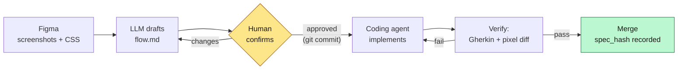

**The single highest-leverage rule for your specific constraint** (screenshots only, no structured design data): force the drafting model to tag every statement with **evidence provenance** — `observed` (visible in a screenshot), `extracted` (present in the CSS), `named` (from a Figma layer name), or `assumed` (invented by the model). Humans then review the ~15% marked `assumed` instead of re-reading 100% of the document. This is what makes a screenshot-only pipeline reviewable at all.

---

## 1. What the field actually converged on (2025 → mid-2026)

### 1.1 Every serious tool landed on the same four-phase pipeline

GitHub Spec Kit (Specify → Plan → Tasks → Implement) and AWS Kiro (Requirements → Design → Tasks) independently arrived at the same shape, and Microsoft's own framing adds explicit clarify/validate steps around it. The consistent claim across vendors and consultancies: separate the *planning* artifacts from the *implementation* run, keep a human gate between them, and express the artifacts as Markdown files in the repo.

Thoughtworks' write-up is blunt about the practical version: in methodologically-neutral tools (Cursor, Claude Code), you build the workflow yourself, requirements get formalised into `.md` files, and reviewing them is an iterative human-in-the-loop step.

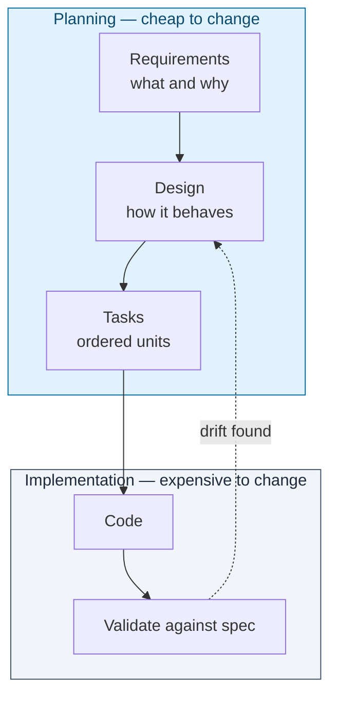

### 1.2 The three-file pattern is the de-facto structure

Kiro's `requirements.md` / `design.md` / `tasks.md` triple is the most copied structure in the ecosystem — enough that Spec Kit users filed migration issues to import Kiro folders wholesale, explicitly wanting to preserve two things: **EARS notation** in requirements and **Mermaid diagrams** in design.

Two details worth stealing directly:

- **EARS** (Easy Approach to Requirements Syntax): `WHEN <condition> THE SYSTEM SHALL <behaviour>`. It is deliberately boring, and that is the point — it removes the modal ambiguity ("should", "might", "ideally") that agents silently resolve in their own favour.
- **Approval gates as hard stops.** Community re-implementations of the Kiro workflow encode a mandatory prompt after each phase ("Do the requirements look good?") rather than letting the agent flow through.

### 1.3 Mermaid became the lingua franca for human↔model diagrams

This is the most important finding for your dual-format question. Mermaid wins not because it is the most expressive notation — BPMN and SCXML are far more expressive — but because it sits at a unique intersection:

| Property | Why it matters here |
|---|---|
| Plain text | Diffs in git; reviewable in a PR |
| Renders natively | GitHub, GitLab, Notion, Obsidian, most IDEs |
| Heavy training exposure | LLMs generate and *read* it reliably; there are now benchmarks specifically for LLM→Mermaid sequence-diagram generation |
| Strict DSL | Every edge is explicit — prose lets a model infer a connection that isn't there |
| Bidirectional | Vision models convert flowchart *images* to Mermaid; research systems use Mermaid as the verifiable middle layer between a multimodal model and a human expert |

Practitioner guidance that repeatedly shows up: give models **Mermaid source, not PNGs**, when you want them to reason over a flow; declare the diagram type up front (`stateDiagram-v2`, `flowchart TD`) before describing content; and always render before committing, because syntactically-invalid Mermaid is the common failure mode.

### 1.4 Statecharts are the formalism underneath

Mermaid is the *rendering*. The *model* you want is a statechart (Harel), because UI flow is not a DAG — it has back edges, modals, retries, and concurrent regions (e.g. a toast while a form is submitting). Flowcharts hide those; statecharts name them.

The Stately/XState ecosystem has been arguing for a decade that state diagrams are the shared language between BA, designer, and developer, and that they double as living documentation. The practical properties that matter for agents:

- **Hierarchy** — a screen contains its own `loading / empty / error / ready` sub-states, so you can talk about `Cart.empty` as a first-class address.
- **Guards** — `[cart.items > 0]` is a machine-checkable condition, not an English caveat.
- **Impossible states become visible** — the classic argument, and it is exactly the class of bug agents ship.
- **Direct compilation** — the same structure exports to Mermaid, to Markdown docs, to test cases, and (if you want) to runnable XState.

### 1.5 Values moved to DTCG; conventions moved to AGENTS.md

Two standards hardened enough to build on:

- **W3C DTCG token JSON** (`$type` / `$value`) is now the shared dialect across Style Dictionary, Tokens Studio, Cobalt, Supernova, Penpot and the newer AI design tooling. Practitioner reports converge on the same failure mode: agents match colours on simple screens and then break on nested components, mode-based tokens, and alias chains — unless an explicit token file plus a short conventions file is in context first. A frequently-skipped field, `$description`, is what tells an agent *when* to use a token rather than merely what its value is.
- **AGENTS.md** is stewarded by the Linux Foundation's Agentic AI Foundation, read natively by most agents, and used in 60k+ repos. Claude Code is the notable holdout — the standard bridge is a thin `CLAUDE.md` that imports `@AGENTS.md`.

Two cautions from the same literature: keep it short (a practical ceiling of roughly 150–200 standing instructions before reliability degrades; sub-150-line files in practice), and **do not let an LLM write it for you** — a 2026 study across 138 repositories found LLM-generated context files reduced agent task success while raising inference cost by 20%+, with human-written files giving only a marginal gain. Generated files are useful as an *inventory* of what might belong there, not as the file itself.

### 1.6 Verification split into two layers, and mixing them is a known bug

- **Semantic verification**: Gherkin / Given-When-Then, run as real tests. The O'Reilly Radar analysis frames this precisely — a Gherkin scenario is simultaneously the description of intent *and* the executable oracle, so validation is built into the medium; the cost curve of specification completeness is U-shaped, and the minimum sits around well-structured acceptance criteria rather than either extreme.
- **Visual verification**: deterministic pixel diffing (Playwright + pixelmatch), *not* model judgement. The widely-reported failure is an agent screenshotting its own output, comparing it to the reference, and cheerfully missing a completely broken button. A probabilistic system is structurally the wrong tool for "are these two images different"; use it to *explain* a diff a differ already found.

Also relevant: Playwright MCP defaults to accessibility-tree snapshots rather than screenshots — cheaper, more precise, and it gives the agent stable element handles. Reserve vision mode for genuine visual checks.

### 1.7 Where the design-to-code tooling actually stands (and why your constraint matters less than it looks)

The honest 2026 picture on Figma MCP: teams with mature, well-structured design systems get large gains; teams with disorganised files get results "marginal over a screenshot workflow." Reported styling inaccuracy without Code Connect mapping sits around 85–90%, with 40–80 hours of setup to get the good outcome. Figma's own developer docs are candid that the Dev Mode code panel emits visual properties and spacing only — **no logic, no JavaScript**.

Read that carefully: **MCP was never going to give you the flow.** It gives you geometry, tokens and component identity. Interaction design, business rules, error handling and edge cases still have to be communicated explicitly by a human. So the artifact this report describes — the Flow Spec — is exactly the thing MCP does *not* replace. You are missing the cheap half (geometry), not the valuable half (behaviour).

### 1.8 What the skeptics get right

Worth internalising before you build this, because it shapes the design:

- **Agents treat specs as suggestions.** The recurring practitioner complaint: after a long spec review, implementations land at roughly 70–90% compliance, and you cannot tell what is missing until QA. → *Consequence: the spec must generate executable checks, not just prose.*
- **Specs get unwieldy.** On HN: as projects grow, spec maintenance costs as much as any other methodology; nail everything down and the document becomes large and overly detailed. → *Consequence: one flow per file, hard size cap, and split rather than grow.*
- **Stale specs are worse than stale docs**, because an agent will execute an obsolete plan confidently and never flag it. → *Consequence: spec hash in the PR, CI enforcement, spec updated in the same commit as the code.*
- **Over-specification wastes effort on small work.** The pragmatic trigger used by practitioners: write the spec if you'd be annoyed by a different-but-plausible interpretation; skip it if a follow-up prompt would fix the output.
- **Empty / loading / error states are the specific thing AI-generated frontends omit** — one analysis of AI-generated dashboards reported the overwhelming majority shipped with no empty state and no error state, with generic spinners standing in for real loading design. → *Consequence: the state matrix is mandatory, not optional, and its cells must be filled or explicitly marked N/A.*

---

## 2. Format bake-off

Scored for *this* job: expressing a software flow so that a human can confirm it and an agent can build from it.

| Format | Human read | Diffable | Unambiguous for agents | Executable | LLM fluency | Token cost | Verdict |
|---|---|---|---|---|---|---|---|
| Prose PRD | ●●● | ●●● | ● | ✗ | ●●● | high | Model silently resolves ambiguity. Never normative. |
| Bullet user story list | ●●● | ●●● | ●● | ✗ | ●●● | med | Fine as a preamble, not a spec. |
| **EARS statements** | ●●● | ●●● | ●●● | ✗ | ●●● | low | Excellent for *rules*; no topology. |
| **Gherkin / GWT** | ●●● | ●●● | ●●● | **✓** | ●●● | med | Best verification layer. Poor at showing the map. |
| Mermaid `flowchart` | ●●● | ●●● | ●● | ✗ | ●●● | low | Great for a journey overview; can't express nested UI states. |
| **Mermaid `stateDiagram-v2`** | ●●● | ●●● | ●●● | ✗ | ●●● | low | **Best human view.** Rendering only — needs a data source. |
| Mermaid `sequenceDiagram` | ●●● | ●●● | ●●● | ✗ | ●●● | low | Complement, for one transition's client/server chatter. |
| **YAML statechart** | ●● | ●●● | ●●● | via codegen | ●●● | **lowest** | **Best machine source.** Most token-efficient structured format in file-native agent benchmarks. |
| JSON statechart | ● | ●● | ●●● | via codegen | ●●● | +28% vs YAML | Same semantics, noisier to review; bracket-tracking costs model attention. |
| XState machine (TS) | ●● | ●●● | ●●●● | **✓ runtime** | ●●● | med | Correct end-state if UI logic is genuinely complex. Overkill for most CRUD screens. |
| SCXML | ● | ●● | ●●●● | ✓ | ● | high | Formally superb, practically dead in frontend. |
| BPMN / XPDL | ● | ✗ | ●●●● | ✓ | ● | very high | Wrong domain, XML sprawl, no LLM fluency. |
| PlantUML | ●● | ●●● | ●●● | ✗ | ●● | med | Fine, but weaker native rendering than Mermaid. |
| Screenshots alone | ●●●● | ✗ | ● | ✗ | ●● | very high | Pixel ground truth. Zero behavioural information. |

**Two research notes that decide the tie-breaks:**

1. **YAML over JSON as the machine layer.** In a file-native agentic benchmark across 11 models, YAML was the most token-efficient format (JSON +28%, TOON +38%, Markdown +60%); a separate multi-agent study found JSON scored worst on comprehension due to "syntactic noise" — attention spent tracking brackets and escapes — with YAML about 10pp better. Meanwhile, aggregate format effects on task accuracy are small compared to model capability (a 9,649-trial study found no significant aggregate accuracy difference across YAML/Markdown/JSON/TOON). Translation: **format choice buys you tokens and reviewability, not magic accuracy** — so choose the one humans can also read.
2. **Markdown as the container.** The same multi-agent analysis found document-structured Markdown outperformed raw data formats because headers act as attention anchors and match pretraining priors. Hence the recommendation: *Markdown document containing a YAML block*, not a bare `.yaml` file.

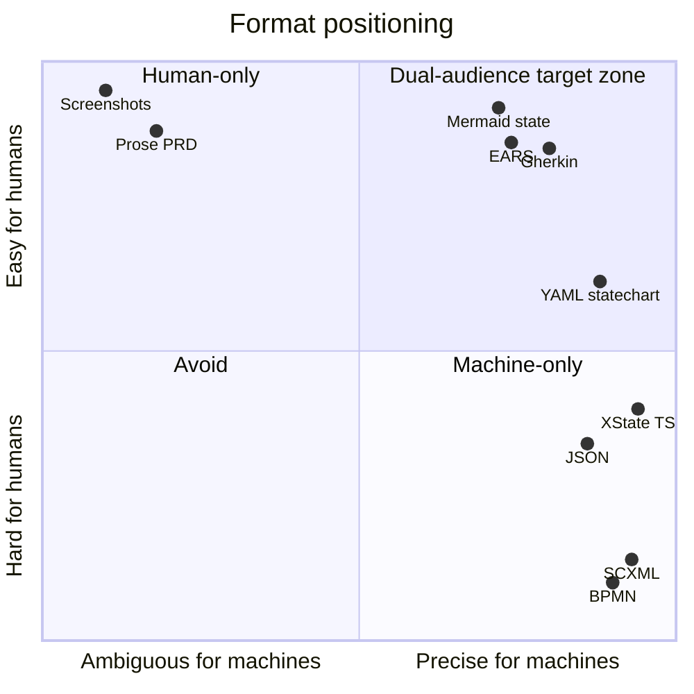

The target zone is reachable by *one* artifact only if you accept that it is a **compiled** artifact: authored once in YAML, projected into Mermaid + tables + Gherkin.

---

## 3. Artifact architecture: four files, one job each

The most common failure I found in team write-ups is a single giant "design doc" that mixes behaviour, pixel values, and house conventions. Agents then can't tell a *rule* from an *observation*, and humans can't review any of it quickly. Split by lifetime and authority:

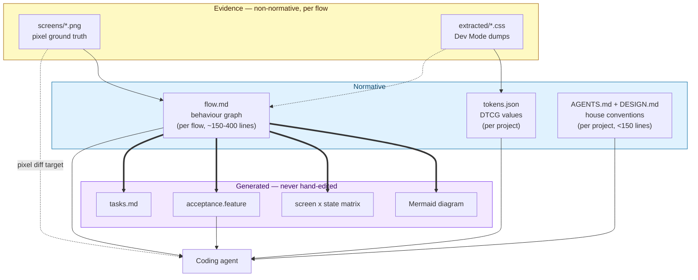

| Artifact | Owns | Changes when | Audience |
|---|---|---|---|
| `flow.md` | screens, states, transitions, guards, data needs | product behaviour changes | both |
| `tokens.json` (DTCG) | colour/space/type/radius values, modes | design system changes | machine (+ generated docs) |
| `AGENTS.md` / `DESIGN.md` | file layout, component reuse rules, "never hardcode X" | rarely | both |
| `screens/*.png` | exact pixels | design changes | human + pixel-differ |

**Why not put pixel values in the flow spec:** they double the document, they go stale the fastest, and they are the one thing a screenshot already answers perfectly. The flow spec should say `uses: ui/Button@primary`, never `padding: 12px 20px`.

---

## 4. The Flow Spec format

### 4.1 The dual-projection principle

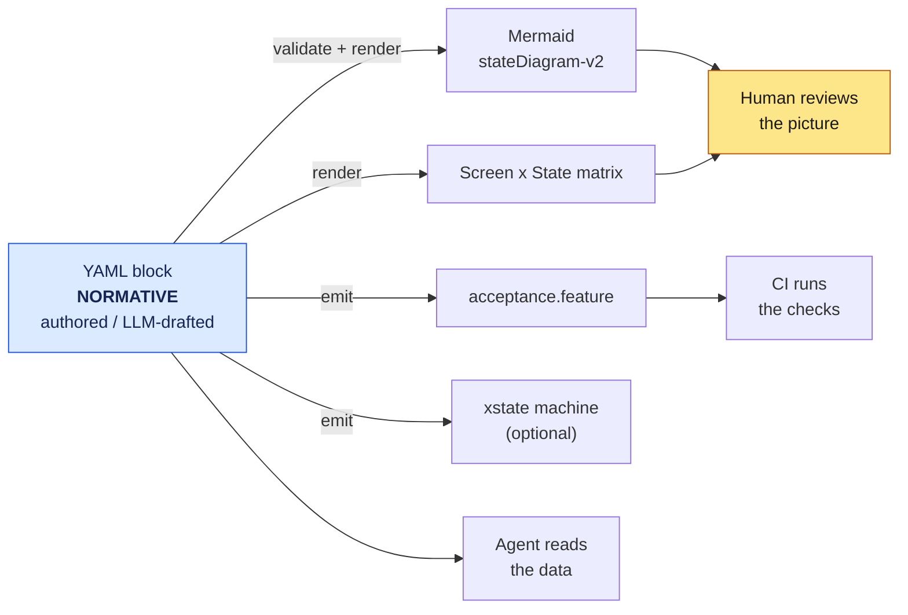

One rule enforced by a pre-commit hook / CI job: **the generated blocks are regenerated from the YAML on every commit.** If someone edits the diagram by hand, the build fails. This is the entire trick that makes one artifact serve two audiences honestly.

### 4.2 Schema

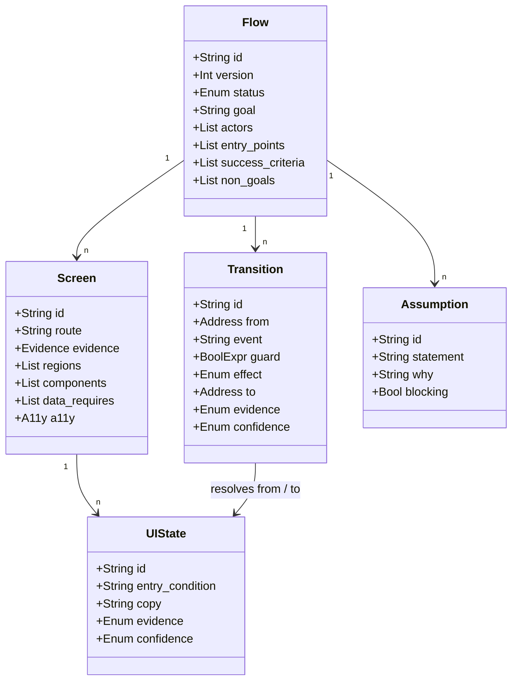

Field notes on the parts that carry most of the value:

- **`id` naming is the contract.** `S<n>_<slug>` for screens, `T<n>` for transitions, dotted names for error sub-states (`error.network`, `error.validation`). Screenshot filenames must match exactly: `S1_cart__empty.png`. This is what lets a multimodal model bind an image to a node without you describing it.
- **`from` / `to` are addresses, not names**: `S2_shipping#error.validation`. An agent can resolve these; "the error version of the shipping page" it cannot.
- **`event` uses a verb:target grammar**: `click:submit_button`, `submit:address_form`, `receive:api_200`, `timeout:30s`. Mixed user/system events in one vocabulary is what makes the graph complete.
- **`guard` must be a boolean expression over named data**, never English.
- **`confidence` + `evidence`** on every state and transition. This is the screenshot-only survival mechanism (§5.4).
- **`assumptions[]`** is a first-class list, not a footnote. Anything `blocking: true` prevents approval.

### 4.3 A worked example

Here is what the normative block looks like for a small checkout flow (abridged; full template in Appendix A):

```yaml
flow:
  id: checkout
  version: 3
  status: approved
  spec_hash: 8f3c1a2e
  goal: Let an authenticated or guest shopper turn a non-empty cart into a paid order.
  actors: [guest, member]
  entry_points: [S1_cart from any header cart icon, deep link /cart]
  success_criteria:
    - Order id returned and rendered on S4_confirm
    - Cart cleared server-side before S4_confirm renders
  non_goals: [saved payment methods, multi-currency]

screens:
  - id: S1_cart
    route: /cart
    title: Cart review
    evidence: { png: screens/S1_cart__ready.png, css: extracted/S1_cart.css, layer: "1.0 Cart" }
    data_requires: [cart.items[], cart.totals]
    components: [ui/Table, ui/QuantityStepper, ui/Button@primary]
    states:
      - { id: loading,           evidence: assumed,  confidence: low,  note: "no skeleton frame in Figma" }
      - { id: empty,             evidence: observed, confidence: high, png: screens/S1_cart__empty.png }
      - { id: ready,             evidence: observed, confidence: high }
      - { id: error.network,     evidence: assumed,  confidence: low }

  - id: S2_shipping
    route: /checkout/shipping
    # ...
```

```yaml
transitions:
  - { id: T1, from: S1_cart#loading, event: "receive:api_200", guard: "cart.count == 0", effect: none,        to: S1_cart#empty,            evidence: assumed,  confidence: med }
  - { id: T2, from: S1_cart#loading, event: "receive:api_200", guard: "cart.count > 0",  effect: none,        to: S1_cart#ready,            evidence: assumed,  confidence: med }
  - { id: T3, from: S1_cart#ready,   event: "click:checkout",  guard: "cart.count > 0",  effect: navigate,    to: S2_shipping#loading,      evidence: observed, confidence: high }
  - { id: T4, from: S2_shipping#form, event: "submit:address", guard: "form.valid",      effect: mutate,      to: S3_payment#loading,       evidence: observed, confidence: high }
  - { id: T5, from: S2_shipping#form, event: "submit:address", guard: "!form.valid",     effect: none,        to: S2_shipping#error.validation, evidence: observed, confidence: high }
```

Which projects to exactly this, for the human:

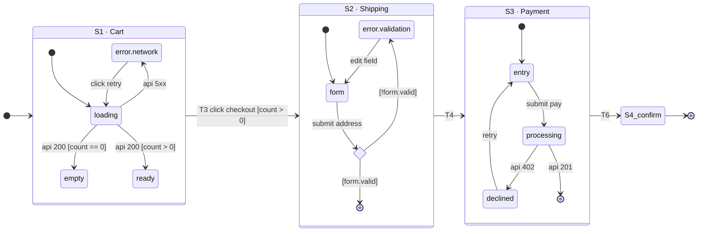

…and to this table, which is the artifact reviewers actually scan hardest:

| Screen | loading | empty | ready | error.validation | error.network | success |
|---|---|---|---|---|---|---|
| S1 Cart | ⚠ assumed | ✅ designed | ✅ designed | n/a | ⚠ assumed | — |
| S2 Shipping | ✅ designed | n/a | ✅ designed | ✅ designed | ⚠ assumed | — |
| S3 Payment | ✅ designed | n/a | ✅ designed | ✅ designed | ⚠ assumed | — |
| S4 Confirm | ✅ designed | n/a | ✅ designed | n/a | ⚠ assumed | ✅ |

Every ⚠ is a question for the designer. Empty cells are bugs. This one table catches the single most reliable class of AI-frontend defect.

### 4.4 Where sequence diagrams earn their place

Use one per transition that crosses the network. State diagrams answer *what state comes next*; they hide *who talks to whom and when*, which is where optimistic updates and race conditions live.

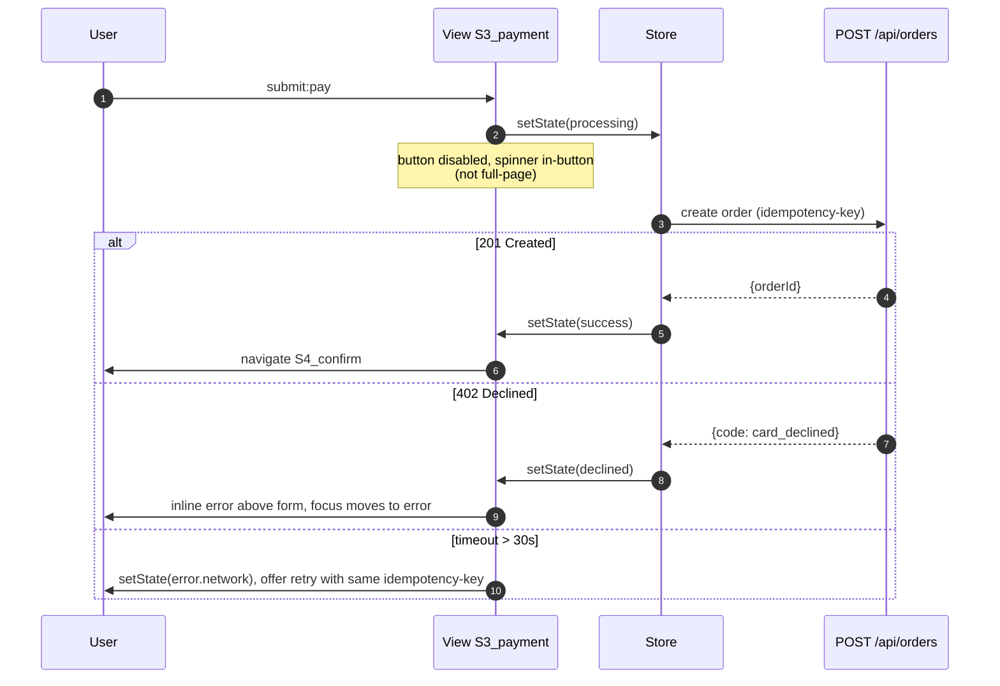

### 4.5 Levels of formality — pick per flow, not per project

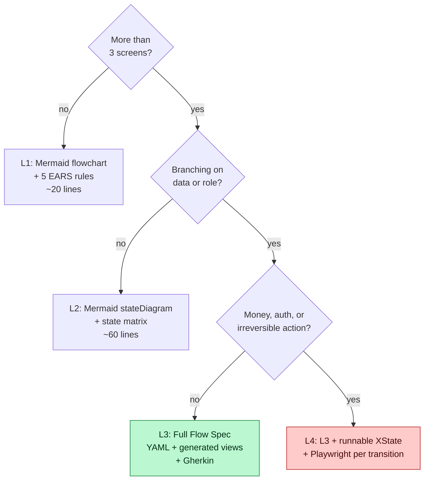

L3 is the default. Do not start at L4 — the practitioner consensus is that over-specification is a real cost, and unwieldy specs are the documented failure mode of this whole approach.

---

## 5. Extraction without MCP or REST: the capture protocol

Your constraint — screenshots plus copied CSS — removes the node tree, variant metadata and variable definitions. What it does **not** remove is the three things that actually carry flow information: **prototype connections, frame names, and screen ordering.** Capture those deliberately and you recover most of the value.

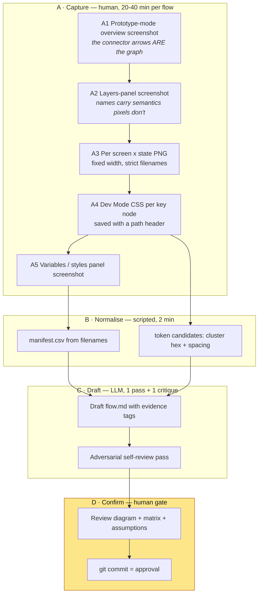

### 5.1 A1 — the highest-value artifact you can produce in 30 seconds

In Figma's Prototype tab, connections between frames are drawn as arrows on the canvas, and a "flow" is defined as the network of frames and connections on a page, with named starting points per journey. **Zoom to fit and screenshot that canvas.** Then screenshot it again zoomed into each cluster so the labels are legible.

That single image gives a multimodal model the edge list — the part it otherwise has to hallucinate. There is a long-standing community request for Figma to emit a simplified flowchart view of a prototype precisely because the raw connector view is visually overwhelming; you are doing that reduction yourself, in the Flow Spec.

If the file has no prototype connections at all, the fallback is ordering by frame name (see A2) plus an explicit interview with the designer. Do not let the model guess the edges silently — that is what `confidence: low` is for.

### 5.2 A2/A3 — naming is the whole interface

Rename frames in Figma (or just in your export filenames) to a numbered scheme before capture. The handoff literature is consistent on this: number frames explicitly (`1.0`, `1.1`, `1.2`) so no one has to infer sequence, and keep a separate clean handoff file rather than the exploration file.

```
screens/
  S1_cart__ready.png
  S1_cart__empty.png
  S2_shipping__form.png
  S2_shipping__error-validation.png
  S3_payment__processing.png
  S4_confirm__success.png
```

Rules: fixed export width per breakpoint (e.g. 1440 and 390), 2× for text legibility, one state per file, `__` separating screen id from state id, hyphens inside a dotted state name. The filename *is* the join key between the image, the YAML node, and later the pixel-diff baseline.

### 5.3 A4 — what CSS gives you, and what it doesn't

Figma's own guidance is explicit that the code panel covers visual properties and spacing, with no logic exported. So treat CSS as a **value source only**:

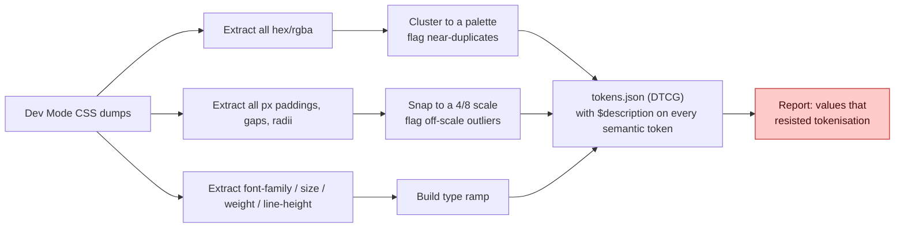

The residual report matters: hardcoded values sitting in the design file leak straight into prompts, and the reported breakage pattern is nested components, mode-based tokens, and alias chains rather than flat colours. Anything that won't snap to a token is a design-system conversation, not a coding task.

Write the tokens as DTCG (`$type`/`$value`), pipe through Style Dictionary or Cobalt to CSS variables / a Tailwind theme block, and put `$description` on every semantic token so the agent knows *when* to use it.

### 5.4 The evidence-and-confidence discipline (the core technique for your setup)

Because the model is inferring behaviour from pixels, its output is a mixture of transcription and invention — and the two are indistinguishable in fluent prose. Force them apart:

| Tag | Means | Reviewer action |
|---|---|---|
| `observed` | Visible in a named screenshot | Spot check |
| `extracted` | Present in a CSS dump | Trust |
| `named` | Derived from a Figma layer/frame name | Spot check |
| `inferred` | Deduced from convention (e.g. a spinner implies a loading state) | Read |
| `assumed` | Invented; no evidence at all | **Must be resolved before approval** |

Rule: **no transition may be `assumed` and non-blocking at the same time in an L3+ spec.** Screens can carry assumed states (that is how you discover missing designs); edges cannot.

A realistic first-pass distribution for a screenshot-only capture of a 6-screen flow: ~55% observed/extracted, ~25% inferred, ~20% assumed. The review is then a 20-minute conversation about ~15 items rather than a 90-minute document read.

### 5.5 What you genuinely lose without MCP, and the cheapest substitutes

| Lost | Substitute |
|---|---|
| Exact token values & variable names | CSS clustering + one screenshot of the Variables panel |
| Component identity / variants | A repo-side component index (`docs/components.md`) the agent greps; ask it to *match*, not invent |
| Auto Layout / constraint semantics | Two breakpoint screenshots (390 / 1440) — responsive behaviour becomes an observation, not a guess |
| Code Connect mapping | An explicit `components:` list per screen in the Flow Spec, using real import paths |
| Asset export | Manual export to `public/assets/` with the same naming discipline |

Note that the Code Connect gap is the one with the biggest documented quality impact — which means writing that `components:` line by hand is the highest-value manual step in the whole pipeline. It is also five seconds of typing per screen.

---

## 6. The prompts

Three prompts, run in order. Full copy-paste versions in `prompts.md`; the structure and the *why* are here.

### 6.1 Draft prompt (multimodal)

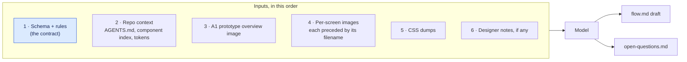

Non-obvious details that change output quality a lot:

- **Put the schema first and the images last.** The output format must be locked before content is described — the consistently-reported pattern in Mermaid-generation guidance is that declaring the diagram type and constraints up front dramatically improves reliability.
- **Precede every image with its filename as a text line.** Otherwise the model cannot reliably bind image *n* to a node id, and IDs are the whole contract.
- **Ban prose in the YAML block.** Anything the model wants to explain goes in the prose section or `open-questions.md`.
- **Require the state matrix to be exhaustive**, with explicit `n/a` — an omission must be a decision, not a gap. This is the direct countermeasure to the empty/loading/error blind spot.
- **Require EARS phrasing for every rule** in the prose section: `WHEN <condition> THE SYSTEM SHALL <behaviour>`.
- **Forbid invented component names.** Instruct: match against the supplied component index, or write `component: UNKNOWN` and add an open question.

### 6.2 Critique prompt (fresh context, adversarial)

Run this in a **new session** with the drafted `flow.md` and the same images, but framed as a reviewer, not an author. Authoring context makes models defend their own output.

Ask it for exactly these six checks:

1. Unreachable states and dead ends (any state with no outgoing edge that is not terminal).
2. Missing back/cancel/dismiss edges — the most commonly omitted class in AI-drafted flows.
3. Every `error.*` state: is there a documented recovery path?
4. Guards that overlap or leave a gap (e.g. `count > 0` and `count == 0` cover it; `count > 1` and `count == 0` do not).
5. Transitions whose `to` screen has no matching evidence file.
6. Any statement tagged `observed` that the reviewer cannot verify in the supplied images → downgrade to `assumed`.

That last one is the single most useful check in a screenshot pipeline: it catches the model's tendency to launder inference as observation.

### 6.3 Implementation prompt

Point at the approved `flow.md`, `tokens.json`, `AGENTS.md`, the component index, and the `screens/` folder. Then constrain the loop:

- Implement **one screen and all of its states** per task; never a whole flow in one shot.
- For each state, the target screenshot filename is given explicitly — the agent must render at that exact viewport width and pixel-diff against it.
- Transitions are implemented as a single navigation/state module derived from the YAML, not scattered across components.
- Every `error.*` state must ship with its recovery affordance from the spec.
- The definition of done is the generated Gherkin scenarios passing, not "looks right".

---

## 7. The human confirmation gate

This is the step the whole design exists to protect, so make it fast and specific. What reviewers should look at, in order, with a 15-minute budget for a 6-screen flow:

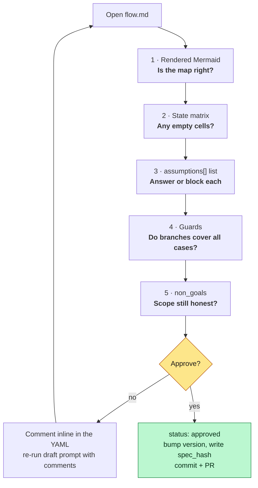

Three practices that make the gate real rather than theatrical:

- **Approval is a git commit**, not a Slack thumbs-up. `status: approved` plus a `spec_hash` in the file, reviewed as a PR by a designer and an engineer. The mandatory-approval-gate pattern is exactly what the Kiro-style workflows encode, and the failure mode when gates are soft is well documented: the reviewer becomes an overworked clerk clicking "continue".
- **Cap the review unit.** One flow, ≤8 screens, ≤400 lines. If it's bigger, split the flow. The cognitive-load argument against SDD only bites when specs are generated for an entire epic at once.
- **Review the diff, not the document,** on version 2+. Because the diagram is generated, a YAML diff of three transitions is a three-line review.

---

## 8. Handoff to the coding agent, and verification

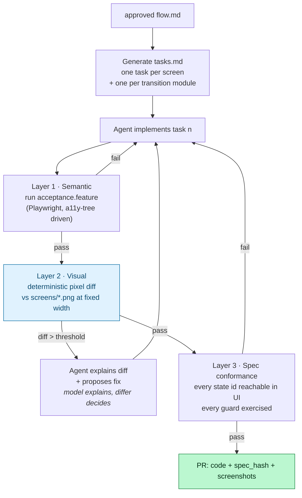

**Layer 1 — semantic.** Each transition emits one Gherkin scenario:

```gherkin
Feature: Checkout — cart to shipping

  Scenario: T3 proceeding with a non-empty cart
    Given the cart contains 2 items
    And the "S1_cart" screen is in state "ready"
    When the user clicks the primary checkout button
    Then the "S2_shipping" screen is shown in state "loading"
    And the browser URL is "/checkout/shipping"

  Scenario: T5 submitting an incomplete address
    Given the "S2_shipping" screen is in state "form"
    And the postcode field is empty
    When the user submits the address form
    Then the screen enters state "error.validation"
    And focus moves to the first invalid field
```

Drive these through the accessibility tree rather than screenshots: Playwright MCP's default snapshot mode returns a semantic view with stable element references, is far cheaper in tokens than vision mode, and does not require a vision-capable model. Reserve screenshots for layer 2.

One caveat from the tooling guidance: snapshot element refs (`e5`, `e10`) are valid only until the page changes — they are interaction handles, not selectors to commit. Generate real locators from roles and labels.

**Layer 2 — visual.** Pixelmatch or Playwright's built-in comparison with an explicit `maxDiffPixelRatio`. **Do not ask the model whether two screenshots match.** Let the differ produce a diff image, then let the model read the diff and explain which token or layout rule is wrong. That division of labour is what the "smart and dumb at the same time" reports are about.

**Layer 3 — conformance.** A script walks the YAML and asserts that every declared state id is reachable in the running app and every guard branch is exercised by at least one scenario. This is the answer to the 70–90% compliance problem: compliance becomes measurable rather than felt.

---

## 9. Drift control

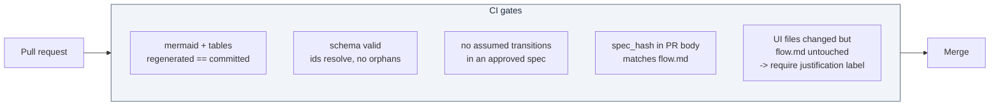

The stale-spec risk is the one that turns this system from an asset into a liability: an agent will execute an obsolete plan confidently and never tell you. G5 is the cheap version of the fix — the spec and the code move in the same commit, or someone explicitly says why not.

Retire flows too. A flow spec for a shipped, stable feature that nobody is changing should be marked `status: frozen` and excluded from agent context, otherwise it is just tokens.

---

## 10. Rollout, cost, and honest limits

**Week 1 — foundation (once per project).**
`AGENTS.md` (hand-written, <150 lines), `docs/components.md` component index, `tokens.json` from your CSS dumps, and the validator script in CI. Nothing flow-specific yet.

**Week 2 — one flow, end to end.** Pick a 4–6 screen flow with real branching. Run capture → draft → critique → gate → implement. Measure two numbers: minutes of human review, and the percentage of acceptance scenarios passing on the agent's first attempt. Those two numbers tell you whether the spec is too thin or too heavy.

**Week 3 — tune the template, then scale.** Add the checks the first flow's bugs revealed. Only then apply to more flows.

**Realistic effort per flow (6 screens, screenshot-only):**

| Step | Human | Machine |
|---|---|---|
| Capture (A1–A5) | 25–40 min | — |
| Draft + critique | 5 min | 2 passes |
| Review gate | 15–25 min | — |
| Implement | supervision | per-screen tasks |
| **Total human** | **~50–70 min** | |

**Limits you should plan for, not be surprised by:**

- Agents will still implement roughly the spec, not exactly the spec. The generated checks are the mitigation; without them this is documentation theatre.
- Screenshot-only extraction cannot recover variant logic or responsive constraint semantics. Two breakpoints per screen is the pragmatic floor.
- Motion and micro-interaction survive almost none of this pipeline. Specify them as prose plus a reference URL or a short screen recording; nobody has a good machine format for easing curves in a flow spec.
- This buys you the most on flows with branching and error handling, and the least on static marketing pages, where a screenshot and a token file are genuinely sufficient. Use the L1–L4 decision tree and don't over-spec.

---

## Appendix A — Field reference

Companion file: `FLOW-SPEC-TEMPLATE.md` (copy-paste starting point).

**`flow`** — `id` (kebab, matches folder) · `version` (int, bump on any behavioural change) · `status` (`draft|review|approved|frozen`) · `spec_hash` (written by the validator) · `goal` (one sentence) · `actors[]` · `entry_points[]` · `success_criteria[]` (observable, not aspirational) · `non_goals[]` (the field that prevents scope invention).

**`screens[]`** — `id` (`S<n>_<slug>`) · `route` · `title` · `evidence{png, css, layer}` · `data_requires[]` (dotted paths the screen cannot render without) · `data_source` (endpoint or store selector) · `components[]` (real import paths from the component index, or `UNKNOWN`) · `a11y{focus_on_enter, live_region, landmarks}` · `responsive{breakpoints}` · `states[]`.

**`screens[].states[]`** — `id` (`loading|empty|ready|success|error.<kind>|<domain-specific>`) · `entry_condition` · `copy` (exact user-facing strings; put them here, not in code) · `evidence` · `confidence` · `png` (state-specific override).

**`transitions[]`** — `id` (`T<n>`) · `from` (`S<id>#<state>`) · `event` (`<verb>:<target>`) · `guard` (boolean over `data_requires` paths) · `effect` (`none|navigate|mutate|open_overlay|close_overlay|replace`) · `to` (`S<id>#<state>`) · `optimistic` (bool) · `idempotency` (for mutations) · `evidence` · `confidence`.

**`assumptions[]`** — `id` · `statement` · `why` · `blocking` (bool). Approval is blocked while any `blocking: true` remains.

**`rules[]`** — free-standing EARS statements that don't belong to a single transition: `WHEN the session expires mid-checkout THE SYSTEM SHALL preserve cart contents and return the user to S1_cart with a notice.`

**Reserved state ids.** Always consider, explicitly mark `n/a` if genuinely inapplicable: `loading`, `empty`, `partial`, `ready`, `submitting`, `success`, `error.validation`, `error.network`, `error.permission`, `error.conflict`, `offline`, `disabled`, `readonly`.

---

## Appendix B — Prompts

Companion file: `prompts.md` contains the three prompts in full:

1. **P1 Draft** — schema-first, images last, evidence tags mandatory, exhaustive state matrix, EARS rules, no invented components.
2. **P2 Critique** — fresh context, adversarial reviewer framing, the six structural checks from §6.2.
3. **P3 Implement** — one screen per task, explicit pixel-diff target, Gherkin as definition of done.

---

## Appendix C — Validator

Companion file: `validate_flow.py` (stdlib + PyYAML only). It:

- parses the `yaml flowspec` fenced block out of `flow.md`;
- validates ids, resolves every `from`/`to` address, and rejects duplicates;
- reports **orphan states** (unreachable) and **dead ends** (no outgoing edge, not terminal);
- reports **guard gaps** — sibling transitions sharing a `from` + `event` whose guards are not obviously exhaustive;
- checks every referenced evidence file exists on disk;
- blocks approval on `assumed` transitions or unresolved blocking assumptions;
- **regenerates** the Mermaid `stateDiagram-v2` block and the screen × state matrix in place, between `<!-- GENERATED:... -->` markers;
- emits `acceptance.feature` skeletons, one scenario per transition;
- writes `spec_hash`.

Run it as a pre-commit hook and in CI with `--check` (fails if regenerated output differs from what's committed).

```bash
python validate_flow.py specs/flows/checkout/flow.md          # fix + regenerate
python validate_flow.py specs/flows/checkout/flow.md --check  # CI mode
python validate_flow.py specs/flows/checkout/flow.md --gherkin
```

---

## Appendix D — Sources

**Spec-driven development**
- GitHub Blog — Spec Kit announcement and the four-phase workflow · https://github.blog/ai-and-ml/generative-ai/spec-driven-development-with-ai-get-started-with-a-new-open-source-toolkit/
- Microsoft for Developers — spec-first lifecycle (constitution → specify → clarify → plan → tasks → implement → validate) · https://developer.microsoft.com/blog/spec-driven-development-ai-native-engineering/
- Thoughtworks — SDD in practice, markdown artifacts, human-in-the-loop review · https://www.thoughtworks.com/en-us/insights/blog/agile-engineering-practices/spec-driven-development-unpacking-2025-new-engineering-practices
- Kiro docs — feature specs, EARS notation, requirements/design/tasks · https://kiro.dev/docs/specs/feature-specs/
- Spec Kit issue #1242 — Kiro→Spec Kit migration, EARS + Mermaid preservation · https://github.com/github/spec-kit/issues/1242
- Kiro-style workflow with mandatory approval gates · https://gist.github.com/kehao-chen/22bc28f4c825b5f9af9c5c411f89ba89
- Augment Code — when to skip the spec · https://www.augmentcode.com/guides/what-is-spec-driven-development

**Critiques**
- Sibylline — agents treat specs as suggestions; 80–90% compliance · https://sibylline.dev/articles/2026-01-28-problems-with-spec-driven-development/
- Augment Code — stale specs mislead agents silently · https://www.augmentcode.com/blog/what-spec-driven-development-gets-wrong
- Towards AI — SDD is not a silver bullet; cognitive-load failure on epic-sized specs · https://pub.towardsai.net/why-specification-driven-development-sdd-is-not-a-silver-bullet-for-ai-assisted-sdlc-491c71bcf835
- HN — specs get unwieldy as projects grow · https://news.ycombinator.com/item?id=47019109
- HN — Ask HN: what happened to spec-driven development · https://news.ycombinator.com/item?id=49182353

**Diagrams / Mermaid / statecharts**
- Why Mermaid suits LLM comprehension; give models source not PNGs · https://mermaid2img.com/blog/mermaid-diagrams-for-ai-understanding
- Mermaid prompt engineering — declare type and constraints first · https://mermaid2img.com/blog/mermaid-prompt-engineering-for-llms
- MermaidSeqBench — benchmark for LLM→Mermaid sequence diagrams · https://arxiv.org/html/2511.14967v1
- Flowchart2Mermaid — VLM converts flowchart images to Mermaid · https://arxiv.org/html/2512.02170v1
- MermaidLLM — Mermaid as the verifiable human/AI shared representation · https://dl.acm.org/doi/10.1145/3746058.3758449
- Stately — state machines and statecharts; hierarchy, guards, impossible states · https://stately.ai/docs/xstate-v4/state-machines-and-statecharts
- Statecharts.dev — statecharts in user interfaces · https://statecharts.dev/use-case-statecharts-in-user-interfaces.html
- State machines as a team's shared source of truth · https://medium.com/@stefanoslignos/state-machines-as-the-source-of-truth-in-a-team-df9954710807

**Format effectiveness research**
- Structured context engineering for file-native agents — YAML most token-efficient; JSON +28%, TOON +38%, MD +60% · https://arxiv.org/pdf/2602.05447
- Notation matters — format effects are small vs model capability (9,649 trials) · https://arxiv.org/pdf/2605.29676
- Fat-Cat — JSON syntactic noise vs YAML vs document-structured Markdown · https://arxiv.org/pdf/2602.02206
- Let Me Speak Freely — format restriction degrades reasoning · https://arxiv.org/html/2408.02442v1

**Figma / design-to-code**
- Figma — guide to prototyping; flows as networks of frames and connections · https://help.figma.com/hc/en-us/articles/360040314193-Guide-to-prototyping-in-Figma
- Figma — create and manage prototype flows, flow starting points · https://help.figma.com/hc/en-us/articles/360039823894-Create-and-manage-prototype-flows
- Figma — developer handoff tips; code panel is visual properties only, no logic · https://www.figma.com/best-practices/tips-on-developer-handoff/
- Figma — optimise files for handoff, ready-for-development · https://help.figma.com/hc/en-us/articles/360040521453-Optimize-design-files-for-developer-handoff
- Figma developer docs — the official implement-design agent workflow (context → screenshot → assets → translate → validate) · https://developers.figma.com/docs/figma-mcp-server/skill-figma-implement-design
- Figma — create-design-system-rules skill; rule-writing guidance · https://github.com/figma/mcp-server-guide/blob/main/skills/figma-create-design-system-rules/SKILL.md
- Designpixil — numbered happy-path frames, state documentation, separate handoff file · https://designpixil.com/blog/design-handoff-figma-developers
- Figma forum — request for a simplified proto-to-flow view · https://forum.figma.com/suggest-a-feature-11/proto-to-flow-a-new-way-to-handoff-communicate-39301
- 2026 MCP reality check — uneven gains, Code Connect ceiling, setup cost · https://baeseokjae.github.io/posts/figma-mcp-design-to-code-2026/
- CTO guide to Figma MCP; don't run two design MCP servers at once · https://alexbobes.com/tech/figma-mcp-the-cto-guide-to-design-to-code-in-2026/
- Builder.io — structural data beats pixels · https://www.builder.io/blog/figma-mcp-server
- Figma × Anthropic Code to Canvas (Feb 2026) · https://www.figma.com/blog/introducing-claude-code-to-figma/

**Tokens and conventions**
- DTCG in practice — the JSON dialect tools aligned on · https://tasteprofile.io/blog/w3c-dtcg-design-tokens-practical-guide
- Why AI tools ignore your tokens: DTCG + Style Dictionary + AGENTS.md pipeline · https://atomize.tools/blog/figma-design-tokens-vibe-coding/
- AI-ready design system handbook — `$description` is the field that tells agents *when* · https://ds-handbook.vercel.app/
- AGENTS.md field guide 2026 · https://www.iuriio.com/blog/posts/2026/05/agents-md-field-guide-2026
- AGENTS.md best practices — keep it short, hand-written · https://www.betterclaw.io/blog/agents-md-best-practices
- AGENTS.md spec notes — LLM-generated context files reduced success and raised cost across 138 repos · https://asdlc.io/practices/agents-md-spec/
- Governing specs — ~150–200 standing instructions as a practical ceiling · https://www.truefoundry.com/blog/spec-driven-development-ai-agents

**Verification**
- O'Reilly Radar — why coding agents still need clear specs; BDD as spec + oracle; U-shaped cost curve · https://www.oreilly.com/radar/why-ai-coding-agents-still-need-clear-specs/
- Gherkin guidelines as an agent context file · https://github.com/AutomationPanda/gherkin-guidelines-for-ai
- Acceptance criteria agents can actually execute · https://tekk.coach/spec-driven-development/acceptance-criteria-agents-can-actually-execute/
- Playwright MCP — accessibility-tree snapshots, token cost, ref lifetime · https://qaskills.sh/blog/playwright-mcp-testing-capability-guide-2026
- Playwright MCP visual regression workflow · https://testdino.com/blog/playwright-mcp-visual-testing
- Why an LLM is the wrong tool for visual regression judgement · https://delta-qa.com/en/blog/playwright-mcp-model-context-protocol-visual-testing/
- The pixel-perfect loop and its failure rate · https://www.buildmvpfast.com/blog/figma-to-code-pixel-perfect-loop-ai-agent-screenshot-iterate-2026
- Playwright MCP + pixelmatch + rules, worked example · https://egghead.io/ai-driven-design-workflow-playwright-mcp-screenshots-visual-diffs-and-cursor-rules~aulxx

**UI states**
- The three UI states AI almost never builds correctly · https://blog.vibecoder.me/empty-states-loading-states-error-states
- Empty state taxonomy and patterns · https://www.setproduct.com/blog/empty-state-ui-design
- Flow mapping as a directed graph, distinct from wireframing · https://www.indiehackers.com/post/ai-tools-that-map-complete-ux-user-flows-without-manual-diagramming-compared-340001ecfa
