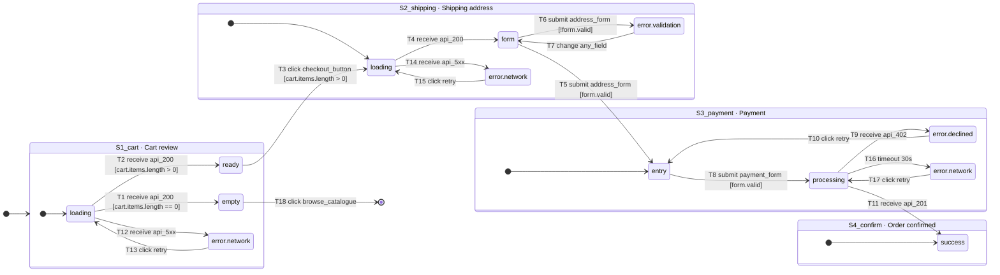

# Flow Spec — Checkout

> **How to read this file.** The `yaml flowspec` block below is the only normative
> content. Everything between `GENERATED` markers is produced by
> `validate_flow.py` and must never be hand-edited. Prose sections are commentary.

## 1. Normative specification

```yaml flowspec
flow:
  id: checkout
  version: 1
  status: draft          # draft | review | approved | frozen
  spec_hash: be2627e6        # written by the validator
  goal: >
    Let an authenticated or guest shopper turn a non-empty cart into a paid order
    in at most three steps.
  actors: [guest, member]
  entry_points:
    - Header cart icon from any page
    - Deep link /cart
  success_criteria:
    - An order id is returned and rendered on S4_confirm
    - The server-side cart is cleared before S4_confirm renders
    - A confirmation email is enqueued
  non_goals:
    - Saved payment methods
    - Multi-currency
    - Guest-to-member account upgrade during checkout

screens:
  - id: S1_cart
    route: /cart
    title: Cart review
    evidence:
      png: screens/S1_cart__ready.png
      css: extracted/S1_cart.css
      layer: "1.0 Cart"
    data_requires: [cart.items, cart.totals]
    data_source: GET /api/cart
    components:
      - src/components/ui/Table.tsx
      - src/components/ui/QuantityStepper.tsx
      - src/components/ui/Button.tsx@primary
    a11y:
      focus_on_enter: h1#cart-title
      live_region: "#cart-total announces on quantity change"
    responsive:
      breakpoints: [390, 1440]
      notes: "Table collapses to stacked cards below 768"
    states:
      - id: loading
        entry_condition: "request in flight"
        copy: null
        evidence: assumed
        confidence: low
        note: "No skeleton frame exists in Figma — needs a design decision"
      - id: empty
        entry_condition: "cart.items.length == 0"
        copy: "Your cart is empty. Browse the catalogue."
        evidence: observed
        confidence: high
        png: screens/S1_cart__empty.png
      - id: ready
        entry_condition: "cart.items.length > 0"
        evidence: observed
        confidence: high
        png: screens/S1_cart__ready.png
      - id: error.network
        entry_condition: "GET /api/cart failed"
        copy: "We couldn't load your cart. Try again."
        evidence: assumed
        confidence: low

  - id: S2_shipping
    route: /checkout/shipping
    title: Shipping address
    evidence:
      png: screens/S2_shipping__form.png
      css: extracted/S2_shipping.css
      layer: "2.0 Shipping"
    data_requires: [user.addresses, shipping.methods]
    data_source: GET /api/shipping/options
    components:
      - src/components/ui/Form.tsx
      - src/components/ui/Input.tsx
      - src/components/ui/RadioGroup.tsx
    a11y:
      focus_on_enter: "first invalid field on error, else first input"
    states:
      - id: loading
        evidence: observed
        confidence: high
      - id: form
        evidence: observed
        confidence: high
      - id: error.validation
        entry_condition: "client-side validation failed"
        evidence: observed
        confidence: high
        png: screens/S2_shipping__error-validation.png
      - id: error.network
        evidence: assumed
        confidence: low

  - id: S3_payment
    route: /checkout/payment
    title: Payment
    evidence:
      png: screens/S3_payment__entry.png
      css: extracted/S3_payment.css
      layer: "3.0 Payment"
    data_requires: [order.draft, payment.providers]
    data_source: POST /api/orders
    components:
      - src/components/ui/Form.tsx
      - src/components/ui/Button.tsx@primary
    states:
      - id: entry
        evidence: observed
        confidence: high
      - id: processing
        entry_condition: "POST /api/orders in flight"
        evidence: observed
        confidence: high
      - id: error.declined
        copy: "That card was declined. Try another payment method."
        evidence: observed
        confidence: high
      - id: error.network
        evidence: assumed
        confidence: low

  - id: S4_confirm
    route: /checkout/confirmation
    title: Order confirmed
    evidence:
      png: screens/S4_confirm__success.png
      css: extracted/S4_confirm.css
      layer: "4.0 Confirmation"
    data_requires: [order.id, order.summary]
    components:
      - src/components/ui/Card.tsx
    states:
      - id: success
        evidence: observed
        confidence: high
        terminal: true

transitions:
  - id: T1
    from: S1_cart#loading
    event: "receive:api_200"
    guard: "cart.items.length == 0"
    effect: none
    to: S1_cart#empty
    evidence: inferred
    confidence: med
  - id: T2
    from: S1_cart#loading
    event: "receive:api_200"
    guard: "cart.items.length > 0"
    effect: none
    to: S1_cart#ready
    evidence: inferred
    confidence: med
  - id: T3
    from: S1_cart#ready
    event: "click:checkout_button"
    guard: "cart.items.length > 0"
    effect: navigate
    to: S2_shipping#loading
    evidence: observed
    confidence: high
  - id: T4
    from: S2_shipping#loading
    event: "receive:api_200"
    guard: "true"
    effect: none
    to: S2_shipping#form
    evidence: inferred
    confidence: med
  - id: T5
    from: S2_shipping#form
    event: "submit:address_form"
    guard: "form.valid"
    effect: mutate
    to: S3_payment#entry
    evidence: observed
    confidence: high
  - id: T6
    from: S2_shipping#form
    event: "submit:address_form"
    guard: "!form.valid"
    effect: none
    to: S2_shipping#error.validation
    evidence: observed
    confidence: high
  - id: T7
    from: S2_shipping#error.validation
    event: "change:any_field"
    guard: "true"
    effect: none
    to: S2_shipping#form
    evidence: inferred
    confidence: med
  - id: T8
    from: S3_payment#entry
    event: "submit:payment_form"
    guard: "form.valid"
    effect: mutate
    to: S3_payment#processing
    optimistic: false
    idempotency: "Idempotency-Key header, uuid per draft order"
    evidence: observed
    confidence: high
  - id: T9
    from: S3_payment#processing
    event: "receive:api_402"
    guard: "true"
    effect: none
    to: S3_payment#error.declined
    evidence: observed
    confidence: high
  - id: T10
    from: S3_payment#error.declined
    event: "click:retry"
    guard: "true"
    effect: none
    to: S3_payment#entry
    evidence: inferred
    confidence: med
  - id: T11
    from: S3_payment#processing
    event: "receive:api_201"
    guard: "true"
    effect: navigate
    to: S4_confirm#success
    evidence: observed
    confidence: high
  - id: T12
    from: S1_cart#loading
    event: "receive:api_5xx"
    guard: "true"
    effect: none
    to: S1_cart#error.network
    evidence: assumed
    confidence: low
  - id: T13
    from: S1_cart#error.network
    event: "click:retry"
    guard: "true"
    effect: none
    to: S1_cart#loading
    evidence: assumed
    confidence: low
  - id: T14
    from: S2_shipping#loading
    event: "receive:api_5xx"
    guard: "true"
    effect: none
    to: S2_shipping#error.network
    evidence: assumed
    confidence: low
  - id: T15
    from: S2_shipping#error.network
    event: "click:retry"
    guard: "true"
    effect: none
    to: S2_shipping#loading
    evidence: assumed
    confidence: low
  - id: T16
    from: S3_payment#processing
    event: "timeout:30s"
    guard: "true"
    effect: none
    to: S3_payment#error.network
    evidence: assumed
    confidence: low
  - id: T17
    from: S3_payment#error.network
    event: "click:retry"
    guard: "true"
    effect: mutate
    to: S3_payment#processing
    idempotency: "reuse the original Idempotency-Key"
    evidence: assumed
    confidence: low
  - id: T18
    from: S1_cart#empty
    event: "click:browse_catalogue"
    guard: "true"
    effect: navigate
    to: EXIT
    evidence: observed
    confidence: high

rules:
  - WHEN the session expires mid-checkout THE SYSTEM SHALL preserve the cart contents and return the user to S1_cart with an explanatory notice.
  - WHEN a POST /api/orders request is retried THE SYSTEM SHALL reuse the original idempotency key so no duplicate order is created.
  - WHEN any error state is entered THE SYSTEM SHALL move keyboard focus to the error message.
  - WHILE a mutation is in flight THE SYSTEM SHALL disable the submitting control and SHALL NOT block the rest of the page.

assumptions:
  - id: A1
    statement: S1_cart shows a skeleton while loading rather than a spinner.
    why: No loading frame exists in the Figma file.
    blocking: true
  - id: A2
    statement: Network errors use a full-width inline banner, not a toast.
    why: No error frame captured; inferred from the pattern used on S2.
    blocking: true
  - id: A3
    statement: Guest users are not prompted to create an account before payment.
    why: No account-creation frame appears between S2 and S3.
    blocking: false
```

## 2. Flow map

<!-- GENERATED:mermaid — do not edit by hand -->

<!-- /GENERATED:mermaid -->

## 3. Screen × state matrix

<!-- GENERATED:matrix — do not edit by hand -->
| Screen | loading | empty | ready | form | entry | processing | success | error.validation | error.declined | error.network |
|---|---|---|---|---|---|---|---|---|---|---|
| S1_cart | ⚠ assumed | ✅ designed | ✅ designed | — | — | — | — | — | — | ⚠ assumed |
| S2_shipping | ✅ designed | — | — | ✅ designed | — | — | — | ✅ designed | — | ⚠ assumed |
| S3_payment | — | — | — | — | ✅ designed | ✅ designed | — | — | ✅ designed | ⚠ assumed |
| S4_confirm | — | — | — | — | — | — | ✅ designed | — | — | — |

✅ evidence in the design · ⚠ inferred or invented — confirm with the designer · — not applicable
<!-- /GENERATED:matrix -->

## 4. Open questions

<!-- GENERATED:assumptions — do not edit by hand -->
**Blocking — must be resolved before approval**

- **A1** S1_cart shows a skeleton while loading rather than a spinner.  
  _why:_ No loading frame exists in the Figma file.
- **A2** Network errors use a full-width inline banner, not a toast.  
  _why:_ No error frame captured; inferred from the pattern used on S2.

**Non-blocking**

- **A3** Guest users are not prompted to create an account before payment.  
  _why:_ No account-creation frame appears between S2 and S3.
<!-- /GENERATED:assumptions -->

## 5. Commentary

*Free prose for anything a reviewer needs that isn't machine-relevant: why this
flow exists, links to research, decisions considered and rejected, motion notes
with a reference recording. Never put normative behaviour here — if an agent
needs it, it belongs in the YAML block.*
