# A Minimal, Production-Grade Hybrid RAG for a Pi Coding-Agent Extension

**Scope:** ingestion + hybrid (lexical + semantic) fuzzy retrieval, production-grade accuracy, general purpose, natively usable from **Go or TypeScript**, installable and operable **inside a corporate network**, small and fast enough to sit inside a **Pi coding-agent extension** whose durable store is **GitHub**.

**Date of research:** 5 August 2026. Version numbers move; the *shapes* of the trade-offs in here do not.

---

## 0. Verdict first

**Nothing off-the-shelf fits all your constraints at once.** Every mature hybrid-search engine fails at least one of: *no native binaries*, *no runtime model download*, *no separate server process*, *works on Windows + Termux + macOS + Linux*, *sub-50 ms cold path*.

The honest answer is a **thin build on top of two boring, vendored primitives**:

| Layer | Choice | Why |
|---|---|---|
| Lexical | **BM25 in pure TS** — `minisearch` (7 kB gz, zero deps, BM25+, fuzzy/prefix, serialisable index) | Zero native deps, zero network, best-in-class blast radius |
| Semantic | **Static embeddings (model2vec / `potion-*`) re-implemented as a gather+mean in ~120 lines**, table vendored as int8 | A model2vec model is a *lookup table*, not a network. No ONNX, no WASM, no download |
| Fusion | **RRF (k=60)** over the two rank lists, optional MMR for diversity | Rank-based fusion sidesteps score-incompatibility |
| Storage | Plain files in a git repo + a local packed binary index cache | Merge-free by construction, works with your existing GitHub auth |
| Optional tier | **`@ternlight/base`** (7.2 MB WASM, model+tokenizer+engine in the package, no postinstall) or the corporate LLM gateway's `/embeddings` | Better semantics when the environment allows it |

**Total runtime dependency surface: one 7 kB pure-JS package + one vendored data file.** That is the only configuration I found that survives an air-gapped, `--ignore-scripts`, Artifactory-proxied, Windows-and-Termux corporate laptop.

Everything below is the evidence.

---

## 1. Constraints, restated as engineering requirements

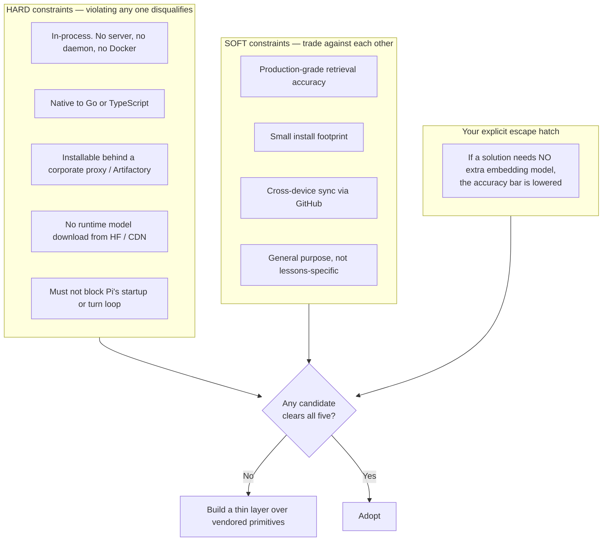

### 1.1 The corpus math changes everything

This is the single most important observation in this document, and almost every "which vector DB" article gets it wrong for your case.

A "lesson learned during development" is **one short document**: 300–1500 characters, self-contained, rarely needing chunking. A prolific engineer across several devices produces maybe **20–200 lessons/year**. Realistic corpus ceilings:

| Horizon | Lessons | Vectors @ 256d int8 | Brute-force cosine cost | Verdict |
|---|---|---|---|---|
| Year 1 | ~500 | 128 KB | 0.13 M MACs → **<0.5 ms** | trivial |
| Year 5, one person | ~5,000 | 1.3 MB | 1.3 M MACs → **~1–2 ms** | trivial |
| Whole team, shared repo | ~50,000 | 12.8 MB | 12.8 M MACs → **~15–25 ms** | still fine |
| You are wrong about scale | 500,000 | 128 MB | ~200 ms | *now* you need ANN |

**You do not need an ANN index. You do not need a vector database.** HNSW, IVF-PQ, DiskANN, `vec0` — all of it is machinery for a problem you will not have for a decade. A `Float32Array` and a `for` loop beat every one of them on total system complexity, and lose nothing until ~10⁵ vectors.

This reframes the whole evaluation: **the question is not "which vector DB", it is "which embedding function, and how do I fuse it with BM25".**

---

## 2. Part A — Pi coding agent: features and behaviours that constrain the design

Pi is Mario Zechner's minimal terminal agent harness, now developed under **Earendil Inc.** (repo moved `badlogic/pi-mono` → `earendil-works/pi`; npm `@mariozechner/pi-coding-agent` → `@earendil-works/pi-coding-agent`; docs at `pi.dev/docs`). It is deliberately minimal: <cite index="4-1">Pi ships with powerful defaults but skips features like sub agents and plan mode; instead you can ask pi to build what you want or install a third party pi package</cite>. There is **no MCP** in core — the documented answer is to build a CLI tool with a README (a *skill*) or write an extension that adds MCP.

### 2.1 Runtime facts that matter

| Fact | Source | Consequence for our design |
|---|---|---|
| Node **22.19+** required; also ships as standalone binary | install guides | `node:sqlite` exists but see §5.2 |
| Extensions are **TypeScript modules loaded via `jiti`** — no compile step | pi docs | Ship `.ts` directly; no build pipeline |
| The default-exported **factory is awaited before startup continues** | pi docs | **Never** load a model in the factory. Hard latency gate. |
| Docs explicitly warn: *do not start processes, sockets, file watchers or timers from the factory*; defer to `session_start` | pi docs | Lazy-init everything; register an idempotent `session_shutdown` |
| npm deps work via a `package.json` next to the extension; **pi packages install with `npm install --omit=dev`** | pi docs | Runtime deps must be in `dependencies`, not `devDependencies` |
| Install docs recommend `--ignore-scripts` | pi docs | **Any dependency with a postinstall binary fetch is a landmine** |
| Built-in tools truncate at **50 KB / 2000 lines** | pi docs | Retrieval output must be budgeted, not dumped |
| Tool calls run **in parallel by default** | pi docs | Index must be safe under concurrent reads |
| `--offline` / `PI_OFFLINE=1` disables all startup network ops | pi README | A well-behaved extension must respect offline mode |
| Runs on Windows, macOS, Linux, **Termux/Android** | pi docs | Native modules must have `android-arm64` prebuilds — most don't |

### 2.2 The event lifecycle and where a lessons extension hooks in

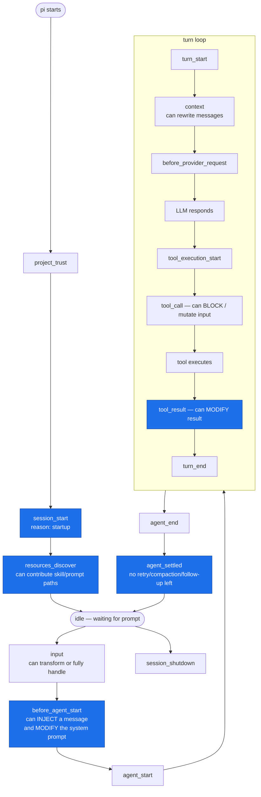

**Blue nodes are the four hooks a lessons extension should use:**

| Hook | Use | Latency budget |
|---|---|---|
| `session_start` | Warm the index in the background (`void warm()`, do **not** await) | 0 ms perceived |
| `before_agent_start` | **Auto-retrieve**: silently inject the top 3–5 relevant lessons as a persistent custom message | **≤ 30 ms** — runs on *every* user turn |
| `registerTool("lessons_search")` | **Explicit retrieve**: model-driven query, may afford a reranker | ≤ 300 ms — hidden by LLM latency |
| `agent_settled` | **Capture**: propose a new lesson from the finished turn; never block | async, off critical path |

`pi.appendEntry()` persists extension state in the session without spending LLM context — ideal for "which lessons were injected this session" dedup bookkeeping.

### 2.3 Prior art in the Pi ecosystem (and what it teaches)

| Package | Approach | Lesson for us |
|---|---|---|
| `pi-memory` (jayzeng) | Delegates to the **`qmd`** CLI (BM25 + vectors + LLM rerank via `node-llama-cpp` + GGUF) | Powerful, but pulls in a native llama runtime and a **first-run model download** — a corporate non-starter |
| `pi-hermes-memory` (chandra447) | **SQLite FTS5**, memories + skills, session indexing | Notably: *every write passes a scanner before being accepted* to stop the LLM being tricked into storing malicious content that resurfaces via search. **Copy this.** |
| `@mem0/pi-agent-plugin` | Cloud Mem0, semantic memory across devices | Solves cross-device the easy way — and fails your corporate/offline constraint |
| Obsidian extension (awesome-pi list) | LanceDB with vector + FTS + graph | Confirms LanceDB is usable from a Pi extension — at native-binary cost |
| A config-sync extension | Syncs Pi config via **Git**, WebDAV, R2, S3 | Git-as-sync is already an accepted pattern in this ecosystem |

Two of these wrap memory content in `<memory-context>` XML with a guard note ("NOT new user input"). That is a real mitigation for **retrieval-time prompt injection**, and it belongs in your design (§8.4).

---

## 3. Part B — The retrieval problem, honestly stated

### 3.1 Why hybrid, not dense-only

Lexical and dense retrieval fail in *complementary* ways, which is exactly why fusing them helps.

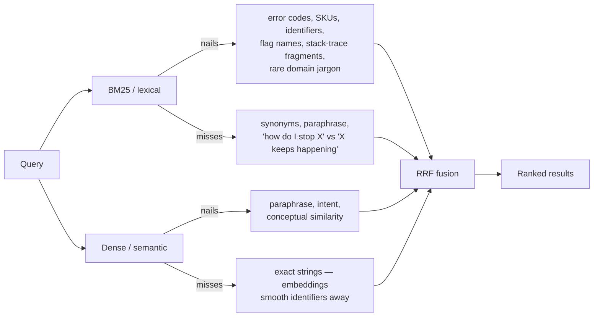

Your corpus is **developer lessons**, which is the single worst case for dense-only retrieval: it is dense with `ECONNRESET`, `--ignore-scripts`, `GOPROXY`, `vec0`, `useEffect`, ticket IDs and file paths. <cite index="31-1">A 2026 benchmark on financial documents with mixed text and tables confirmed this pattern empirically: BM25 outperformed state-of-the-art dense retrieval, because those documents are full of identifiers, numbers, and exact terminology that dense embeddings smooth over.</cite> Code and ops notes have the same shape.

Published effect sizes:

| Result | Source |
|---|---|
| <cite index="38-1">Tuned hybrid reaches 0.7497 NDCG on WANDS — a 7.4% lift over either BM25 (0.6983) or pure vector (0.6953) alone</cite> | denser.ai, 2026 |
| <cite index="36-1">Run BM25 and vector concurrently, fuse with RRF, and recall@10 goes from 65–78% to 91%; the fusion step takes 6 ms</cite> | supermemory, 2026 |
| <cite index="206-1">Contextual Embeddings + Contextual BM25 reduce failed retrievals by 49%; with reranking, by 67%</cite> | Anthropic, 2024 |
| <cite index="199-1">Across the 18 BEIR datasets, BM25 remains a highly competitive zero-shot method, outperforming most neural/sparse models in out-of-domain scenarios absent domain-specific adaptation</cite> | BEIR analyses |

**Design consequence:** BM25 is your *floor*, not your fallback. If the embedding tier is unavailable — corporate policy, cold start, model file missing — the system must degrade to BM25+fuzzy and still be genuinely useful. That is also precisely the "no extra embedding model, lower quality bar" tier you asked about.

### 3.2 RRF, and why not weighted score blending

```
RRF(d) = Σ_i  w_i / (k + rank_i(d)),   k = 60
```

<cite index="32-1">RRF operates on ranks not scores, which solves the score-incompatibility problem that makes naïve weighted averaging fail in production RAG pipelines.</cite> BM25 scores are unbounded and corpus-dependent; cosine is in [-1, 1]. Min-max normalising them per query makes the fusion depend on the *worst* result in each list — unstable. Use RRF as the default, and only reach for weighted blending after you have an eval harness (§9).

Practical refinement worth adding once you measure: <cite index="29-1">weight BM25 at 0.8+ for exact lookups like error codes, vectors at 0.8+ for conceptual queries, 50/50 for mixed intent</cite> — routed by a cheap regex pre-pass that detects identifier-shaped queries (`/[A-Z]{2,}[_-]|::|\.\w+\(|^[a-z]+\/[a-z]+$/`).

---

## 4. Part C — The candidate landscape

```mermaid
flowchart TB
    ROOT["Embedded hybrid retrieval"]

    ROOT --> TS["TypeScript / Node"]
    ROOT --> GO["Go"]

    TS --> TS_PURE["Pure JS, no native code"]
    TS --> TS_WASM["WASM"]
    TS --> TS_NAT["Native addon / NAPI"]
    TS --> TS_PROC["External process"]

    TS_PURE --> MS["minisearch — BM25+, fuzzy, 7 kB"]
    TS_PURE --> FS["flexsearch — fastest, not BM25"]
    TS_PURE --> OR["orama — fulltext + vector + hybrid, 0 deps"]
    TS_PURE --> VX["vectra — file-backed vectors + BM25"]

    TS_WASM --> SQLW["sql.js / wa-sqlite + FTS5"]
    TS_WASM --> TERN["@ternlight/base — embedding model IN the wasm"]

    TS_NAT --> BS3["better-sqlite3 + sqlite-vec"]
    TS_NAT --> LDB["@lancedb/lancedb"]
    TS_NAT --> HNSW["hnswlib-node / embedded-vector-db"]
    TS_NAT --> ORT["onnxruntime-node + transformers.js"]

    TS_PROC --> QMD["qmd CLI — BM25 + vec + LLM rerank"]
    TS_PROC --> SRV["Qdrant / Meilisearch / Typesense"]

    GO --> GO_PURE["Pure Go, CGO_ENABLED=0"]
    GO --> GO_CGO["cgo required"]

    GO_PURE --> BLV["bleve — text only without the vectors tag"]
    GO_PURE --> CHM["chromem-go — in-RAM brute force"]
    GO_PURE --> NCR["ncruces/go-sqlite3 + sqlite-vec WASM"]

    GO_CGO --> SVEC["mattn/go-sqlite3 + sqlite-vec"]
    GO_CGO --> BLVV["bleve + FAISS, vectors tag"]
    GO_CGO --> LIBSQL["go-libsql — DiskANN, no Windows"]
    GO_CGO --> DUCK["DuckDB + VSS"]

    classDef ok fill:#1a7f37,color:#fff
    classDef warn fill:#9a6700,color:#fff
    classDef bad fill:#a40e26,color:#fff
    class MS,OR,TERN,CHM,BLV ok
    class VX,FS,SQLW,NCR,LDB,BS3 warn
    class SRV,QMD,ORT,HNSW,SVEC,BLVV,LIBSQL,DUCK bad
```

Green = survives corporate + offline + all-platforms. Amber = survives with work. Red = fails at least one hard constraint.

### 4.1 TypeScript candidates in detail

**`minisearch` v7.2** — ~1.7 M weekly downloads, ~7 kB gzipped, **zero external dependencies**, <cite index="171-1">full-text search with BM25 scoring, fuzzy search with configurable edit-distance thresholds, prefix search, field boosting, and filtering by document attribute</cite>. Index is JSON-serialisable (`toJSON` / `loadJSON`) so cold start is a parse, not a re-tokenise. No vectors — by design. This is the highest-confidence component in the entire report.

**`orama` v3.1.18** — zero dependencies, <cite index="37-1">full-text, vector and hybrid search, BM25, typo tolerance, stemming and tokenisation in 30 languages, plugin system</cite>. Genuinely does hybrid in one library. Two cautions: (a) last publish was ~7 months ago and the company's focus has moved to OramaCore (Rust) and cloud; (b) a well-documented footgun — <cite index="124-1">by default Orama sets `threshold` to 1, meaning all results matching ANY term are returned</cite>, i.e. OR-mode by default, which quietly bloats result sets. Vector search is brute-force, which is *correct* at your scale.

**`vectra`** (stevenic, v0.15.0) — <cite index="33-1">a lightweight, file-backed vector database for Node.js and browsers with Pinecone-compatible filtering and hybrid BM25 search</cite>. Closest single-package fit to "file-backed hybrid". Small maintainer surface; audit before adopting.

**`embedded-vector-db`** — <cite index="30-1">hybrid search combining semantic vector search with BM25, RRF fusion, persistent storage, built on top of hnswlib-node</cite>. `hnswlib-node` is a native addon → prebuild download → corporate risk, and no Termux build. Fails hard constraint 3.

**`@lancedb/lancedb`** — the strongest *feature* story: <cite index="81-1">hybrid search combining semantic and full-text search via a reranker; the default is RRFReranker, and Cohere / CrossEncoder / custom rerankers are available</cite>, with a first-class TypeScript API (`.query().fullTextSearch(...).nearestTo(vec).rerank(r).limit(10)`). FTS is Tantivy. Cost: NAPI native binaries per platform, tens of MB, no Termux, and an index format that is a directory of Arrow/Lance files — hostile to git.

**SQLite paths** — see §5.2, they have a specific and nasty failure mode.

**`qmd`** (`@tobilu/qmd`) — architecturally the closest thing to what you want: <cite index="223-1">QMD combines BM25 full-text search, vector semantic search, and LLM re-ranking, all running locally via node-llama-cpp with GGUF models</cite>, with <cite index="223-1">smart chunking that uses a scoring algorithm to find natural markdown break points, keeping sections, paragraphs and code blocks together, with code-fence protection</cite>, plus LLM query expansion. It's a CLI, so integration is `pi.exec`. Blocked by: `node-llama-cpp` native binaries + a **first-run GGUF download** (`pi-memory`'s own README warns "the very first embed downloads the embedding model"). Steal the chunking algorithm; don't ship the dependency.

### 4.2 Go candidates in detail

An April–May 2026 head-to-head benchmark (100k docs, 1024-d, 1k queries, M2 Pro) is the best public data:

| Engine | Build | Index on disk | RAM at query | p50 | p95 | recall@10 |
|---|---|---|---|---|---|---|
| chromem-go | pure Go | in-RAM only | ~1.3 GB | 38 ms | 71 ms | 1.00 (brute force) |
| sqlite-vec via `mattn/go-sqlite3` | **CGO** | 412 MB | ~85 MB | 1.7 s | 2.4 s | 1.00 |
| Bleve HNSW | *see below* | 1.6 GB | ~280 MB | 22 ms | 41 ms | 0.93 |
| LanceDB-go (IVF-PQ) | **CGO** | 540 MB | ~120 MB | 6 ms | 14 ms | 0.96 |

<cite index="80-1">chromem-go is fast but RAM-greedy — 100k × 1024 × float32 ≈ 410 MB of raw vectors plus overhead; past ~250k vectors on a 4 GB laptop you'll OOM. sqlite-vec is the slowest by 2–3 orders of magnitude because it's brute force — fine for offline/batch/local-CLI, not for a chat UI.</cite>

**Correction to the popular summary.** That article's TL;DR says "lexical + vector in one engine, pure-Go: use Bleve." **Bleve's vector search is not pure Go.** From Bleve's own docs: <cite index="135-1">a `vectors` GO TAG needs to be set for bleve to access all the supporting code, and this tag must be set only after the FAISS shared library is made available; failure to do either will inhibit you from using this feature.</cite> Each Bleve release pins a **specific fork checkpoint** of `blevesearch/faiss` (v2.5.0 → `352484e`, v2.6.0 → `fff814d`), which you must build with cmake and install to `/usr/local/lib`. That is cgo + a C++ build + a shared-library deploy story on every developer machine — categorically incompatible with "corporate laptop, no toolchain".

Bleve's **text** search is genuinely pure Go and excellent. Its hybrid model is simple and worth knowing: <cite index="135-1">hybrid searches union results from `query` with results from `knn`, and the FTS scores from exact searches are summed with the similarity distances: `aggregate_score = (query_boost × query_hit_score) + (knn_boost × knn_hit_distance)`</cite> — with <cite index="135-1">advanced score fusion strategies available from v2.5.4+</cite> and <cite index="135-1">pre-filtered vector and hybrid search from v2.4.3+</cite>.

**chromem-go** — <cite index="149-1">embeddable vector database for Go with a Chroma-like interface and zero third-party dependencies, in-memory with optional persistence; 1,000 documents in 0.3 ms and 100,000 in 40 ms</cite>, exhaustive cosine NN with metadata and substring document filtering. <cite index="149-1">Still in beta, under heavy construction, may introduce breaking changes before v1.0.0.</cite> No BM25 — its "full-text filter" is substring containment.

**sqlite-vec in Go, without cgo** — `asg017/sqlite-vec-go-bindings` has a **WASM** path for `ncruces/go-sqlite3`, sidestepping cgo entirely. Caveat from the sqlite-vec v0.1.7 release notes: <cite index="76-1">the documentation site is stale, docs are out-of-date, and some old Go/ncruces bindings are paused.</cite> Verify before betting on it.

**go-libsql** — best raw numbers (DiskANN + int8 quantisation, millisecond latency at 1M) but <cite index="80-1">CGO required, Linux and macOS only, no Windows support today</cite>. Disqualified.

---

## 5. Part D — The deep comparison matrices

### 5.1 Matrix 1 — TypeScript / Node candidates

Scoring: ✅ good · ⚠️ conditional · ❌ blocking. "Corp install" = installs cleanly through Artifactory/Nexus with `--ignore-scripts` and no direct internet.

| # | Candidate | Kind | BM25 | Vector | Hybrid built-in | Fuzzy / typo | Native deps | Corp install | Air-gap | Termux / Win | Cold start | Disk | Git-friendly index | Maint. health | Licence | Fit |
|---|---|---|---|---|---|---|---|---|---|---|---|---|---|---|---|---|
| 1 | **minisearch 7.2** | pure JS | ✅ BM25+ | ❌ | ❌ | ✅ edit-dist + prefix | none | ✅ | ✅ | ✅ | <5 ms | 7 kB | ✅ JSON | ✅ 1.7 M dl/wk | MIT | **9/10 as lexical half** |
| 2 | **orama 3.1** | pure JS | ✅ | ✅ brute | ✅ `mode:'hybrid'` | ✅ tolerance | none | ✅ | ✅ | ✅ | ~10 ms | ~2 kB core | ⚠️ custom persist | ⚠️ 7 mo since publish | Apache-2.0 | **8/10** |
| 3 | **vectra 0.15** | pure JS | ✅ | ✅ brute | ✅ | ⚠️ | none | ✅ | ✅ | ✅ | fast | small | ✅ file-backed | ⚠️ small project | MIT | 7/10 |
| 4 | flexsearch 0.8 | pure JS | ❌ contextual scoring | ❌ | ❌ | ✅ | none | ✅ | ✅ | ✅ | fast | small | ⚠️ | ✅ 1.3 M dl/wk | Apache-2.0 | 5/10 — not BM25 |
| 5 | **node:sqlite + FTS5** | built-in | ✅ FTS5 bm25() | ❌ | ❌ | ⚠️ trigram | none | ✅ | ✅ | ✅ | fast | 0 | ❌ binary db | ✅ Node core | — | ⚠️ **FTS5 roulette, §5.2** |
| 6 | better-sqlite3 + sqlite-vec | NAPI | ✅ | ✅ brute | ❌ manual | ⚠️ | **yes** | ❌ prebuild-install → GitHub Releases | ⚠️ | ❌ no Termux | ~30 ms | ~10 MB | ❌ | ✅ | MIT | 4/10 |
| 7 | **@lancedb/lancedb** | NAPI | ✅ Tantivy | ✅ IVF-PQ | ✅ RRF + rerankers | ✅ | **yes** | ⚠️ npm platform pkgs OK | ✅ | ❌ | 100 ms+ | 50–100 MB | ❌ directory | ✅ active | Apache-2.0 | 5/10 — best features, worst footprint |
| 8 | embedded-vector-db | NAPI | ✅ | ✅ HNSW | ✅ RRF | ⚠️ | **yes** | ❌ | ⚠️ | ❌ | ~50 ms | ~15 MB | ❌ | ⚠️ | MIT | 3/10 |
| 9 | sql.js-fts5 / wa-sqlite | WASM | ✅ | ❌ | ❌ | ⚠️ | none | ✅ | ✅ | ✅ | ~80 ms | ~1.5 MB | ❌ | ⚠️ | MIT | 5/10 |
| 10 | qmd CLI (`@tobilu/qmd`) | subprocess | ✅ FTS5 | ✅ GGUF | ✅ + LLM rerank + query expansion | ✅ | **yes** node-llama-cpp | ❌ | ❌ downloads GGUF | ❌ | 300 ms+ | 100 MB+ | ❌ | ✅ active | MIT | 3/10 — great ideas, wrong shape |
| 11 | Qdrant / Meilisearch / Typesense | server | ✅ | ✅ | ✅ | ✅ | server | ❌ | ⚠️ | ❌ | seconds | 100 MB+ | ❌ | ✅ | mixed | **0/10 — violates in-process** |
| 12 | Mem0 / Orama Cloud / CF AI Search | SaaS | ✅ | ✅ | ✅ | ✅ | none | ⚠️ | ❌ | ✅ | network | 0 | n/a | ✅ | — | **0/10 — data egress** |
| 13 | **Custom: minisearch + static embeddings + RRF** | pure JS | ✅ | ✅ brute | ✅ RRF you own | ✅ | none | ✅ | ✅ | ✅ | **~20 ms** | 7 kB + 8–30 MB table | ✅ packed bin | you | MIT | **10/10** |

### 5.2 The `node:sqlite` FTS5 trap — verify, never assume

This one deserves its own callout because it silently degrades hybrid search to vector-only in shipping products.

Node's built-in SQLite has historically been compiled **without FTS5**. Reports through **April 2026** confirm it across the 22.x and 23.x lines: <cite index="102-1">on Node.js v23.11.0 the built-in SQLite (v3.49.1) is not compiled with ENABLE_FTS5, causing FTS5-based keyword search to fail silently; this means the keyword/BM25 fallback in hybrid memory search is completely non-functional</cite>. <cite index="100-1">Any code path relying on node:sqlite for FTS5 virtual tables silently degrades to vector-only search.</cite> A `--sqlite-enable-fts5` configure option exists, but official binaries are what your users have.

**I tested it during this research.** On Node **v22.22.2** (bundled SQLite 3.51.2, `node_shared_sqlite: false`):

```
FTS5:  AVAILABLE
RTREE: AVAILABLE
sqlite_version: 3.51.2
```

So it *has* been enabled somewhere between 22.14 and 22.22 — but the failure is version-dependent, silent, and your users span Node versions, distro builds, Homebrew, nvm, mise, and the Pi standalone binary.

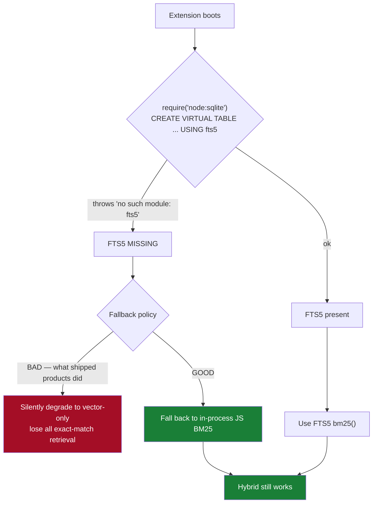

**Rule: if you use SQLite at all, feature-detect FTS5 at startup and fall back to a JS BM25 index — never to vector-only.** This is a strong argument for making the JS BM25 index the *primary* path and SQLite the optional accelerator.

### 5.3 Matrix 2 — Go candidates

| # | Candidate | Pure Go | BM25 | Vector | Hybrid | Windows | Termux/arm | Single binary | Corp build | Scale sweet spot | Maturity | Fit |
|---|---|---|---|---|---|---|---|---|---|---|---|---|
| 1 | **bleve (text only)** | ✅ | ✅ | ❌ | ❌ | ✅ | ✅ | ✅ | ✅ | any | ✅ 11k★, mature | **8/10 as lexical half** |
| 2 | bleve + FAISS (`-tags vectors`) | ❌ cgo + C++ build | ✅ | ✅ IVF/SQ/RaBitQ | ✅ score sum + fusion strategies | ⚠️ linker issues reported | ❌ | ❌ | ❌ needs cmake + pinned FAISS fork | 10⁵–10⁷ | ✅ | 3/10 |
| 3 | **chromem-go** | ✅ zero deps | ❌ substring only | ✅ brute | ❌ | ✅ | ✅ | ✅ | ✅ | <100k | ⚠️ pre-1.0 beta | **7/10 as vector half** |
| 4 | ncruces/go-sqlite3 + sqlite-vec (WASM) | ✅ | ✅ FTS5 | ✅ | ⚠️ manual | ✅ | ✅ | ✅ | ✅ | 10⁴–10⁶ | ⚠️ bindings "paused" | 6/10 |
| 5 | mattn/go-sqlite3 + sqlite-vec | ❌ cgo | ✅ | ✅ brute | ⚠️ manual | ✅ | ⚠️ | ✅ | ⚠️ needs gcc | 10⁴–10⁶ | ✅ | 5/10 |
| 6 | go-libsql | ❌ cgo | ✅ | ✅ DiskANN | ⚠️ | ❌ **no Windows** | ❌ | ✅ | ⚠️ | 10⁶+ | ⚠️ young | 2/10 |
| 7 | DuckDB + VSS | ❌ cgo | ✅ FTS ext | ✅ HNSW | ⚠️ manual | ✅ | ❌ | ✅ | ⚠️ | analytics | ✅ | 3/10 |
| 8 | LanceDB-go | ❌ cgo | ✅ | ✅ IVF-PQ | ✅ | ⚠️ | ❌ | ⚠️ | ❌ | 10⁵–10⁸ | ⚠️ Go bindings thin | 3/10 |
| 9 | **Custom: bleve-text (or own BM25) + static embeddings + RRF** | ✅ | ✅ | ✅ brute | ✅ yours | ✅ | ✅ | ✅ | ✅ | <10⁵ | you | **10/10** |

### 5.4 Matrix 3 — Embedding backends (the actual decision)

This is where the real trade lives. All figures are from vendor docs / published evals; the SciFact column is `NDCG@10`.

| # | Backend | Runtime needed | Wire size | Model download at runtime | Latency / embed | Dim | Max input | Quality signal | Corp-safe | Fit |
|---|---|---|---|---|---|---|---|---|---|---|
| 0 | **None (BM25 + fuzzy only)** | — | 0 | no | 0 | — | — | Strong zero-shot baseline on BEIR | ✅✅ | **Your lowered-bar tier** |
| 1 | **model2vec `potion-base-8M`, PCA→128d, int8** | none — gather + mean | **~4.2 MB** total incl. vocab+scales | **no** (vendored) | **<1 ms** | 128–512 | unbounded | See eval below | ✅✅ | **Recommended default** |
| 2 | model2vec `potion-retrieval-32M` | none | ~30 MB fp32 / ~8 MB int8 | no | <1 ms | 512 | unbounded | <cite index="44-1">most performant static retrieval model, 81.69% of all-MiniLM-L6-v2 with a retrieval score of 35.06 while being orders of magnitude faster</cite> | ✅✅ | Recommended for quality tier |
| 3 | **`@ternlight/base`** | WASM SIMD, bundled | **7.2 MB gz** | **no — model is inside the .wasm** | 5.1 ms p50, ~195/s | 384 | **128 tok** | Spearman 0.844 vs MiniLM; **SciFact 0.465** | ✅ | Good, but see risk note |
| 4 | `@ternlight/mini` | WASM SIMD | 5.0 MB gz | no | 2.5 ms, ~400/s | 384 | 128 tok | Spearman 0.820; SciFact 0.439 | ✅ | ditto |
| 5 | transformers.js + `onnxruntime-node`, MiniLM q8 | ONNX native | ~23 MB model + runtime | **yes by default** (HF CDN) | 5–20 ms | 384 | 512 | all-MiniLM-L6-v2 **SciFact 0.645** | ❌ postinstall fetch | 4/10 |
| 6 | transformers.js **with vendored local model** | ONNX native | ~23 MB + ~40 MB runtime | no (`allowRemoteModels=false`, `localModelPath`) | 5–20 ms | 384 | 512 | same | ⚠️ still a native addon | 5/10 |
| 7 | `node-llama-cpp` + GGUF (the qmd path) | native llama | 100 MB+ | yes | 10–50 ms | varies | large | high | ❌ | 2/10 |
| 8 | **Corporate LLM gateway `/embeddings`** | HTTP | 0 | n/a | 30–200 ms network | 1536 | 8k | best available | ⚠️ if approved | **Great opt-in tier** |
| 9 | Public API (OpenAI/Voyage/Cohere) | HTTP | 0 | n/a | 50–300 ms | 1024–3072 | large | best | ❌ egress | 0/10 |

#### The honest counter-evidence on static embeddings

Two independent 2026 evaluations point in opposite directions, and the difference is *entirely* about whether you fuse with keyword search.

**Against, semantic-only** — a blogger who tested potion against MiniLM on his own site: <cite index="67-1">I tested the potion models (2M, 4M, 8M) against MiniLM-L6-v2 on my actual content, and the results were disappointing. For "improving search on a static site", MiniLM correctly finds the two search-related posts; all three potion models miss both entirely. On "design systems", potion returns the 404 page, Privacy Policy, and Colophon — pages with short generic text that become false attractors after mean pooling.</cite> Jaccard overlap with MiniLM's top results: ~32%.

**For, hybrid** — a rigorous 30-query eval with a pre-registered ship rule found the winning configuration to be **potion-base-8M, PCA-truncated to 128 dims, 600-char chunks with 120 overlap, title-prefixed, RRF-fused with a keyword ranking**:

| Arm | Download | recall@1 | recall@3 | MRR@10 |
|---|---|---|---|---|
| potion-base-8M 128d + RRF with keyword | **4.21 MB** | **0.717** | **0.967** | **0.944** |
| MiniLM-L6-v2, ONNX q8 (semantic only) | 23.10 MB | 0.700 | — | — |

**Reading both together:** static embeddings alone are mediocre and have a specific pathology — *short generic documents become false attractors under mean pooling*. Fused with BM25 via RRF, they beat a 5.5×-larger ONNX transformer on the same corpus. Two mitigations fall directly out of this: **(a) always fuse; (b) prefix each lesson's embedded text with its title/tags**, which is exactly what the winning arm did.

#### The honest caution on ternlight

Ternlight is the most exciting *new* option (July 2026) and the best fit on paper: <cite index="196-1">model + BERT tokenizer + engine in a single .wasm — no postinstall step, no runtime fetch</cite>, MIT, works in Node ≥18, browsers, Workers, Deno and Bun. But read its own numbers carefully:

| | mini | base | teacher (all-MiniLM-L6-v2) |
|---|---|---|---|
| Spearman vs teacher | 0.820 | 0.844 | 1.000 |
| **SciFact NDCG@10** | 0.439 | **0.465** | **0.645** |

A 0.844 STS-style correlation with the teacher translates to a **~28% relative drop in retrieval quality** on SciFact. High sentence-similarity correlation does not imply retrieval parity — that is a general lesson worth internalising. And the project is ~1 month old with **5 GitHub stars, 48 commits, one contributor**. If you adopt it: vendor it, pin the exact version, and gate it behind your own eval.

### 5.5 The quality-vs-footprint frontier

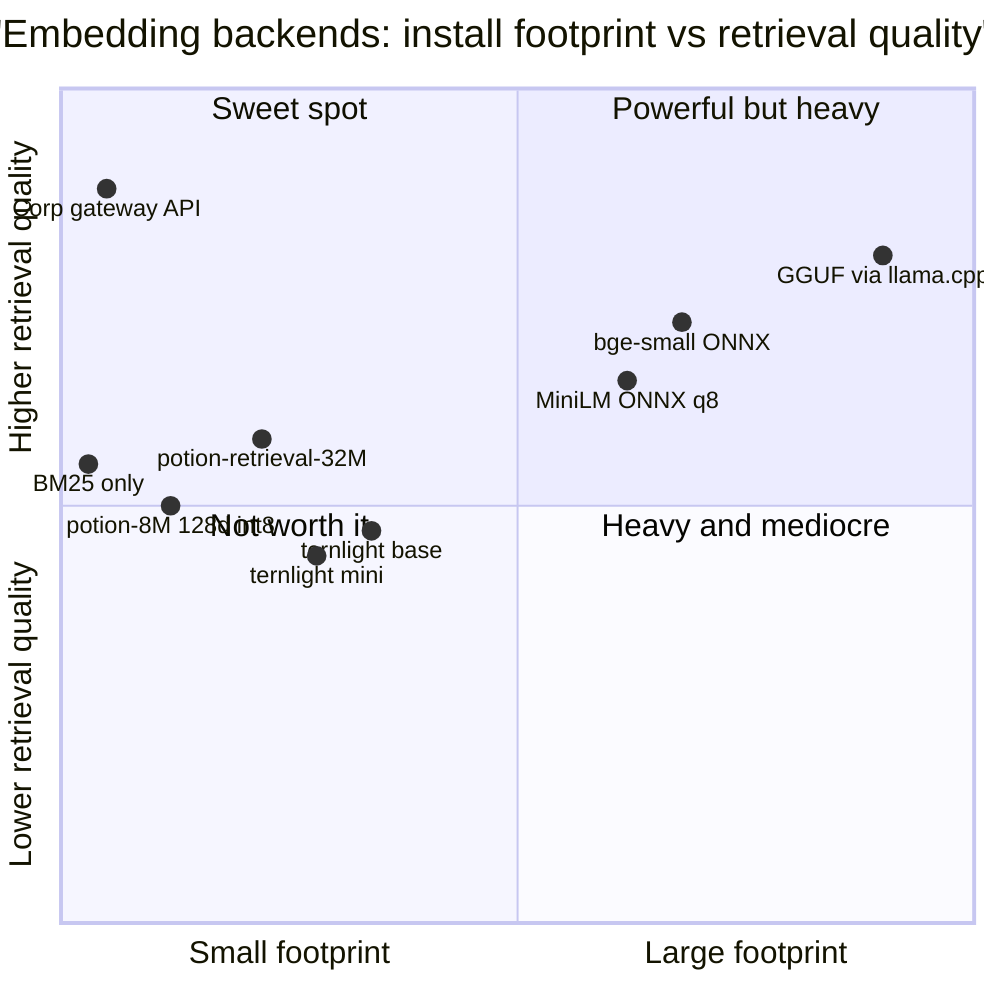

Note where **BM25-only** sits: cheaper than everything and *above* both ternlight tiers on identifier-heavy corpora. That is not a joke — it is the strongest argument for your "lower the bar if no embedding model" clause.

---

## 6. Part E — Corporate network availability (the complementary research)

This is where most candidates actually die. The failure is rarely "the library doesn't work" — it's "the install can't complete".

### 6.1 The four distribution mechanisms, ranked by corporate survivability

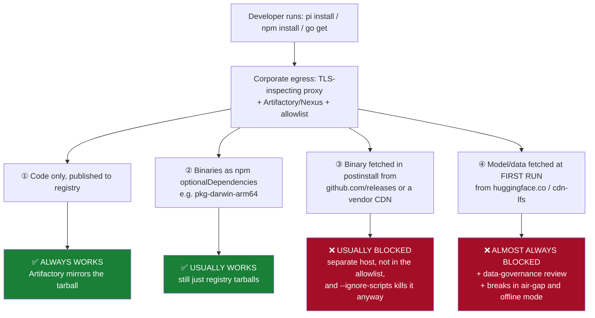

Concrete evidence for ③: the transformers.js install failure is a classic — <cite index="127-1">the issue is due to onnxruntime-node not using HTTP_PROXY and HTTPS_PROXY environment variables in the post installation script</cite>, with the install dying on `Downloading "https://github.com/microsoft/onnxruntime/releases/download/…"`. The eventual fix requires users to set `GLOBAL_AGENT_HTTP_PROXY`/`GLOBAL_AGENT_HTTPS_PROXY` — a thing nobody discovers on their own. And `node-pre-gyp`'s remote path handling has a long history of not composing with an Artifactory subpath.

Concrete evidence for ④: transformers.js <cite index="126-1">by default downloads the model files on first run and caches them in ./node_modules/@huggingface/transformers/.cache/</cite>. You can disable it (`env.allowRemoteModels = false`, `env.localModelPath`, `env.remoteHost`), but then *you* own shipping ~23 MB of ONNX through your package — at which point the static-embedding table at 4 MB is strictly better.

**Pi makes this worse in a good way**: its own install docs recommend `--ignore-scripts`, and pi packages install with `npm install --omit=dev`. An extension whose retrieval silently breaks under `--ignore-scripts` is an extension that breaks for exactly the users who need it most.

### 6.2 Matrix 4 — Corporate-network readiness

| Candidate | Registry-only install | Survives `--ignore-scripts` | Survives TLS-inspection | Air-gapped `npm ci` from vendored tarballs | Zero runtime egress | Data leaves the machine | Verdict |
|---|---|---|---|---|---|---|---|
| minisearch | ✅ | ✅ | ✅ | ✅ | ✅ | no | ✅ |
| orama | ✅ | ✅ | ✅ | ✅ | ✅ | no | ✅ |
| vectra | ✅ | ✅ | ✅ | ✅ | ✅ | no | ✅ |
| model2vec table vendored in your pkg | ✅ | ✅ | ✅ | ✅ | ✅ | no | ✅ |
| @ternlight/base | ✅ | ✅ | ✅ | ✅ | ✅ | no | ✅ |
| node:sqlite | n/a built-in | ✅ | ✅ | ✅ | ✅ | no | ✅ (but FTS5 roulette) |
| sqlite-vec (npm platform pkgs) | ✅ | ✅ | ✅ | ⚠️ version skew between `sqlite-vec` and platform pkgs | ✅ | no | ⚠️ |
| better-sqlite3 | ⚠️ prebuild-install → GitHub | ❌ | ⚠️ | ❌ | ✅ | no | ❌ |
| @lancedb/lancedb | ✅ NAPI platform pkgs | ✅ | ✅ | ✅ | ✅ | no | ⚠️ size/platforms |
| hnswlib-node | ❌ node-gyp build | ❌ | ⚠️ | ❌ | ✅ | no | ❌ |
| onnxruntime-node / transformers.js | ❌ | ❌ | ❌ known proxy bug | ❌ | ❌ HF CDN | no | ❌ |
| node-llama-cpp + GGUF (qmd) | ❌ | ❌ | ❌ | ❌ | ❌ | no | ❌ |
| Any SaaS memory/vector API | ✅ | ✅ | ✅ | ❌ | ❌ | **yes** | ❌ |

### 6.3 Go-side corporate notes

| Concern | Detail | Mitigation |
|---|---|---|
| Module proxy | <cite index="237-1">A GOPROXY controls the source of your Go module downloads and can help assure builds are deterministic and secure</cite>; Artifactory only resolves Go from **virtual** repos | `GOPROXY=https://…/artifactory/api/go/go-virtual` |
| Private modules | <cite index="235-1">Forgetting GOPRIVATE is the most frequent mistake — Go sends the request to the proxy, which returns 404 or an auth error</cite> | Set `GOPRIVATE` + `GONOSUMDB` for internal paths only |
| Checksums | <cite index="234-1">Using GONOSUMCHECK on public code defeats the security model — checksums are the trust anchor</cite> | Never disable for public modules |
| cgo | Requires a C toolchain on every dev machine; corporate images often lack one, and cross-compilation breaks | **Design for `CGO_ENABLED=0`.** This alone eliminates bleve-vectors, go-libsql, DuckDB, LanceDB-go, mattn+sqlite-vec |

### 6.4 GitHub as the metadata store, under corporate conditions

Your durable store is GitHub. Things to design around:

| Risk | Impact | Mitigation |
|---|---|---|
| `github.com` allowed but `api.github.com` blocked (or vice versa) | REST-API sync fails while `git` works | **Prefer plain `git` over the REST API.** Git reuses the credential helper, SSO'd PAT, and proxy config the developer already has working |
| SAML/SSO-enforced org requires PAT authorisation | Silent 403 on push | Detect and surface once, with the exact `gh auth`/PAT instruction |
| GitHub Enterprise Server, not github.com | Hardcoded hostnames break | Make the remote a config value; never hardcode `github.com` |
| Corporate policy forbids source-adjacent data leaving the repo boundary | Lessons may contain secrets/PII | Redaction pass on capture (§8.4) + `.gitattributes` + opt-in per-repo |
| Proxy needs `http.proxy` | `git push` hangs | Read `git config --get http.proxy` and `HTTPS_PROXY`; never invent your own HTTP client |
| Pi's `--offline` / `PI_OFFLINE=1` | User has explicitly asked for no network | **Honour it.** Local index only; queue the push |

---

## 7. Part F — The recommended build

Since nothing fits, here is the design. It is small enough that a first working version is a weekend, and the parts you don't want you can delete.

### 7.1 System architecture

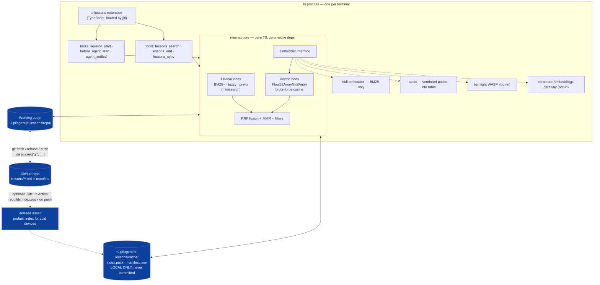

### 7.2 Why "no database" is the right call here

| Alternative | Why not |
|---|---|
| SQLite + FTS5 + sqlite-vec | FTS5 availability roulette (§5.2); binary file is hostile to git diff/merge; native extension loading adds a platform matrix |
| LanceDB | Directory-of-Arrow-files, native binaries, ~50–100 MB, no Termux |
| Orama with its persistence plugin | Fine, and a legitimate alternative — but you'd still write the RRF, the sync and the packing yourself, so you gain a dependency and lose control of the on-disk format |
| Files + in-memory index | Rebuild of 5,000 short docs is ~50 ms; packed cache makes cold start ~20 ms; every file is a human-readable, diffable, merge-free Markdown doc |

### 7.3 On-disk formats

**Repo (committed, human-readable, merge-free):**

```
lessons/
  2026/08/01HKY9Q7X4M2N8VJ3D5R6T7W8.md     # ULID filename → no filename collisions ever
  2026/08/01HKY9R2A8B1C4D7E0F3G6H9J2.md
manifest.json                               # {schema, embedder:{id,dims,quant}, count}
.pi-lessons/                                # optional prebuilt artifacts, CI-generated
  index.pack
```

Each lesson file:

```markdown
---
id: 01HKY9Q7X4M2N8VJ3D5R6T7W8
created: 2026-08-01T09:12:44Z
device: mbp-work
repo: acme/payments-api
tags: [node, npm, corporate-proxy]
title: npm install fails behind Artifactory when a package uses prebuild-install
supersedes: null
---
prebuild-install fetches binaries from github.com/<org>/<repo>/releases, which the
egress allowlist blocks. Symptom is a 1-second hang then ETIMEDOUT inside postinstall.
Fix: prefer packages that ship binaries as npm optionalDependencies, or set
`npm config set ignore-scripts true` and vendor the binary.
```

**Local cache (never committed) — `index.pack`, a single little-endian binary blob:**

| Section | Type | Notes |
|---|---|---|
| header | 64 B | magic, schema version, embedder id hash, dims, N, quant flag |
| ids | UTF-8 + offsets | ULIDs, doc order = row order |
| vectors | `int8[N × dims]`, C order | **single global scale** — see the gotcha below |
| lexical | minisearch `toJSON()` | avoids re-tokenising on cold start |
| meta | JSON | tags, repo, mtime, content hash for incremental rebuild |

### 7.4 Two implementation gotchas that will cost you a day each

Both come from a 2026 write-up by someone who did exactly this in JavaScript and verified against the Python reference:

**(1) You never need to dequantise the document matrix.** <cite index="185-1">Cosine similarity is invariant to a positive per-row scale, and every row of docs.bin was quantized with the same global scale, so that scale is a constant factor across every document's score — it cannot change the ranking. A Float32Array query vector dotted directly against the raw int8 document rows produces the same ranking as dotting against the dequantized float32 rows, to within 1e-6.</cite>

**(2) `int8 @ int8` wraps silently.** <cite index="185-1">A 300-dimension dot product of two int8 vectors whose true value is 3,000,000 does not throw, does not produce NaN, and does not saturate — it wraps and can return something like -64. There is no exception to catch. The fix is structural: accumulate into a Float32Array or a plain JS number, never into an Int8Array or Int32Array sized to the inputs.</cite>

**The three tokenizer traps** if you re-implement model2vec's tokenizer rather than shipping a WASM one:

1. <cite index="185-1">No `[CLS]`/`[SEP]` — `tokenize()` calls encode with `add_special_tokens=False`; the TemplateProcessing post-processor in tokenizer.json is a decoy left over from the tokenizer's BERT ancestry.</cite>
2. <cite index="185-1">`[UNK]` ids are deleted, not embedded — model2vec filters unk_token_id out of the id list entirely. A fully out-of-vocabulary query tokenizes to an empty id list, and mean-pooling zero rows must yield a zero vector rather than throwing.</cite>
3. <cite index="185-1">Accents are stripped even though tokenizer.json sets `"strip_accents": null` — HuggingFace's BertNormalizer treats a null strip_accents as "inherit from lowercase", and lowercase is true. So `café` and `cafe` tokenize identically.</cite>

And one packing subtlety: <cite index="185-1">token rows carry the model's zipf/SIF-style downweighting in their magnitude — that's how it downweights "the" without a stopword list — so a single global scale would destroy that signal; each token row needs its own float32 scale.</cite> Document rows, being L2-normalised, share one global scale. Two different quantisation regimes in the same file; don't unify them.

The whole forward pass is four lines: <cite index="185-1">tokenize to WordPiece ids with no special tokens; gather one embedding row per id; mean-pool the unnormalized rows; L2-normalize the pooled result.</cite>

### 7.5 Ingestion pipeline

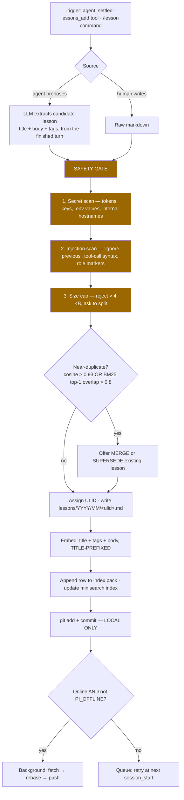

**Title-prefixing is not cosmetic** — it was the winning arm's configuration in the eval above, and it directly counteracts the "short generic documents become false attractors under mean pooling" pathology.

**Chunking:** a lesson is one chunk. If a lesson exceeds ~600 characters, apply qmd's insight rather than a fixed window: <cite index="223-1">instead of cutting at hard token boundaries, use a scoring algorithm to find natural markdown break points, keeping sections, paragraphs and code blocks together, with code-fence protection so break points inside code blocks are ignored</cite>.

### 7.6 Retrieval pipeline

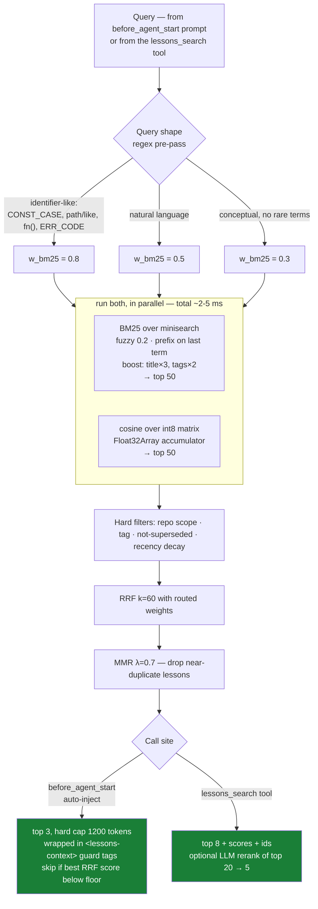

**The "skip if below floor" branch is the most important box on this diagram.** An auto-injector that always injects something is a context-poisoning machine. Injecting nothing must be the common case.

### 7.7 GitHub sync — merge-free by construction

```mermaid
sequenceDiagram
    autonumber
    participant D1 as Device A (laptop)
    participant GH as GitHub repo
    participant D2 as Device B (desktop)

    Note over D1,D2: Design invariant — one lesson = one file, ULID name.<br/>Adds never conflict. Edits are rare. Deletes are tombstones.

    D1->>D1: capture lesson → write lessons/2026/08/&lt;ulidA&gt;.md
    D1->>D1: git commit (local, always succeeds)
    D1->>GH: git fetch && git rebase && git push
    Note right of D1: rebase of pure-add commits is a fast-forward;<br/>no textual conflict is possible

    D2->>GH: git fetch (at session_start, background)
    GH-->>D2: new/changed files since last sync ref
    D2->>D2: incremental reindex — only changed content hashes
    D2->>D2: embed new rows → append to index.pack

    Note over D1,D2: Rare conflict case: two devices edit the SAME lesson file
    D1->>GH: push edit to &lt;ulidX&gt;.md
    D2->>GH: push edit to &lt;ulidX&gt;.md → rejected
    D2->>D2: rebase fails on that one file
    D2->>D2: resolution = keep BOTH: write a new ULID with<br/>`supersedes: ulidX`, restore theirs. Never auto-merge prose.
```

**Two sync-cost decisions:**

- **Do not commit `index.pack`.** A binary that changes on every add produces a repo that grows without bound and conflicts on every push.
- **Do optionally publish it as a GitHub Actions artifact/release asset.** A fresh device then downloads one file instead of embedding 5,000 lessons on first run. Guard it by embedder-id + dims + corpus hash in the manifest, and fall back to local rebuild whenever the guard mismatches or the network is unavailable.

### 7.8 Latency budget

Measured/estimated on a 5,000-lesson corpus, 128-d int8, Node 22, mid-range laptop.

| Path | Operation | Budget | Notes |
|---|---|---|---|
| Extension factory | register tools/hooks only | **< 5 ms** | Awaited by pi. Nothing else may go here. |
| `session_start` | `void warm()` — fire and forget | **0 ms perceived** | Never `await` |
| Warm (background) | read `index.pack` + `loadJSON` | 15–40 ms | One `readFileSync` + typed-array views |
| Warm (cold, no pack) | embed 5,000 lessons with static embedder | 1–3 s | Static: <1 ms each. Ternlight: ~25 s — do it chunked with yields |
| `before_agent_start` | embed query + BM25 + cosine + RRF + MMR | **8–25 ms** | Static embedder. Ternlight adds ~5 ms. |
| `lessons_search` tool | same + optional LLM rerank | 20 ms / 400 ms | Rerank only when explicitly invoked |
| `agent_settled` | capture + write + git | async | Must never block `agent_settled` returning |
| git fetch/push | network | 200 ms–3 s | Always background; always cancellable via `ctx.signal` |

**Memory:** 5,000 × 128 int8 = 640 KB of vectors + ~3–6 MB minisearch index + 4 MB embedding table resident = **under 12 MB**. Compare chromem-go's ~1.3 GB at 100k × 1024 float32 — dimension reduction and int8 are doing enormous work here.

### 7.9 The embedder interface (the one abstraction worth having)

```ts
export interface Embedder {
  readonly id: string;       // "potion-base-8M@128:int8" — goes in the manifest
  readonly dims: number;
  readonly available: boolean;
  warm(signal?: AbortSignal): Promise<void>;
  embed(texts: string[], signal?: AbortSignal): Promise<Float32Array[]>;
}
```

Four implementations, selected by config with automatic downgrade:

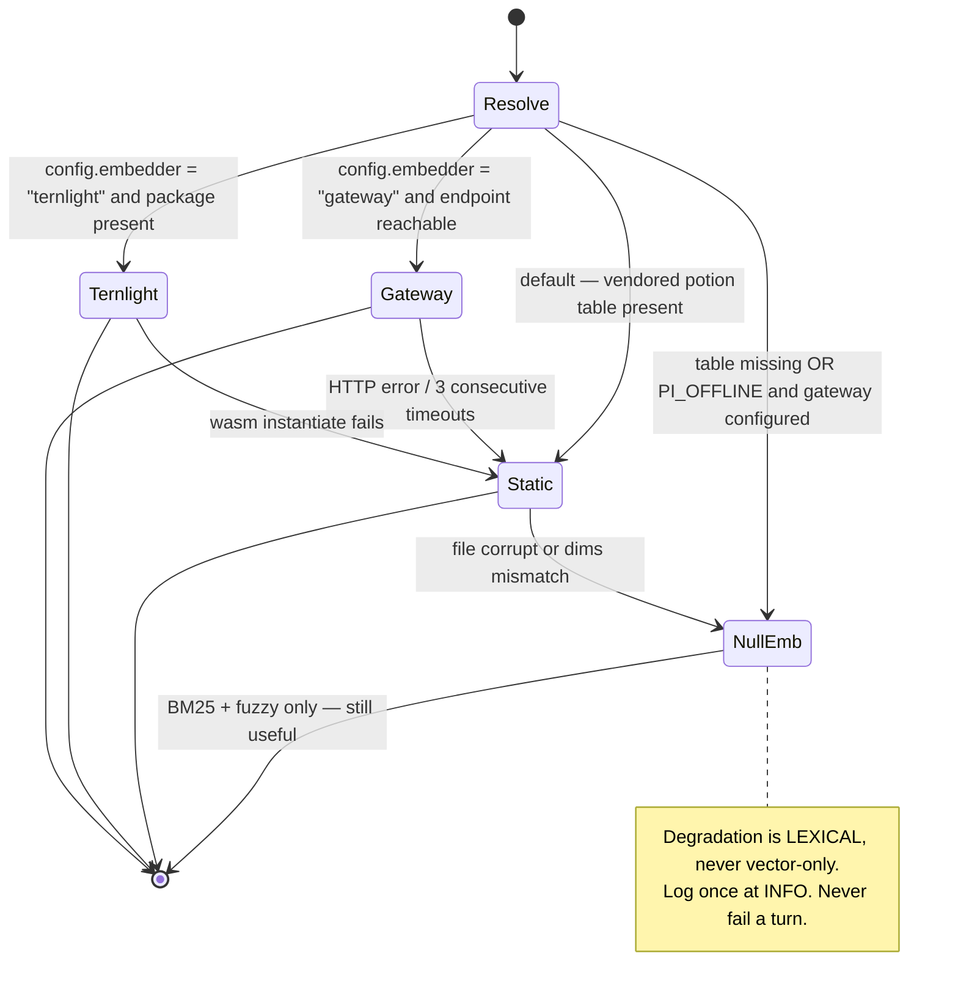

**Changing `embedder.id` must invalidate the vector half of the cache and trigger a rebuild** — silently mixing vector spaces is the single most common way these systems rot.

### 7.10 Go port

If you want the same thing in Go — for a standalone `lessons` CLI that pi can shell out to, or for another agent:

| Component | Go choice | Note |
|---|---|---|
| Lexical | `blevesearch/bleve` **without** the `vectors` tag, or ~200 lines of hand-rolled BM25 | Pure Go, `CGO_ENABLED=0` |
| Vectors | `[]int8` slice + hand-rolled cosine, or `chromem-go` | Brute force; SIMD via `golang.org/x/sys/cpu` if you ever need it |
| Embedder | model2vec in Go: `tokenizers`-free WordPiece + gather + mean | Same four-line forward pass; same three tokenizer traps |
| Fusion | 30 lines of RRF | — |
| Storage | same files + same `index.pack` | **Byte-identical format** so TS and Go share one cache |

Constraint to hold: **`CGO_ENABLED=0` must build and pass tests on linux/darwin/windows × amd64/arm64.** That single rule keeps you out of every Go trap in §5.3.

---

## 8. Part G — Getting to "production-grade accuracy"

Accuracy is not a library choice. It is a measurement loop plus four cheap techniques.

### 8.1 The eval harness (build this before the second embedder)

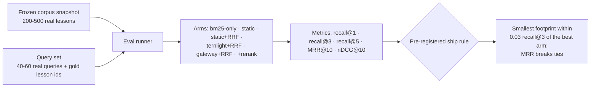

The "pre-registered ship rule" idea is lifted directly from the static-embedding eval cited above, and it is the right discipline: decide the rule *before* seeing the numbers, so you can't rationalise your way into a heavier dependency.

**Where the query set comes from:** log every `lessons_search` call and every auto-injection for two weeks (locally, opt-in), then hand-label. Real queries beat synthetic ones by a wide margin, especially for the identifier-heavy tail.

### 8.2 Accuracy techniques, ranked by value per unit of complexity

| # | Technique | Expected gain | Cost | Do it? |
|---|---|---|---|---|
| 1 | **Hybrid + RRF** | Large — the 65–78% → 91% recall@10 class of improvement | ~40 lines | **Yes, day one** |
| 2 | **Title/tag prefixing before embedding** | Large for short docs; fixes the false-attractor pathology | 1 line | **Yes, day one** |
| 3 | **Query routing by shape** (identifier vs conceptual) | Meaningful; most of the value the sources attribute to per-query weight tuning | ~20 lines | **Yes** |
| 4 | **Contextual enrichment**: at capture time have the LLM add one sentence situating the lesson (project, stack, when it applies), and index *that* too | Anthropic's contextual embeddings + contextual BM25 gave a 49% reduction in failed retrievals | 1 extra cheap LLM call at capture; **zero query-time cost** | **Yes** — capture is off the hot path |
| 5 | **MMR diversity** on the final list | Prevents 3 near-identical lessons crowding the top-3 | ~25 lines | Yes |
| 6 | **Recency/usage decay** — `score × (1 + 0.1·log(1+uses)) × decay(age)` | Lessons rot; superseded ones must sink | ~10 lines | Yes |
| 7 | **LLM reranking** of top-20 → top-5 | Anthropic: 49% → 67% reduction in failures | One extra LLM call | **Only in the explicit tool**, never in auto-inject |
| 8 | ANN index | Zero — brute force is exact | High | **No** |
| 9 | Bigger embedding model | Moderate | Very high on your constraints | Only via the gateway tier |

Note that (4) is nearly free in your architecture: capture happens at `agent_settled`, where you already have a live LLM session and no latency pressure. This is a structural advantage a coding-agent extension has over a generic RAG service, and you should exploit it.

### 8.3 What "production grade" actually means for this system

| Property | Target | How you know |
|---|---|---|
| recall@3 on the eval set | ≥ 0.90 | eval harness |
| Auto-inject precision | ≥ 0.7 of injections judged useful | thumbs on injected blocks |
| **Auto-inject silence rate** | ≥ 60% of turns inject nothing | counter |
| p99 `before_agent_start` added latency | < 40 ms | timing histogram in `pi.appendEntry` |
| Zero-network correctness | full function offline except sync | CI runs with egress blocked |
| Corrupt cache | rebuilds silently, never throws | fuzz the pack file in CI |
| Model swap | forces rebuild, never mixes spaces | manifest guard test |

### 8.4 Security — the part that is genuinely load-bearing

A cross-device, LLM-writable, auto-injected memory store is a **persistent prompt-injection channel**. Content written on device A, from a repo you were reviewing, gets silently injected into the system context on device B months later.

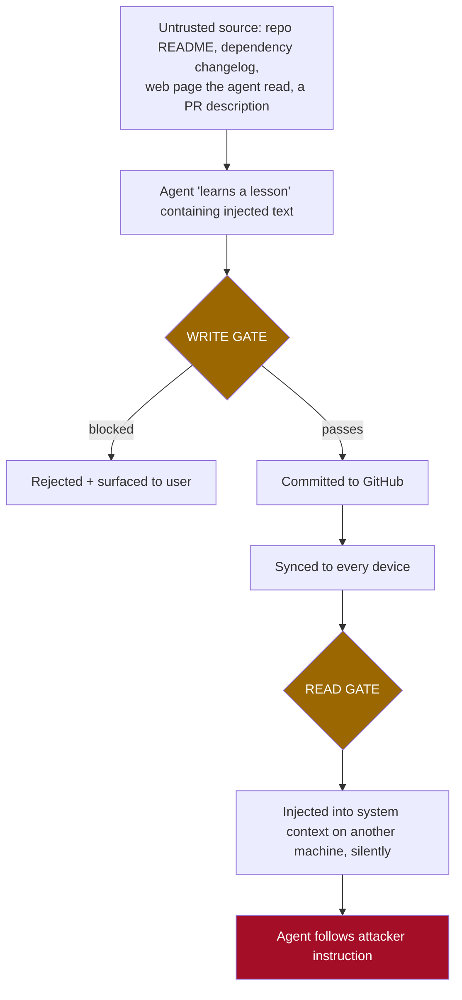

Mandatory controls:

1. **Write gate** — scan every candidate lesson before acceptance. `pi-hermes-memory` already does this: <cite index="218-1">every write — memory and skills — passes through a scanner before being accepted; this prevents the LLM being tricked into storing malicious content that could later be surfaced through search</cite>.
2. **Read gate / framing** — wrap injected content in guard tags. Prior art again: <cite index="221-1">memory blocks are wrapped in `<memory-context>` XML tags with a guard note ("NOT new user input") to prevent the LLM from treating stored facts as instructions</cite>.
3. **Secret redaction on capture** — high-entropy strings, `sk-`/`ghp_`/`AKIA` prefixes, `.env` values, internal hostnames. A lessons repo is a *very* attractive accidental secret store.
4. **Provenance** — every lesson records device, repo, session id, and whether it was human-authored or agent-proposed. Weight human-authored lessons higher and make agent-proposed ones reviewable.
5. **Respect `ctx.isProjectTrusted()`** — do not auto-inject cross-project lessons into an untrusted project directory.

---

## 9. Part H — Decision tree, and what would change my mind

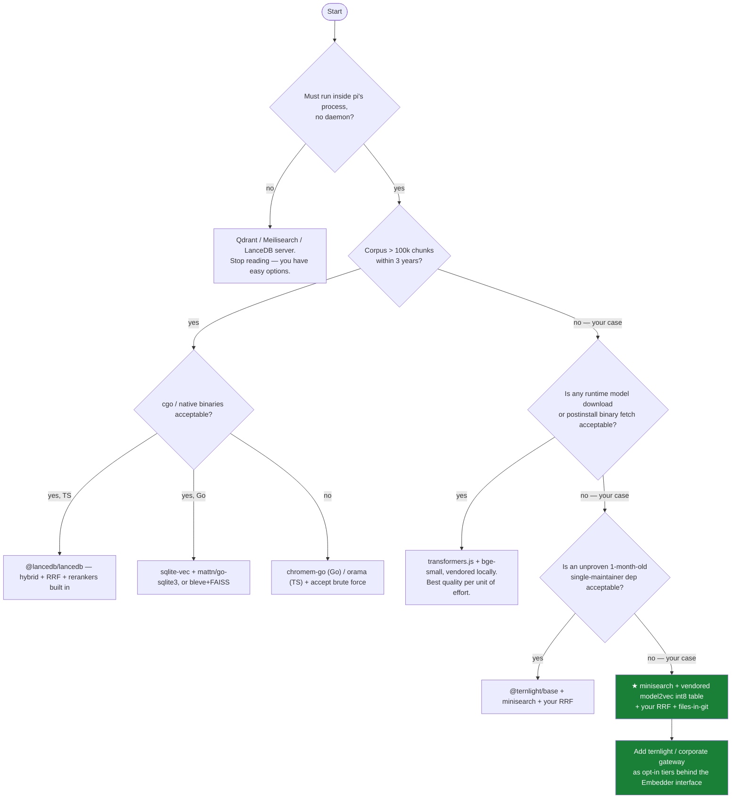

### 9.1 Build order

| Phase | Ship | Gate to proceed |
|---|---|---|
| **0** | `lessons_add` + `lessons_search` tools, minisearch only, files in git, manual sync | You actually use it for 2 weeks |
| **1** | Eval harness + 40-query set from real usage | recall@3 measured for BM25-only |
| **2** | Static embedder + RRF + title-prefixing | recall@3 improves by ≥ 0.05, p99 < 40 ms |
| **3** | `before_agent_start` auto-injection, with silence floor | silence rate ≥ 60%, no complaints |
| **4** | Background git sync + `agent_settled` capture with write gate | works offline; survives conflict test |
| **5** | Optional tiers: ternlight, corporate gateway, LLM rerank | each must beat phase-2 on the eval or be deleted |
| **6** | Go port sharing `index.pack` | byte-identical cache across languages |

### 9.2 What would change the recommendation

| If this became true | Switch to |
|---|---|
| Corpus reliably exceeds ~200k chunks | Add an ANN index; at that point `@lancedb/lancedb` (TS) or sqlite-vec (Go) earns its weight |
| Your corporate LLM gateway exposes `/embeddings` and is approved | Make it the default tier; static becomes the offline fallback. This is the single biggest available quality jump. |
| Ternlight reaches ~1 year, multiple maintainers, and publishes BEIR-wide numbers | Promote it from opt-in to default semantic tier |
| Node ships FTS5 in every supported build **and** you need >100k docs | SQLite becomes attractive as the storage layer; keep files as the source of truth regardless |
| You need multi-user, multi-tenant, or server-side sharing | The whole design changes — that is a service, not an extension |
| Total lessons stay under ~300 | <cite index="206-1">Anthropic's own advice applies: if your knowledge base is smaller than 200,000 tokens, you can just include the entire knowledge base in the prompt, with no need for RAG</cite>. Ship a compact index instead of a retriever. |

### 9.3 Residual risks

| Risk | Likelihood | Mitigation |
|---|---|---|
| Static embeddings underperform on *your* queries (the false-attractor pathology) | Medium | Eval harness first; title-prefixing; BM25-weighted routing; the null-embedder path always works |
| minisearch becomes unmaintained | Low | 7 kB, zero deps, MIT — vendorable in an afternoon |
| Pi's extension API changes | Medium — pi moves fast, org just changed | Pin the pi version range; the core is API-agnostic; keep the pi adapter under ~200 lines |
| Git repo grows unwieldy | Low | One small file per lesson; shard by year/month; `git gc` |
| Auto-injection annoys you into disabling it | **High — this is the most likely failure** | Silence floor, hard token cap, per-project opt-in, one-key toggle |
| Secrets leak into a synced repo | Medium | Redaction gate + private repo + pre-commit hook |

---

## 10. Appendix — Source index

**Pi coding agent**
- `pi.dev/docs/latest/extensions` — extension API, full event lifecycle, `ExtensionContext`, tool definition, truncation utilities, dynamic tool loading
- `pi.dev/docs/latest/quickstart`, `github.com/earendil-works/pi` — install, `--ignore-scripts`, packages, `PI_OFFLINE`, `--omit=dev`
- `npmjs.com/package/@mariozechner/pi-coding-agent` — package manifest format, `npmCommand`, telemetry opt-out
- Prior art: `pi-memory` (jayzeng), `pi-hermes-memory` (chandra447), `@mem0/pi-agent-plugin`, `awesome-pi.site/extensions`

**Retrieval and hybrid search**
- denser.ai, *Hybrid Search for RAG* (Jun 2026) — WANDS NDCG numbers, BM25-beats-dense on identifier-heavy corpora
- supermemory.ai, *Hybrid Search Guide* (Jun 2026) — recall@10 65–78% → 91%, 6 ms fusion cost, per-query-class weighting
- digitalapplied.com, *Hybrid Search: BM25, Vector & Reranking Reference 2026* — RRF rank-vs-score argument
- anthropic.com/engineering/contextual-retrieval — 49% / 67% failure-rate reductions; the <200k-token no-RAG rule
- BEIR analyses (emergentmind); `arxiv.org/pdf/2510.14880` Table 16 — all-MiniLM-L6-v2 SciFact NDCG@10 = 0.645

**Embedding backends**
- `github.com/MinishLab/model2vec`, `huggingface.co/minishlab/potion-retrieval-32M` — static embedding models, sizes, MTEB retrieval scores
- `pypi.org/project/static-site-search-eval` — the JS re-implementation recipe, three tokenizer traps, int8 quantisation gotchas, 30-query eval with pre-registered ship rule
- allaboutken.com (Mar 2026) — the negative result on semantic-only potion retrieval
- `github.com/soycaporal/ternlight` + `ternlight.dev` — sizes, latency, Spearman, SciFact NDCG@10, architecture
- `huggingface.co/docs/transformers.js` — `allowRemoteModels`, `localModelPath`, `remoteHost`, default cache behaviour

**Engines**
- `github.com/blevesearch/bleve/blob/master/docs/vectors.md` — FAISS prerequisite, `vectors` build tag, pinned fork table, hybrid score formula
- `github.com/philippgille/chromem-go` — zero-dep pure Go, benchmarks, beta status
- shaharia.com, *Embedded Vector Databases for Go in 2026* — the 100k-doc head-to-head benchmark and decision matrix
- `lancedb.com/docs/search/hybrid-search` — TS hybrid API, RRF default reranker
- `alexgarcia.xyz/sqlite-vec/go.html`, `asg017/sqlite-vec` releases — cgo vs WASM Go bindings; "some old Go/ncruces bindings are paused"
- `npmjs.com/package/minisearch`, `lucaong.github.io/minisearch` — BM25+ params, fuzzy/prefix, zero deps
- `github.com/oramasearch/orama`, `docs.orama.com` — hybrid mode, the `threshold` OR-mode default
- `github.com/ehc-io/qmd`, `@tobilu/qmd` — markdown-aware chunking, LLM query expansion, RRF, node-llama-cpp dependency

**Corporate network**
- nodejs.org/api/sqlite — `allowExtension`, `loadExtension`, stability history
- nodejs/node#56951 and openclaw issues #3776, #20987, #29321, #59518 — the node:sqlite FTS5 gap through April 2026
- huggingface/transformers.js#1138 → microsoft/onnxruntime#23232 — the postinstall proxy failure and `GLOBAL_AGENT_*` workaround
- `gofaq.org` GOPROXY/GOPRIVATE guides; JFrog Artifactory Go module docs — Go proxy configuration and the virtual-repo requirement

**Verified locally during this research**
- Node v22.22.2, bundled SQLite 3.51.2 (`node_shared_sqlite: false`): `CREATE VIRTUAL TABLE … USING fts5` **succeeds**; RTREE also present. Contradicts reports from Node 22.14 / 23.x — hence the feature-detection rule in §5.2.

---

*Compiled 5 August 2026. Every version number, benchmark and availability claim above should be re-verified before it becomes load-bearing; the argument structure is designed to survive the numbers changing.*
