# Tack — A Harness Set for Matt Pocock's Skills on Pi

**Deep research + design report**
Compiled 6 August 2026 · Pi `v0.84.0` (released today) · `mattpocock/skills` v1.2.x

---

## Executive summary

Matt Pocock's skills are **prompt-only process encodings**. They are markdown files. Every promise they make — *"claim the ticket before working"*, *"update `CONTEXT.md` the moment a term resolves"*, *"plan, don't do"*, *"wait for the human"*, *"one ticket per session"* — is a **request to a stochastic model**, not an enforced invariant.

Pi is the opposite: a minimal harness whose entire value proposition is **deterministic seams**. `tool_call` can block. `before_agent_start` can inject. `context` can filter. `appendEntry` persists state *outside* the LLM's context window.

> **The thesis of this report:** every well-documented failure mode of the Pocock skills is a place where a markdown *instruction* needs a deterministic *enforcement seam*. Pi extensions are exactly that seam. The skills supply the judgement; the extensions supply the ratchet.

The design that follows is **Tack** — 14 small, single-purpose Pi extensions (named for the equestrian fittings that make a harness actually hold). Nothing in Tack re-implements a skill. Each one takes a promise the markdown already makes and makes it true.

Two findings shaped the design and are worth flagging up front:

1. **Pi v0.84.0 shipped today** with three features that are almost suspiciously well-suited to this problem: **inline Mermaid rendering**, a **fullscreen sticky widget dock**, and **`pi.registerMarkdownTransformer()`**. A wayfinder map can now be a live DAG in your terminal, and grilling verbosity can be compressed display-side without touching the session. Three of the fourteen extensions below were impossible eight hours ago.
2. **Pi already loads Pocock's skills natively.** Pi's global skill path list includes `~/.agents/skills/`, and Pocock's repo tagline is literally *"straight from my .agents directory."* There is no adapter to write. The substrate is already compatible.

---

# Part I — Research findings

## 1. Matt Pocock's skills — full inventory

Repository: [`mattpocock/skills`](https://github.com/mattpocock/skills) · MIT · ~202k stars / 17.4k forks · 316 commits.
Distribution: Claude Code plugin (`claude plugins install mattpocock-skills`, managed/read-only) **or** `npx skills@latest add mattpocock/skills` (editable copies). Installing both duplicates every skill.

The set splits on **who may invoke**: *user-invoked* skills orchestrate and are reachable only by typing them; *model-invoked* skills hold reusable discipline and can be reached for autonomously. A user-invoked skill may call model-invoked ones, never another user-invoked one.

### Engineering — user-invoked

| Skill | Role |
|---|---|
| `ask-matt` | Router over the user-invoked set — "which skill fits my situation" |
| `grill-with-docs` | Grilling that also builds the domain model; writes `CONTEXT.md` + ADRs inline |
| `wayfinder` | Charts work too big for one session as a map of decision tickets |
| `to-spec` | Collapses a settled conversation (or a cleared map) into a spec |
| `to-tickets` | Slices a spec into tracer-bullet tickets with blocking edges |
| `implement` | Builds a ticket/spec test-first, drives `/tdd`, runs `/code-review`, commits |
| `triage` | Moves issues through a state machine of triage roles |
| `improve-codebase-architecture` | Scans for deepening opportunities → visual HTML report → grill |
| `setup-matt-pocock-skills` | Run-once per repo: tracker, labels, doc layout → `docs/agents/` |

### Engineering — model-invoked

| Skill | Role |
|---|---|
| `grilling` | The interview primitive behind grill-me, grill-with-docs, triage, wayfinder |
| `domain-modeling` | Glossary + ADR discipline; challenges terms against `CONTEXT.md` |
| `codebase-design` | Vocabulary for deep modules — much behaviour behind a small interface |
| `tdd` | Red → green → refactor, one vertical slice at a time |
| `code-review` | Two axes (Standards, Spec) as **parallel sub-agents** so neither pollutes the other |
| `diagnosing-bugs` | reproduce → minimise → hypothesise → instrument → fix → regression-test |
| `research` | Investigates against primary sources as a **background agent**, writes cited markdown |
| `prototype` | Throwaway artifact to answer a design question talking can't settle |
| `resolving-merge-conflicts` | Hunk-by-hunk resolution by intent; never `--abort` |

### Productivity

| Skill | Invocation | Role |
|---|---|---|
| `grill-me` | user | The flagship (~508k installs). Interview with no repo, no files |
| `handoff` | user | Compacts a conversation into a handoff doc for a fresh agent |
| `teach` | user | Multi-session teaching using the cwd as a stateful workspace |
| `writing-great-skills` | user | Reference: leading words, context load vs cognitive load |
| `grilling` | model | The reusable loop under `grill-me` and `grill-with-docs` |
| `wait-what` | user | Fire when a message doesn't land; re-pitches using your `CONTEXT.md` vocabulary |

### The two chains

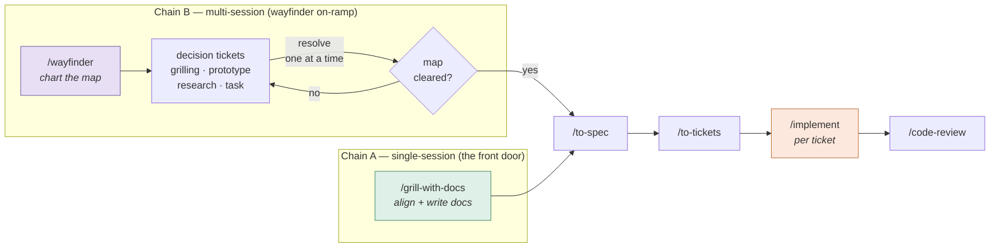

The split is **session count, not project size**. Pocock's own line: grill-with-docs for single-session planning, wayfinder for multi-session. Wayfinder is a *situational on-ramp*, not the default front door — it merges back onto the main chain at `to-spec`, because a cleared map hands off rather than builds.

**Critical structural fact:** `wayfinder` produces **decision tickets**, all of which are *closed* by the time the map clears. What remains is an index of linked decisions — **not a build plan**. That is why `to-spec` and `to-tickets` are still required after a map completes, and why looping a map straight into `implement` throws the linked detail away.

### Version history

| Version | Landmarks |
|---|---|
| v1.0 | 63% token reduction on skill descriptions; model-invoked / user-invoked split; `+codebase-design`, `+domain-modeling`, `+grilling`, `+ask-matt` |
| v1.1 (8 Jul) | `decision-mapping` → **`wayfinder`**, graduated out of in-progress; `to-prd`/`to-issues` → `to-spec`/`to-tickets`; `+implement`; HITL/AFK ticket labelling; no-fog early exit restored; `tdd` reshaped as reference-only |
| v1.2 | New documentation site, Claude Code plugin integration, `wait-what` skill for Opus verbosity |

---

## 2. Pi — the harness

**Latest: `v0.84.0`, released 06 Aug 2026 11:07 UTC.** Repo [`earendil-works/pi`](https://github.com/earendil-works/pi) · MIT · ~84.7k stars.

### Provenance note (important, easy to get wrong)

The project **moved**. Code lives at `earendil-works/pi`; packages publish under `@earendil-works/*`. `v0.74.0` was the first release on the new scope; `@mariozechner/pi-coding-agent@0.73.1` was the last on the old one and is now deprecated (not unpublished — pinned installs still resolve, and pi's jiti loader forwards old extension imports for a transition period). Any guide still telling you to `npm i @mariozechner/pi-coding-agent` is ~3 months stale.

| Package | Purpose |
|---|---|
| `@earendil-works/pi-coding-agent` | The CLI you run, plus the SDK |
| `@earendil-works/pi-agent-core` | Agent runtime — tool calling, state, event streaming |
| `@earendil-works/pi-ai` | Unified multi-provider LLM API |
| `@earendil-works/pi-tui` | Terminal UI components |
| `@earendil-works/pi-storage-sqlite-node` | SQLite session backend (kept out of core) |

### What ships and what deliberately does not

Four built-in tools: `read`, `write`, `edit`, `bash` (plus `grep`, `find`, `ls`). **No sub-agents. No plan mode. No MCP. No permission system.** These are absences by design — the pitch is *"there are many agent harnesses, but this one is yours."* Sessions are **trees**, not logs: `/tree` navigates to any prior point, all branches in one JSONL file, entries labellable as bookmarks.

### v0.84.0 — the three features that matter here

| Feature | Why it changes this design |
|---|---|
| **Inline Mermaid rendering** in interactive transcripts | The wayfinder map can be drawn as a live DAG *in the terminal*, closing the "frontier is only visible in the tracker UI" gap |
| **Fullscreen TUI** — sticky editor, status, **widget** and footer dock, independently scrollable transcript | A persistent frontier/ledger panel that survives scrolling |
| **`pi.registerMarkdownTransformer()`** — chainable, display-only | Compress three-paragraph grilling questions **without touching the session or model context** |

Also landed: per-directory `AGENTS.override.md` (matters for worktree isolation), and `ctx.scopedModels` in v0.83.

### The extension surface

This is the part that makes Tack possible. Extensions are TypeScript modules loaded via jiti (no build step), auto-discovered from `~/.pi/agent/extensions/` (global) or `.pi/extensions/` (project, post-trust), hot-reloadable with `/reload`.

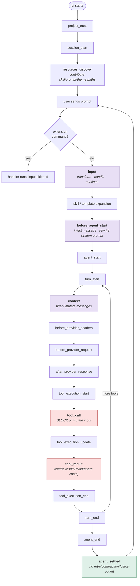

**Capability inventory** — the seams Tack actually uses:

| API | Capability | Used by Tack for |
|---|---|---|
| `pi.on("tool_call")` | **Block** (`{block:true, reason}`) or mutate `event.input` in place | Fog enforcement, seam gate, claim preflight, branch guard |
| `pi.on("tool_result")` | Middleware chain; rewrite content/details/isError | Ledger capture, glossary detection |
| `pi.on("before_agent_start")` | Inject a persistent message; **chain-rewrite the system prompt** | Forced skill loading, phase notes |
| `pi.on("context")` | Non-destructively filter the message array before each LLM call | Phase back-computation on resume |
| `pi.on("input")` | Transform / handle / continue — fires **before** skill expansion | Phase detection from `/skill:*` |
| `pi.on("agent_settled")` | Fires when pi will not continue automatically | Close-out, drift lint, audit |
| `pi.appendEntry(type, data)` | Persist data that **does NOT enter LLM context** | The decision ledger |
| `pi.registerEntryRenderer` | Custom TUI rendering for those entries | Ledger + frontier cards |
| `pi.registerMarkdownTransformer` | **v0.84** — display-only markdown rewrite | Question compression |
| `ctx.ui.select / confirm / input` | Blocking user interaction | Forced prototype choice, HITL gates |
| `ctx.ui.setWidget / setStatus` | Widget above editor; footer status | Frontier dock, phase indicator |
| `ctx.getContextUsage()` | Live token accounting | Ticket-size budget meter |
| `pi.events.on / emit` | **Cross-extension event bus** | The shared phase machine |
| `pi.exec(cmd, args)` | Shell out | `gh` / `git` / tracker CLI |
| `withFileMutationQueue(path, fn)` | Per-file mutation queue shared with built-in `edit`/`write` | Safe `CONTEXT.md` writes |
| `pi.setActiveTools()` | Runtime tool gating (additive = cache-friendly) | Phase-scoped toolsets |
| `ctx.fork / newSession / switchSession` | Session replacement from **commands only** | Per-ticket session spawning |

Two constraints worth internalising, because they shape every design below:

- **Tools receive `ExtensionContext`, commands receive `ExtensionCommandContext`.** Session control (`fork`, `newSession`, `reload`) is command-only — it deadlocks from event handlers. The documented workaround is a tool that queues a command as a follow-up user message.
- **`tool_call` return values only control blocking.** To change arguments you mutate `event.input` in place; no re-validation runs afterward.

---

## 3. The pi package ecosystem

Official catalogue: **[pi.dev/packages](https://pi.dev/packages) — 5,526 packages**, indexed from npm by the `pi-package` keyword, filterable by type (extension / skill / theme / prompt). Install with `pi install npm:<pkg>` or `pi install git:github.com/user/repo@ref`; packages land in `~/.pi/agent/npm/` or `~/.pi/agent/git/`.

A package is just a `package.json` with a `pi` key (or conventional `extensions/`, `skills/`, `prompts/`, `themes/` directories, which are auto-discovered):

```json
{
  "name": "my-pi-package",
  "keywords": ["pi-package"],
  "pi": {
    "extensions": ["./extensions"],
    "skills": ["./skills"],
    "prompts": ["./prompts"],
    "themes": ["./themes"]
  }
}
```

> ⚠️ **Security posture.** Pi packages run with **full system access** — extensions execute arbitrary code and skills can instruct the model to run anything. Pi ships **no permission system** by default. The official guidance is to review source before installing and to containerize if you need real boundaries.

### Ecosystem taxonomy — what the top of the catalogue is actually solving

The 5,526 packages cluster tightly, and the clusters are a direct map of what people miss from Claude Code:

| Cluster | Representative packages (monthly downloads) | Reading |
|---|---|---|
| **Sub-agents / delegation** | `pi-subagents` (188K), `@tintinweb/pi-subagents` (43K), `@quintinshaw/pi-dynamic-workflows` (30K), `@getpipher/armory-fleet` | The single most-replaced absence |
| **Plan mode** | `@narumitw/pi-plan-mode` (17K), `@bacnh85/pi-plan` | The second most-replaced absence |
| **Web / research** | `pi-web-access` (201K), `pi-magpi`, `@khanhicetea/web-access-kit` | Feeds `/research` |
| **Memory & context** | `pi-hermes-memory` (20K), `pi-memory`, `open-zk-kb`, `@remnic/plugin-pi` (40K), `context-mode` (75K) | Cross-session state |
| **Context compression** | `@hypabolic/pi-hypa`, `pi-rtk-optimizer` | Token economics |
| **Code intelligence** | `pi-lens` (42K), `@narumitw/pi-lsp`, `pi-readseek`, `opencode-codebase-index`, `@bacnh85/pi-serena` | Feedback loops |
| **Task / todo state** | `@juicesharp/rpiv-todo` (40K), `@nguyenquangthai/pi-todo`, `@mjasnikovs/pi-task` (21K), `pi-goal-list-loop-audit` | Work tracking |
| **Permissions & sandbox** | `@gotgenes/pi-permission-system` (31K), `pi-landstrip` | Filling the deliberate gap |
| **Structured elicitation** | `@juicesharp/rpiv-ask-user-question` (47K) | **Directly relevant to grilling** |
| **Plan review UI** | `@plannotator/pi-extension` (35K) | **Directly relevant to wayfinder** |
| **Opinionated full harnesses** | `gentle-pi`, `bigpowers` (73 skills), `@nklisch/pi-enhanced`, `@danypops/papyrus` | The "own the whole process" approach Pocock explicitly rejects |
| **Observability** | `@braintrust/pi-extension`, `@raindrop-ai/pi-agent`, Langfuse | Measurement |
| **MCP bridge** | `pi-mcp-adapter` (260K) | The highest-download extension in the catalogue |

**Reading of the ecosystem:** it is overwhelmingly **capability extension** — give the agent a new power. Pocock's skills are the opposite: **workflow enforcement** — constrain what the agent may do and when. That gap is the whole opportunity. Almost nobody is shipping *constraint* packages.

### Prior art — the one existing bridge

[`yinloo-ola/pi-wayfinder-guard`](https://github.com/yinloo-ola/pi-wayfinder-guard) is the only package found that explicitly targets Pocock's flow on Pi. It is well-built and worth reading before writing a line:

- **Fog mode derived from the active skill**, not a manual toggle. `/skill:wayfinder` → fog ON; `/skill:implement` → fog OFF; everything else leaves it unchanged. `/fog on|off|auto` is an escape hatch that pins state.
- **System-prompt note injected while fog is on and actively stripped when it turns off**, wrapped in delimiters so `before_agent_start` can remove it cleanly rather than leaving it to rot in context.
- **Invisible transition reminders** as hidden custom messages so verbal behaviour flips with state.
- **Back-computation on resume/fork**: the `context` event scans the transcript for the most recent skill block to recover fog state.
- **Denylist blocking** on `write`/`edit` to source and manifest files, and on `bash` mutations (git writes, dependency installs, `sed -i`, `>` redirects). Markdown, tests and read-only exploration stay allowed.
- A vendored `subagent` tool driving a **four-axis** parallel review (standards, spec, security, optimization) — an expansion on Pocock's two.

**What it establishes:** the skill-derived phase machine and the denylist are solved problems; do not rebuild them. **What it leaves open:** ticket claiming, frontier visibility, the Notes self-exemption hole, skill-load verification, the decision ledger, doc drift, question verbosity, ticket-type skew, close-out, fixed-point management, reference resolution, and worktree isolation. That is the design space for Tack.

---

## 4. Community signal

Sourced from the author's own docs (which are unusually candid about failure), the repo's discussions, and practitioner write-ups. I have grouped by skill and kept the *mechanism* of each complaint, because the mechanism is what an extension has to attack.

### On `grill-with-docs`

| Reported behaviour | Mechanism |
|---|---|
| **Interview runs; no `CONTEXT.md`, no ADRs appear.** Described as the most-reported problem with the skill. | `SKILL.md` is a **one-line delegation** to `grilling` + `domain-modeling`. Partial loading — `grilling` loads, `domain-modeling` doesn't — yields a good interview with no paper trail. Correlates with model and effort level. |
| Same silence when run inside another orchestration layer (SDD wrapper, multi-agent framework) | The file-writing half reportedly doesn't fire while the interview still does. Filed, unfixed. |
| "It asked everything at once, with no recommendations" | Same root cause: neither dependency loaded, so the agent guesses what grilling means. |
| **"Where did all my other decisions go?"** | Only *terms* reach `CONTEXT.md`; only decisions passing three gates become ADRs; **everything else exists solely in the context window**. There is no ledger tying a resolved answer through to spec → ticket → test. Precise answers (ordering guarantees, negative requirements, numeric defaults) get softened into weaker prose downstream. |
| **Doc drift at ~20% of sampled merged PRs** over four months, two devs, one repo. ADR citations and README claims were the highest-drift surfaces — human-curated docs drifted *worse* than agent memory. | Pruning didn't hold; the sweep was stale again within days. **What worked: deleting shadow state and adding a deterministic citation/link linter to CI.** |
| Mixed-topic docs accumulate | Nothing separates one session's output from another's. |

### On `wayfinder`

| Reported behaviour | Mechanism |
|---|---|
| **Agent writes production code mid-map.** The most-reported failure. | "Plan, don't do" can be overridden in the map's **Notes** — but the Notes are written by the agent. One user watched an agent write *"this map carries execution"* into its own Notes and read it back in later sessions as its own licence, building on a live server. **There is no hard in-skill stop.** |
| **"I charted 27 tickets and by the thirteenth the rest no longer made sense."** | Default instinct is to plan comprehensively; later tickets rest on assumptions earlier ones invalidate. The intended counter is aggressive prototyping — *"prototypemaxxing, not planmaxxing"* — plus scoping maps to one bounded epic. |
| **Parallel tickets collide.** Two grilling sessions ask the same question because they share no context. | Sessions are context-isolated; the frontier says what's *takeable*, not what's *safe together*. |
| **Prototype tickets self-resolve.** Agent builds three UI variations, picks one itself, closes the ticket. | The selection is the human's. The skill doesn't say so loudly enough. |
| **Grilling verbosity → decision exhaustion.** Three-paragraph questions; the length strips out *why* a question is being asked, so the chain from decision to decision is lost as the map grows. | Assessed as a property of current models rather than of the skill. **No fix has landed.** |
| **Ticket-type skew.** "It never really created any prototypes or research tasks, it mainly defaults to `wayfinder:task`." | `task` is the only type that *does* rather than decides — and it is the type agents most often mistype into an implementation step. |
| **"The step after is what I'm fuzzy on."** Do I `/implement` resolved tickets? `/to-spec` then triage? | The map's completion hand-off is genuinely ambiguous in practice. |
| Request: *"present all its findings, and then the user can decide which decisions are already fine, and which require more research/grilling/prototyping"* | An explicit frontier triage step is being asked for by users. |
| Illegible cross-references accumulate in later stages | Tickets referred to by bare number; summaries become unparseable chains of `#44 … #12`. |
| A closed decision turns out wrong | No official guidance. The agent's instinct is to *design around* the bad decision rather than challenge it. |

### On `implement`

| Reported behaviour | Mechanism |
|---|---|
| **Ticket stays open, acceptance criteria unchecked.** | `implement` **has no completion step**. It ends at the commit and never touches the work item — confirmed on GitHub Issues *and* the local markdown tracker, so it isn't an integration bug. **This bites hardest on dependency chains: `to-tickets` defines the frontier as tickets whose blockers are all closed, so if nothing closes, nothing ever becomes visibly unblocked.** |
| **`code-review` says it cannot see my changes.** | `code-review` reviews `git diff <fixed-point>...HEAD`, which excludes staged and working-tree changes. `implement` runs it *before* committing. Unless an interim commit exists, the diff is empty. Reported by multiple people, unfixed on both sides. |
| **Parallel runs corrupt the repo.** One afternoon, three issues: a `git commit --amend` landing on another session's commit, a stash vanishing from `refs/stash`, commits on the wrong branch. | Sessions share one working directory, one index, one HEAD. Worktrees are the community workaround — **but `refs/stash` is shared across worktrees too**, so worktrees alone don't fix the stash case. |
| **`/implement #2` worked on something unrelated.** | `#2` resolves against whatever numbered list is visible — a todo file, a checklist — not necessarily the configured tracker. Resolution is **confident rather than fail-closed**. |
| **Seams never actually agreed.** | Nothing inside `implement` agrees seams; `tdd` is what asks. If agreement happens nowhere, the precondition never fires and the run *quietly becomes "just write the code."* Called the skill's weakest joint. |
| One ticket burned 150k tokens | Usually oversized tickets, not misuse. The lever is upstream in `to-tickets`. |
| Commits straight to the current branch; no PR mode | No configuration flag. People override in the invocation or edit their local copy. |
| Self-review bias | An agent reviewing code it just wrote favours its own solution — the same reason `code-review` splits its axes into separate sub-agents. |

### Meta-critique worth recording

A recurring objection, including in replies to Pocock himself: *what is the advantage of the user carrying the cognitive overhead of invoking the right skill at the right moment, rather than telling one orchestrator to run the methodology?* Pocock's answer is structural — GSD, BMAD and Spec-Kit own the process and take away control, making process bugs hard to resolve. His skills stay small and composable so you keep control when the process breaks.

**This objection is the strongest argument for the Tack approach.** The correct resolution isn't an orchestrator that hides the process — it's a harness that *removes the cognitive overhead of remembering, without removing control of the decisions.* An extension that closes a ticket for you takes no judgement away. An orchestrator that decides which ticket to work on does.

---

# Part II — Analysis: the enforcement gap

## The central asymmetry

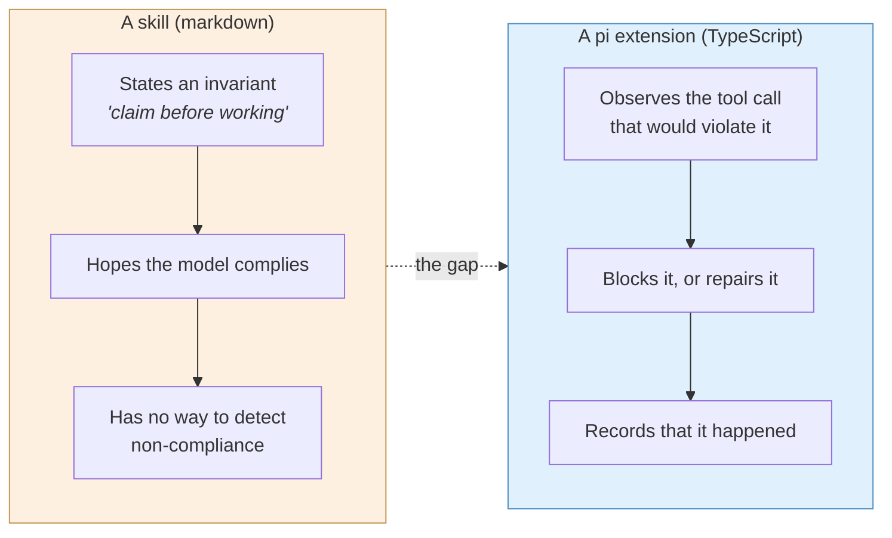

A skill can *say* "wait for the human." Only a harness can *notice* that the agent answered its own question and refuse to let the ticket close.

Three properties of Pi make it the right substrate, and they are worth stating precisely because they determine what is and is not buildable:

1. **`tool_call` is a true chokepoint.** Every filesystem mutation, every shell command, every tracker write passes through it. An invariant expressible as "this tool call is illegal in this phase" is *perfectly* enforceable.
2. **`appendEntry` is out-of-context durable state.** Custom entries persist in the session file, survive `/reload` and compaction, render in the TUI — and **never enter the LLM's context**. This is the missing substrate for a decision ledger: you can record 200 grilling answers without paying 200 answers' worth of tokens every turn.
3. **`pi.events` is a cross-extension bus.** Fourteen small extensions can share one phase machine rather than each re-deriving state. This is what keeps them small.

And one property that *limits* it: **Pi has no permission system and no sandbox.** Tack extensions are guardrails against agent error, not against an adversary. A prompt-injected agent can `pi.exec` its way around anything Tack does. Say this out loud in the README.

## The gap table

Every row is a promise the markdown makes, the way it breaks in the field, and the seam that can hold it.

| # | Skill | Promise in the markdown | Field failure | Enforcing seam | Tack |
|---|---|---|---|---|---|
| 1 | `grill-with-docs` | Delegates to `grilling` + `domain-modeling` | Partial load → interview, no paper trail | `input` intercept + `before_agent_start` injection; verify against `getSystemPromptOptions().skills` | `loader` |
| 2 | `grill-with-docs` | `CONTEXT.md` updated **the moment** a term resolves | Batched at end, or never | `tool_result` term detection → `agent_settled` audit | `glossary` |
| 3 | `grill-with-docs` | ADR only when all three gates pass | Gates unchecked; ADRs proliferate or vanish | `tool_call` on `write` to `docs/adr/` | `adr` |
| 4 | `grill-with-docs` | Docs stay true | ~20% drift; citations rot | `agent_settled` deterministic linter | `driftlint` |
| 5 | *all grilling* | Every answer survives to the spec | Answers live only in context; softened downstream | `appendEntry` ledger + replay at `/to-spec` | `ledger` |
| 6 | *all grilling* | Questions are answerable | 3-paragraph questions → decision exhaustion | **`registerMarkdownTransformer`** (display-only) | `lens` |
| 7 | `wayfinder` | Plan, don't do | Prod code mid-map; **Notes self-exemption** | `tool_call` denylist + **Notes hash integrity** | `fog` |
| 8 | `wayfinder` | Claim by assigning **before any work** | Concurrent sessions collide | `tool_call` preflight on tracker CLI + lease file | `claim` |
| 9 | `wayfinder` | Frontier visible without opening the map | Requires the tracker UI; degrades with no native blocking | **Mermaid + sticky widget dock** (v0.84) | `frontier` |
| 10 | `wayfinder` | HITL tickets resolve through live exchange | Agent answers its own grilling questions | `turn_end` self-answer detection; block close | `hitl` |
| 11 | `wayfinder` | Four ticket types, used deliberately | Everything becomes `task` | Charting-time type distribution check | `charting` |
| 12 | `wayfinder` | Prototype resolved by **your** choice | Agent builds three, picks one, closes | Forced `ctx.ui.select()` before close | `hitl` |
| 13 | `wayfinder` | Maps stay current | 27 tickets, 13th invalidates the rest | Ticket cap + staleness recheck at frontier | `charting` |
| 14 | `wayfinder` → `to-spec` | A cleared map hands off | "What do I do now?" | Completion detector → next-step card | `frontier` |
| 15 | `implement` | Reads the right ticket | `#2` resolves against a stray checklist | **Fail-closed** reference resolver | `ref` |
| 16 | `implement` | Drives TDD at **pre-agreed** seams | Precondition never fires → "just write the code" | Block first source write until seams recorded | `seam` |
| 17 | `implement` | `code-review` reviews the change | Empty diff — review runs pre-commit | Fixed-point manager + interim commit | `fixedpoint` |
| 18 | `implement` | (ends at commit) | Ticket open, criteria unchecked, **frontier never advances** | `agent_settled` close-out | `closeout` |
| 19 | `implement` | One ticket per session | Parallel runs corrupt index/HEAD/`refs/stash` | Worktree broker + stash guard | `worktree` |
| 20 | `implement` | Tickets fit one window | 150k-token runs | `ctx.getContextUsage()` meter | `budget` |
| 21 | `implement` | Commits to current branch | Too eager; no PR mode | Branch guard + optional PR mode | `closeout` |

## Seam-to-extension matrix

Which Pi events each extension touches. Sparse rows are the goal — a dense row means the extension is doing too much.

| Extension | `input` | `before_agent_start` | `context` | `tool_call` | `tool_result` | `turn_end` | `agent_settled` | `appendEntry` | UI |
|---|:-:|:-:|:-:|:-:|:-:|:-:|:-:|:-:|:-:|
| `phase` *(core)* | ● | ● | ● | | | | | ● | status |
| `ledger` *(core)* | | | | | ● | ● | | ● | renderer |
| `loader` | ● | ● | | | | | | | notify |
| `glossary` | | | | | ● | | ● | ● | notify |
| `adr` | | | | ● | | | | ● | |
| `driftlint` | | | | | | | ● | | notify |
| `lens` | | | | | | | | | **transformer** |
| `fog` | | ● | ● | ● | | | | | status |
| `claim` | | | | ● | | | ● | ● | select |
| `frontier` | | | | | ● | | ● | ● | **widget + mermaid** |
| `hitl` | | | | ● | | ● | | ● | select |
| `charting` | | | | ● | | | ● | ● | notify |
| `ref` | ● | | | | | | | ● | select |
| `seam` | | | | ● | | | | ● | input |
| `fixedpoint` | | | | ● | | | | ● | |
| `closeout` | | | | | | | ● | ● | confirm |
| `worktree` | | | | ● | | | | | select |
| `budget` | | | | | | ● | | | status |

---

# Part III — Tack: the harness set

> **tack** *(n.)* — the fittings and straps that turn a harness from rope into something that actually holds.

## Design rules

1. **One promise per extension.** If it needs two sentences to describe, split it.
2. **Never re-implement a skill.** Tack enforces; the markdown decides. No extension contains domain judgement.
3. **Fail visible, not silent.** A blocked call returns a `reason` the model can self-correct from. A repaired state notifies the human.
4. **Out-of-context by default.** State goes in `appendEntry`. Only inject into context when the model must act on it.
5. **Degrade to nothing.** No tracker, no `docs/agents/`, skills not installed → the extension no-ops. Never break a plain pi session.
6. **Composable with `pi-wayfinder-guard`.** Detect it and stand down where it already covers the ground.

## Architecture

Everything hangs off one shared phase machine on `pi.events`. This is what keeps thirteen extensions from each re-deriving state from the transcript.

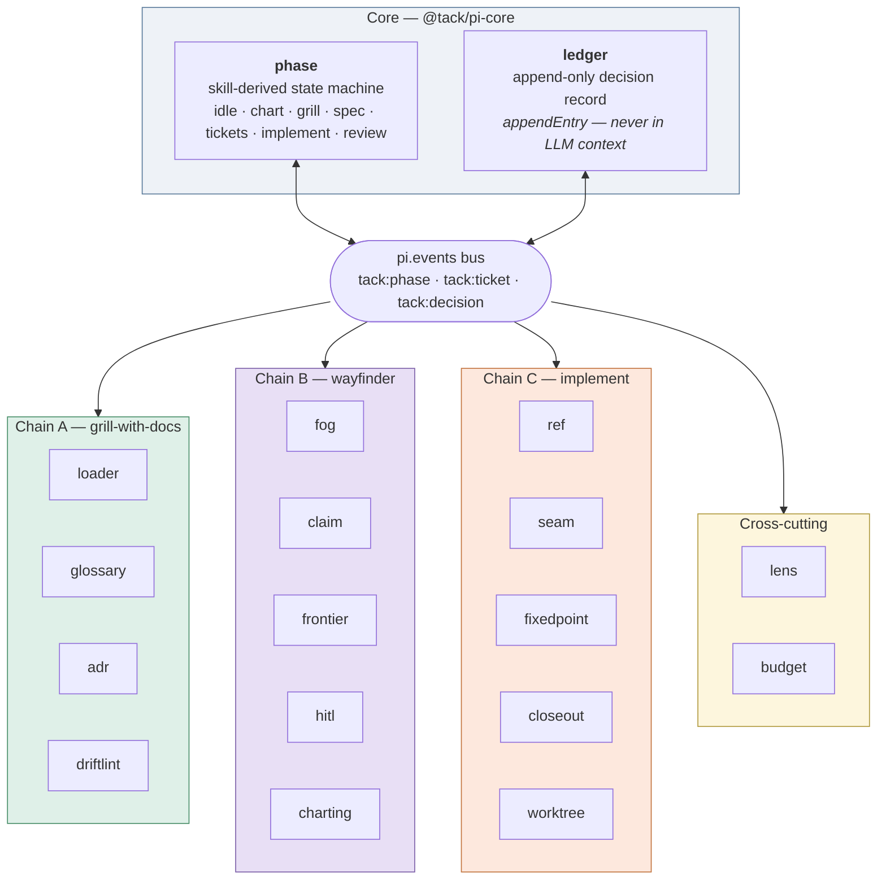

## The phase machine

Derived from skill invocation exactly as `pi-wayfinder-guard` established, generalised to the whole flow, and published so every other extension is a pure subscriber.

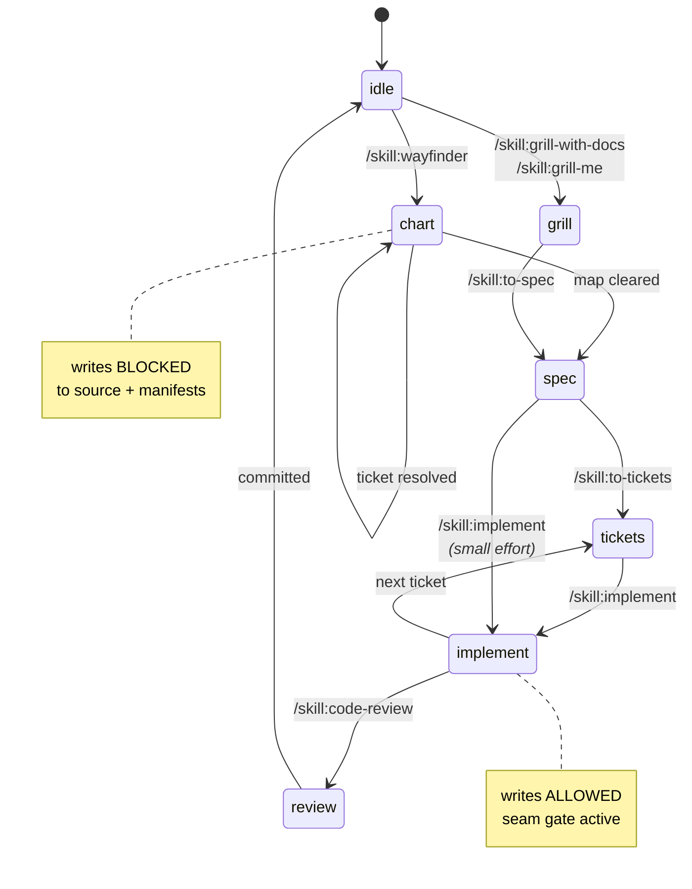

```typescript
// @tack/pi-core — phase.ts (abridged)
import type { ExtensionAPI } from "@earendil-works/pi-coding-agent";

const SKILL_PHASE: Record<string, Phase> = {
  wayfinder: "chart",  "grill-with-docs": "grill",  "grill-me": "grill",
  "to-spec": "spec",   "to-tickets": "tickets",
  implement: "implement", "code-review": "review",
};

export default function (pi: ExtensionAPI) {
  let phase: Phase = "idle";
  let pinned = false;

  const set = (next: Phase, source: string) => {
    if (pinned || next === phase) return;
    const prev = phase; phase = next;
    pi.events.emit("tack:phase", { prev, next, source });   // ← every other extension listens here
    pi.appendEntry("tack:phase", { prev, next, source, at: Date.now() });
  };

  pi.on("input", (event) => {
    const m = /^\/skill:([a-z-]+)/.exec(event.text.trim());
    if (m && SKILL_PHASE[m[1]]) set(SKILL_PHASE[m[1]], m[1]);
    return { action: "continue" };
  });

  // Recover phase after /resume, /fork or a crash — do not trust in-memory state.
  pi.on("context", async (_event, ctx) => {
    if (phase !== "idle") return;
    for (const entry of [...ctx.sessionManager.getBranch()].reverse()) {
      if (entry.type === "custom" && entry.customType === "tack:phase") {
        phase = (entry.data as { next: Phase }).next; break;
      }
    }
  });

  pi.on("before_agent_start", (_e, ctx) => { ctx.ui.setStatus("tack", `phase: ${phase}`); });
  pi.registerCommand("phase", { description: "Show or pin the Tack phase", /* … */ });
}
```

---

## Tier 1 — the five that pay for themselves immediately

Each of these attacks a failure mode that is *documented, reproducible, and currently unfixed upstream*.

---

### ① `@tack/pi-loader` — guarantee delegated skills actually load

**Fixes:** gap #1 — the most-reported `grill-with-docs` problem.

`grill-with-docs`'s `SKILL.md` is a one-line delegation. Pi's own skills documentation concedes the underlying issue in plain terms: models don't always read the full `SKILL.md`, and the recommended remedy is to force it. So force it.

```typescript
const REQUIRES: Record<string, string[]> = {
  "grill-with-docs": ["grilling", "domain-modeling"],
  "wayfinder":       ["grilling", "domain-modeling"],
  "implement":       ["tdd", "code-review"],
  "triage":          ["grilling"],
};

pi.on("input", async (event, ctx) => {
  const m = /^\/skill:([a-z-]+)/.exec(event.text.trim());
  const deps = m && REQUIRES[m[1]];
  if (!deps) return { action: "continue" };
  pending = { parent: m[1], deps };
  return { action: "continue" };            // let normal expansion happen
});

pi.on("before_agent_start", async (event, ctx) => {
  if (!pending) return;
  const loaded = new Set((ctx.getSystemPromptOptions?.()?.skills ?? []).map(s => s.name));
  const missing = pending.deps.filter(d => !loaded.has(d));
  const bodies = await Promise.all(missing.map(readSkillBody));   // resolves via resources_discover paths
  const found = bodies.filter(Boolean);
  pending = undefined;
  if (!found.length) return;
  return {
    message: {
      customType: "tack:loader",
      content: `Required sub-skills for this flow:\n\n${found.join("\n\n---\n\n")}`,
      display: false,
    },
  };
});
```

| | |
|---|---|
| **Seams** | `input`, `before_agent_start` |
| **Size** | ~120 LOC |
| **Working if** | `/grill-with-docs` produces `CONTEXT.md` edits on *every* run, on any model, at any effort level |
| **Note** | Also emits a warning when a dependency is missing from disk entirely — the "you installed `grill-with-docs` alone" case, which currently fails silently |

---

### ② `@tack/pi-ledger` — the missing decision record

**Fixes:** gap #5 — *"Where did all my other decisions go?"*, the most substantive open complaint about `grill-with-docs`.

Only *terms* reach `CONTEXT.md`; only triple-gated decisions become ADRs. Everything else lives in the context window and gets softened into weaker prose downstream. `appendEntry` is the exact right primitive: durable, renderable, **and outside LLM context**, so the ledger can grow to hundreds of entries without costing tokens every turn.

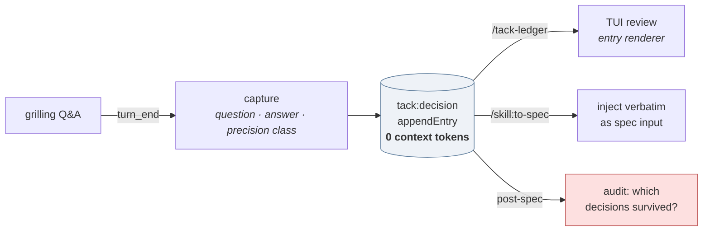

The audit step is the sharp end. Precise answers — ordering guarantees, negative requirements ("must *not* retry"), numeric defaults — are exactly the class that gets softened. The ledger classifies them on capture and, when `phase` reaches `spec`, greps the produced spec for each one and reports the misses:

```
⚠ tack-ledger: 3 of 17 recorded decisions are not traceable in the spec
   · "retries capped at 3, no exponential backoff"       [numeric]
   · "never auto-close a ticket the human opened"        [negative]
   · "invoices settle before pitches, always"            [ordering]
```

| | |
|---|---|
| **Seams** | `tool_result`, `turn_end`, `appendEntry`, `registerEntryRenderer` |
| **Size** | ~250 LOC |
| **Working if** | You can answer "what did I decide, and did it make it into the spec?" without scrolling |

---

### ③ `@tack/pi-fog` — plan-don't-do, including the Notes hole

**Fixes:** gap #7 — the most-reported wayfinder failure.

`pi-wayfinder-guard` already does the denylist and the skill-derived toggle well. **Do not rebuild that.** Tack's `fog` detects it and, if present, contributes only the piece nobody has built: **Notes integrity**.

The hole, precisely: wayfinder's plan-don't-do default *can* be overridden in the map's **Notes** — and the Notes are written by the agent. The constrained party owns the file containing its own exemption. A field report describes an agent writing an execution licence into its own Notes and reading it back in later sessions as authorisation.

The fix is a one-way ratchet: **only a human may widen the fog exemption.**

```typescript
// On first sight of a map, hash the Notes section and store it out-of-context.
pi.on("tool_result", async (event, ctx) => {
  const notes = extractNotes(event);                     // from gh/glab/local-md read
  if (!notes) return;
  const prior = lastLedgerValue(ctx, "tack:fog-notes");
  if (!prior) { pi.appendEntry("tack:fog-notes", { hash: sha(notes), approvedBy: "initial" }); return; }
  if (prior.hash === sha(notes)) return;

  if (widensExemption(prior.text, notes)) {              // new permissive language appeared
    const ok = await ctx.ui.confirm(
      "Map Notes now grant execution rights",
      `The Notes changed to permit implementation during wayfinder.\n\n${diff(prior.text, notes)}\n\nApprove?`
    );
    if (!ok) { pi.events.emit("tack:fog", { pinned: "on", reason: "unapproved Notes widening" }); }
  }
  pi.appendEntry("tack:fog-notes", { hash: sha(notes), approvedBy: "human" });
});
```

It also ships a `/tack-notes` command that prints the current exemption state in plain English — because the docs' own mitigation advice is *read the Notes on any map you didn't chart yourself*, and nobody does that reliably by hand.

| | |
|---|---|
| **Seams** | `tool_result`, `before_agent_start`, `tool_call` (only if guard absent) |
| **Size** | ~180 LOC standalone; ~90 as a guard companion |
| **Working if** | An agent cannot grant itself execution rights across a session boundary |

---

### ④ `@tack/pi-closeout` — advance the frontier

**Fixes:** gaps #18 and #21. Arguably the highest ratio of value to code in the whole set.

`implement` has no completion step. It ends at the commit and never touches the work item. The knock-on is the real damage: **`to-tickets` defines the frontier as tickets whose blockers are all closed. If nothing closes, nothing ever becomes unblocked, and the dependency graph you carefully built does nothing.**

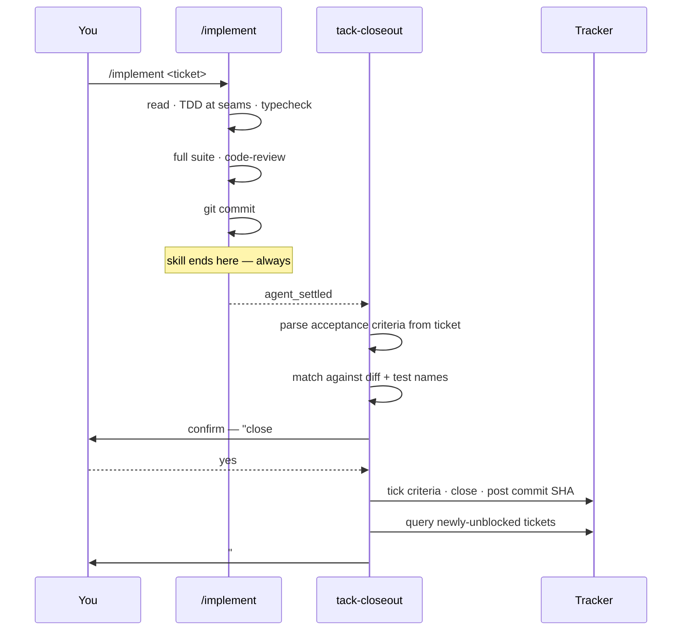

Deliberately **`confirm`-gated, never silent**. Closing someone's ticket without asking is exactly the kind of judgement-stealing the meta-critique warns about. It also carries the branch guard: `implement` commits to whatever branch you are on without asking, so `closeout` checks the branch *before* the run starts and offers PR mode after.

| | |
|---|---|
| **Seams** | `agent_settled`, `tool_call` (branch pre-check), `pi.exec` |
| **Size** | ~220 LOC |
| **Working if** | The frontier moves on its own; you never hand-tick a checkbox |

---

### ⑤ `@tack/pi-fixedpoint` — make `code-review` see the diff

**Fixes:** gap #17. A pure plumbing bug with a pure plumbing fix.

`code-review` reviews `git diff <fixed-point>...HEAD`. That excludes staged and working-tree changes. `implement` runs it *before* committing. Unless an interim commit already exists, **the review examines nothing and reports clean.** Reported repeatedly; unfixed on both sides.

```typescript
pi.on("tool_call", async (event, ctx) => {
  if (!isToolCallEventType("bash", event)) return;
  if (!/git\s+diff\s+\S+\.\.\.HEAD/.test(event.input.command)) return;

  const dirty = await pi.exec("git", ["status", "--porcelain"], { signal: ctx.signal });
  if (!dirty.stdout.trim()) return;                       // nothing uncommitted — fine

  const choice = await ctx.ui.select(
    "code-review would see an empty diff — uncommitted changes exist",
    ["Create a WIP commit and review that (recommended)",
     "Review the working tree instead (git diff <fp>)",
     "Proceed anyway"]
  );
  if (choice?.startsWith("Create")) {
    await pi.exec("git", ["add", "-A"], { signal: ctx.signal });
    await pi.exec("git", ["commit", "-m", "wip: pre-review checkpoint", "--no-verify"], { signal: ctx.signal });
    pi.appendEntry("tack:fixedpoint", { wipCommit: true, at: Date.now() });
  } else if (choice?.startsWith("Review the working")) {
    event.input.command = event.input.command.replace("...HEAD", "");   // mutate in place
  }
});
```

Records the WIP commit so `closeout` can offer to squash it. Also stamps the true fixed point (the branch point) at phase entry, so a review after several commits still compares against the right base.

| | |
|---|---|
| **Seams** | `tool_call`, `pi.exec`, `appendEntry` |
| **Size** | ~140 LOC |
| **Working if** | `code-review` never reports clean on a run that changed files |


---

## Tier 2 — six that make the flow feel engineered

---

### ⑥ `@tack/pi-frontier` — the map, in your terminal

**Fixes:** gaps #9 and #14. **Only possible since Pi v0.84.0, today.**

Wayfinder's frontier is *supposed* to be visible without opening the map — that is what native blocking edges buy you. Two problems: it requires leaving the terminal, and a tracker without native dependency links (self-hosted Gitea, plain markdown) degrades to inferring blockers from prose. v0.84 shipped inline **Mermaid rendering** and a **sticky widget dock** in fullscreen mode. The map can now live where you are.

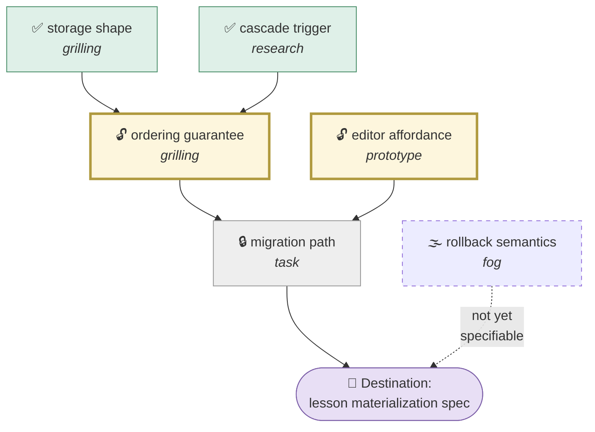

*Closed · **frontier (takeable now)** · blocked · fog.* The widget dock carries the one-line version permanently:

```
🗺  map #128 · destination: lesson materialization spec
    frontier: ordering-guarantee · editor-affordance      2 takeable
    7 closed · 3 open · 2 fog                            ⌥F to expand
```

It also solves the **name-not-number** problem — the skill mandates referring to tickets by name because a wall of `#42`s is illegible, and this renders names by construction. And it closes the **"what do I do now?"** ambiguity from discussion #484: when the last ticket closes, `frontier` detects it and prints the hand-off explicitly, including the reason the two extra steps exist.

```
✓ map #128 cleared — 12 decisions, 0 open

  Next:  /to-spec #128     collapse the linked decisions into one spec
  Then:  /to-tickets       slice the spec into tracer-bullet tickets
  Then:  /implement        one ticket per session

  Going straight to /implement skips the collapse and discards the linked
  detail. Do that only if the effort turned out genuinely small.
```

| | |
|---|---|
| **Seams** | `tool_result` (tracker reads), `agent_settled`, `ctx.ui.setWidget`, Mermaid via assistant markdown |
| **Size** | ~300 LOC |
| **Requires** | Pi ≥ 0.84.0 for Mermaid + dock; degrades to a text widget below that |

---

### ⑦ `@tack/pi-claim` — atomic ticket leases

**Fixes:** gap #8.

The skill says a session claims a ticket by assigning it *before any work*, and that the assignee **is** the claim. That is a lock protocol implemented by asking politely. Two sessions that both read "unassigned" both proceed. The documented symptom: users working two grilling tickets in parallel get asked in one session a question they just answered in the other.

`claim` makes it a real lease: a `tack:claim` entry plus a filesystem lease under the agent dir, checked **and taken** in a single `tool_call` preflight before any tracker write or ticket-scoped read.

```mermaid
sequenceDiagram
    participant S1 as Session A
    participant L as lease store
    participant S2 as Session B
    S1->>L: acquire(#T3, ttl 90m)
    L-->>S1: ✓ held
    S2->>L: acquire(#T3)
    L-->>S2: ✗ held by A since 14:02
    Note over S2: blocked with reason;<br/>offered the next frontier ticket
    S1->>L: release(#T3) on close
    Note over L: stale leases expire<br/>and are reported, not silently stolen
```

Leases are **advisory and visible**, never silent: an expired lease surfaces as *"A's lease on #T3 expired 20m ago — take it over?"* rather than being quietly reaped. It also carries the parallel-safety warning the docs recommend: before handing out a second concurrent ticket it checks whether the two share a blocking ancestor, and says so.

| | |
|---|---|
| **Seams** | `tool_call`, `agent_settled`, `ctx.ui.select` |
| **Size** | ~170 LOC |

---

### ⑧ `@tack/pi-hitl` — keep the human in HITL

**Fixes:** gaps #10 and #12.

v1.1 introduced HITL/AFK labelling specifically because students reported wayfinder grilling *itself*. The label made the requirement legible; it did not make it enforceable. And on `prototype` tickets there is a reported case of an agent building three UI variations, choosing one, and closing the ticket — when the selection is the whole point.

Two small guards:

- **Self-answer detection.** On `turn_end` during a `wayfinder:grilling` or `wayfinder:prototype` ticket, if the assistant message contains both a question and its own resolution with no intervening user turn, block the ticket-close tool call with a reason naming the specific question that was self-answered.
- **Forced selection.** A close on a `wayfinder:prototype` ticket is blocked until a `ctx.ui.select()` over the built variations has been recorded in the ledger. The agent may recommend; it may not decide.

```typescript
pi.on("tool_call", async (event, ctx) => {
  if (!isCloseTicket(event)) return;
  const t = currentTicket(ctx);
  if (t?.type === "prototype" && !ledgerHas(ctx, "tack:prototype-choice", t.id)) {
    const variants = await listVariants(t, ctx);
    const pick = await ctx.ui.select(`Which variation for ${t.name}?`, [...variants, "None — iterate again"]);
    if (!pick || pick.startsWith("None")) {
      return { block: true, reason: `${t.name} is a prototype ticket. The human has not selected a variation.` };
    }
    pi.appendEntry("tack:prototype-choice", { ticket: t.id, pick });
  }
  if (t?.mode === "HITL" && selfAnswered(ctx)) {
    return { block: true, reason: `${t.name} is HITL. You answered your own question; wait for the human.` };
  }
});
```

| | |
|---|---|
| **Seams** | `tool_call`, `turn_end`, `ctx.ui.select` |
| **Size** | ~190 LOC |

---

### ⑨ `@tack/pi-lens` — compress the interrogation

**Fixes:** gap #6 — the sharpest live complaint about wayfinder, explicitly unresolved upstream. **Uses `registerMarkdownTransformer`, added in v0.84.0.**

The decomposition users have given is precise: verbosity itself causes decision exhaustion, and the length *strips out why a question is being asked*, so the chain from decision to decision is lost as the map grows. The verbosity looks like a model property rather than a skill property, which is exactly why the fix belongs in the harness rather than in the markdown.

The critical property of `registerMarkdownTransformer` is that it is **display-only**. The session, the model context and the ledger keep the full text. Only your eyes get the compressed version.

```
BEFORE  ────────────────────────────────────────────────
  When we consider the relationship between a lesson and
  the section that contains it, there are several possible
  interpretations of what "ordering" might mean in this
  context. We could interpret it as a stable sort key that
  persists across… (3 more paragraphs)

AFTER  ─────────────────────────────────────────────────
  Q3 · ordering  ⟵ blocks: migration-path
  Is lesson order a stable key or a derived index?
     a) stable sort key, persists across moves
     b) derived from position, recomputed
     c) both — key for storage, index for display
  ⌥3 expand
```

Three transforms, all reversible in place:

1. **De-hedge.** Strip leading throat-clearing before the interrogative.
2. **Surface the options.** Promote enumerated alternatives out of prose.
3. **Restore the *why*.** Prefix each question with what it blocks, read from the ledger's blocking edges — recovering exactly the chain that verbosity destroys.

| | |
|---|---|
| **Seams** | `registerMarkdownTransformer` |
| **Size** | ~200 LOC |
| **Caveat** | Must stay synchronous and cheap — it runs on every streaming update and every terminal resize. Skip when `isStreaming` |

---

### ⑩ `@tack/pi-glossary` + `@tack/pi-driftlint` — keep the paper trail honest

**Fixes:** gaps #2 and #4.

`grill-with-docs` promises `CONTEXT.md` changes *during* the session, term by term — that inline-ness is the stated success criterion. In practice it batches or vanishes.

**`glossary`** watches `tool_result` for term-resolution shape, tracks resolved-but-unwritten terms, and on `agent_settled` reports them:

```
⚠ tack-glossary: 3 terms resolved this session, 1 not in CONTEXT.md
   · materialization cascade  ✓ written
   · pitch (vs campaign)      ✓ written
   · settlement window        ✗ resolved at 14:31, never written
```

Uses `withFileMutationQueue()` on the `CONTEXT.md` path so its writes serialise with the built-in `edit`/`write` queue — tool calls run in parallel by default, and without the queue two writers can both read the old glossary and one loses.

**`driftlint`** is the piece with the strongest field evidence behind it. The two-developer team that measured ~20% drift across sampled merged PRs found that pruning stale docs did not hold, and that **what actually worked was a deterministic citation and link linter in CI.** So: ship that linter, and run it locally at `agent_settled` rather than waiting for CI.

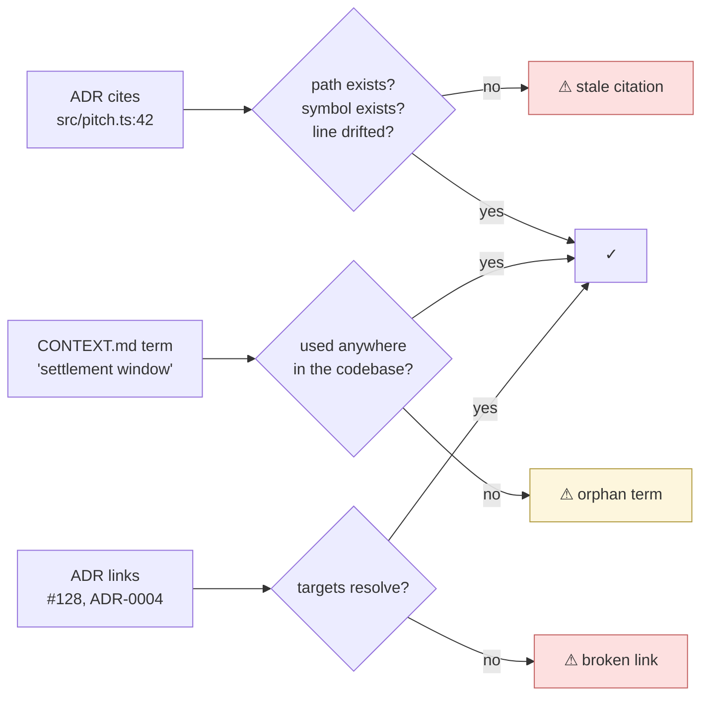

Ships as **both** a pi extension and a standalone `tack-lint` binary, so the same rules run in CI — which is the configuration the field report says held up.

| | |
|---|---|
| **Seams** | `tool_result`, `agent_settled`, `withFileMutationQueue`, `pi.exec` |
| **Size** | ~160 + ~240 LOC |

---

### ⑪ `@tack/pi-ref` — fail-closed reference resolution

**Fixes:** gap #15.

`/implement #2` resolves `#2` against whatever numbered list the agent can see — a todo file, a checklist, another work list. The resolution is *confident rather than fail-closed*, so the mistake isn't visible until work has started.

```typescript
pi.on("input", async (event, ctx) => {
  const m = /^\/skill:(implement|to-spec|triage)\s+#?(\d+)\b/.exec(event.text.trim());
  if (!m) return { action: "continue" };
  const [, skill, num] = m;

  const hits = await resolveEverywhere(num, ctx);   // configured tracker + local md + todo files
  if (hits.length === 1 && hits[0].source === "tracker") {
    return { action: "transform", text: event.text.replace(`#${num}`, hits[0].url) };
  }
  if (!hits.length) {
    ctx.ui.notify(`No #${num} on the configured tracker. Pass a full URL or owner/repo#N.`, "error");
    return { action: "handled" };                   // fail closed — never guess
  }
  const pick = await ctx.ui.select(`#${num} is ambiguous — ${hits.length} matches`, hits.map(h => h.label));
  if (!pick) return { action: "handled" };
  return { action: "transform", text: event.text.replace(`#${num}`, urlFor(pick)) };
});
```

It also implements the docs' own mitigation — **confirm the title back before work begins** — by rewriting the bare number into a fully-qualified URL, so the very first thing the run reads is unambiguous.

| | |
|---|---|
| **Seams** | `input`, `ctx.ui.select`, `pi.exec` |
| **Size** | ~150 LOC |

---

## Tier 3 — three that round it out

### ⑫ `@tack/pi-seam` — no code before the seams are named

**Fixes:** gap #16, described upstream as `implement`'s weakest joint. Nothing inside `implement` agrees seams; `tdd` is what asks; if agreement happens nowhere the precondition never fires and the run *quietly becomes "just write the code."*

The gate: during `phase === "implement"`, block the **first** `write`/`edit` to a non-test source file until a `tack:seam` record exists for this ticket. The block reason asks the question `tdd` would have asked. Once seams are recorded, the extension is inert for the rest of the run — one prompt per ticket, not per file.

Seams get recorded to the ledger, which means they also flow into `code-review`'s spec axis and into the next ticket's context.

| | |
|---|---|
| **Seams** | `tool_call`, `ctx.ui.input`, `appendEntry` |
| **Size** | ~130 LOC |

### ⑬ `@tack/pi-worktree` — real parallelism for `implement`

**Fixes:** gap #19. The field report is vivid: a `git commit --amend` in one session landing on another session's commit, a stash disappearing from `refs/stash`, commits on the wrong branch — one afternoon, three issues.

Worktrees are the known workaround **but they are not sufficient**, because `refs/stash` is shared across worktrees. So `worktree` does two things:

1. **Broker.** `/tack-work <ticket>` provisions `.worktrees/<ticket>` on a fresh branch, writes an `AGENTS.override.md` (v0.84) scoping context to that ticket, and spawns the session there.
2. **Stash guard.** Blocks bare `git stash` during `phase === "implement"`, rewriting to `git stash push -m "tack:<ticket>"` and refusing `git stash pop` without an index that matches this ticket's message. Blocks `commit --amend` outright when the target commit isn't from this session.

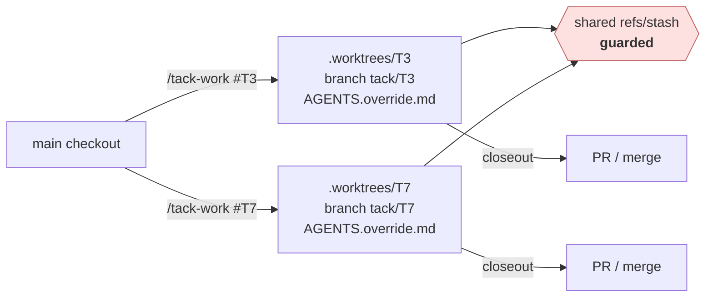

| | |
|---|---|
| **Seams** | `tool_call`, `registerCommand`, `ctx.newSession`, `pi.exec` |
| **Size** | ~280 LOC |

### ⑭ `@tack/pi-budget` — right-size the ticket

**Fixes:** gap #20. A non-trivial ticket exceeding 100k tokens is *normal*, not a bug — but the lever is upstream, in `to-tickets`. `budget` makes that lever visible by measuring what actually happened.

Footer meter during `implement`; on `agent_settled`, a one-line verdict recorded to the ledger. At the next `/to-tickets`, it injects the distribution so slicing is informed by evidence rather than vibes:

```
Last 6 implement runs: 34k · 51k · 47k · 163k ⚠ · 39k · 58k
#T4 (163k) exceeded one window — split tickets of that shape.
```

| | |
|---|---|
| **Seams** | `turn_end`, `ctx.getContextUsage()`, `ctx.ui.setStatus`, `before_agent_start` |
| **Size** | ~110 LOC |

---

## Summary table

| # | Package | Fixes | Tier | LOC | Key seam | Needs v0.84 |
|---|---|---|:-:|--:|---|:-:|
| 0a | `@tack/pi-core` (phase) | substrate | 0 | 150 | `input` + `pi.events` | |
| 0b | `@tack/pi-core` (ledger) | #5 | 1 | 250 | `appendEntry` | |
| 1 | `@tack/pi-loader` | #1 | 1 | 120 | `before_agent_start` | |
| 2 | `@tack/pi-fog` | #7 | 1 | 180 | `tool_result` hash | |
| 3 | `@tack/pi-closeout` | #18 #21 | 1 | 220 | `agent_settled` | |
| 4 | `@tack/pi-fixedpoint` | #17 | 1 | 140 | `tool_call` mutate | |
| 5 | `@tack/pi-frontier` | #9 #14 | 2 | 300 | widget + Mermaid | ✅ |
| 6 | `@tack/pi-claim` | #8 | 2 | 170 | `tool_call` preflight | |
| 7 | `@tack/pi-hitl` | #10 #12 | 2 | 190 | `tool_call` block | |
| 8 | `@tack/pi-lens` | #6 | 2 | 200 | markdown transformer | ✅ |
| 9 | `@tack/pi-glossary` | #2 | 2 | 160 | `withFileMutationQueue` | |
| 10 | `@tack/pi-driftlint` | #4 | 2 | 240 | `agent_settled` + CLI | |
| 11 | `@tack/pi-ref` | #15 | 2 | 150 | `input` fail-closed | |
| 12 | `@tack/pi-seam` | #16 | 3 | 130 | `tool_call` first-write | |
| 13 | `@tack/pi-worktree` | #19 | 3 | 280 | `newSession` + override | ✅ |
| 14 | `@tack/pi-budget` | #20 | 3 | 110 | `getContextUsage` | |

**≈ 2,990 LOC total.** No single extension exceeds 300 lines. That is the point: each one is small enough to read in a sitting, which matters when the security model is *review the source before installing*.


---

# Part IV — The two chains, instrumented

This is the section that answers the question as posed: what goes in the `...`.

## Chain B — `wayfinder → … → implement`

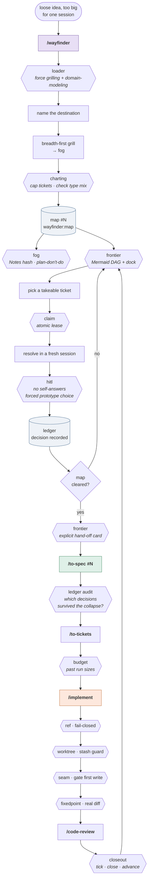

**Reading the loop.** Two cycles matter. The inner one (`frontier → claim → work → hitl → ledger → frontier`) is the map burning down; `claim` makes it safe to run more than one at a time, `hitl` makes sure the human is actually in it. The outer one (`closeout → frontier`) is the thing that currently **does not exist at all** — because `implement` never closes anything, the frontier never advances on its own, and the dependency graph `to-tickets` built sits inert.

## Chain A — `grill-with-docs → … → implement`

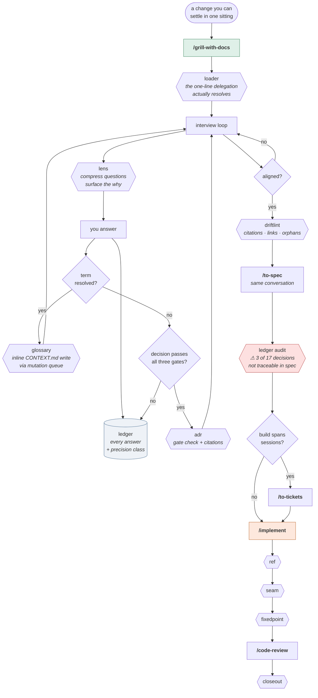

**Reading the loop.** The `TERM / DEC / LED` fan-out is the whole point of chain A. Upstream, three things can resolve in a grilling session and only two of them land anywhere durable — terms in `CONTEXT.md`, triple-gated decisions in ADRs, **and everything else nowhere.** The ledger catches the third bucket, and the audit at `to-spec` is what turns "I think we discussed that" into a checkable claim.

## Before / after

| Moment | Today | With Tack |
|---|---|---|
| `/grill-with-docs` on a weak model | Interview runs, no docs appear, you don't notice for a week | `loader` forces the dependencies; `glossary` reports any unwritten term at session end |
| You answered "retries capped at 3, no backoff" | Softened to "retries should be limited" in the spec | `ledger` audit flags it as an unmatched numeric decision |
| Agent decides to build during a map | Writes to a live server; its own Notes said it could | `fog` blocks the write; the Notes widening needed your confirmation |
| Two grilling tickets in parallel | Both sessions ask you the same question | `claim` refuses the second and offers a non-conflicting frontier ticket |
| Prototype ticket | Agent builds three, picks one, closes | Close blocked until you pick |
| Map clears | "…now what?" | Hand-off card naming `/to-spec` and why the collapse matters |
| `/implement #2` | Silently builds a todo item | Fail-closed; ambiguity surfaced as a picker |
| `implement` finishes | Ticket open, criteria unchecked, frontier frozen | Confirm → close, tick, report newly unblocked |
| `code-review` runs | Empty diff, reports clean | WIP checkpoint; review sees the change |
| Three tickets at once | Stash vanishes, amend hits the wrong commit | Worktrees + stash guard + amend block |

---

# Part V — Build order, packaging, risks

## Dependency graph and sequencing

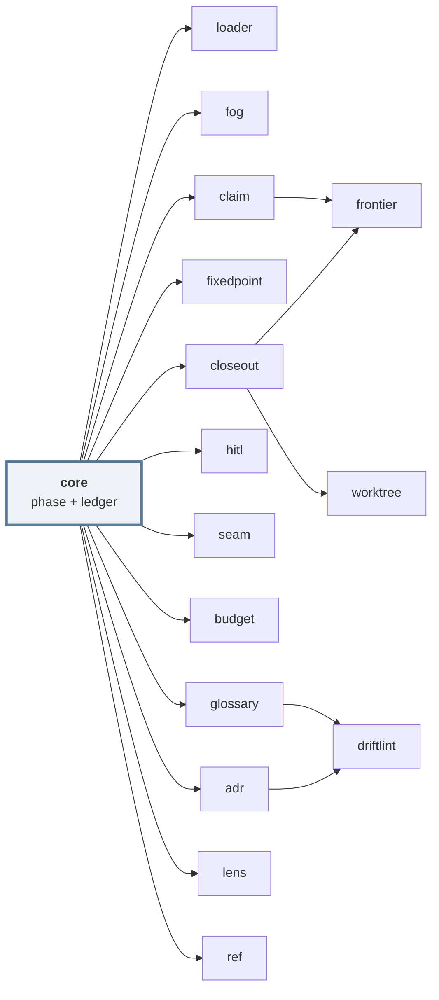

| Wave | Ship | Rationale |
|---|---|---|
| **1** | `core`, `loader`, `fixedpoint` | Substrate plus the two cheapest outright bugs. `loader` alone fixes the single most-reported complaint in the whole skill set. |
| **2** | `closeout`, `fog` | The two highest-consequence behavioural gaps. `closeout` is what makes dependency graphs mean anything. |
| **3** | `frontier`, `claim`, `hitl` | Wayfinder becomes genuinely multi-session. Ship together — `frontier` is misleading without `claim`. |
| **4** | `glossary`, `driftlint`, `adr`, `lens` | Chain A's paper trail. `driftlint` ships as a CLI too, because CI is where the field evidence says it holds. |
| **5** | `ref`, `seam`, `worktree`, `budget` | Polish and parallelism. |

## Packaging

Ship as a **monorepo of independently published packages**, mirroring how `narumiruna/pi-extensions` and `ben-vargas/pi-packages` are structured, plus one meta-package:

```
tack/
├── package.json                    # workspaces
└── packages/
    ├── pi-core/                    # phase + ledger; every other package peer-deps this
    │   ├── package.json            # { keywords: ["pi-package"], pi: { extensions: ["./src/index.ts"] } }
    │   └── src/{index,phase,ledger,renderers}.ts
    ├── pi-loader/  pi-fog/  pi-closeout/  …
    └── pi-tack/                    # meta: depends on all, for `pi install npm:@tack/pi-tack`
```

```bash
pi install npm:@tack/pi-core
pi install npm:@tack/pi-loader
pi install npm:@tack/pi-closeout
# or everything
pi install npm:@tack/pi-tack
pi config          # toggle individual extensions on/off
```

Publishing checklist, from the pi packaging docs and catalogue conventions:

- `keywords: ["pi-package"]` — this is what puts you in the pi.dev catalogue
- runtime deps in `dependencies`, **not** `devDependencies` — package installs use `--omit=dev`
- pin exact versions; pi's own policy treats dependency changes as reviewed code changes
- declare a `pi.image` for the gallery card
- `compatibility: "pi >= 0.84.0"` on the three that need it; graceful degradation below

## Risks and honest limitations

| Risk | Assessment |
|---|---|
| **Skill text is a moving target.** `decision-mapping` → `wayfinder` in v1.1; `to-prd` → `to-spec`; skills get deprecated with successors. | Bind to **artifacts**, not prose: label names (`wayfinder:map`, `wayfinder:<type>`), file paths (`CONTEXT.md`, `docs/adr/`), tracker state, `docs/agents/` config. Never regex a `SKILL.md` body. Pin a tested skills version range and test against it. |
| **Guardrails are not security.** Pi ships no permission system; extensions run with full user permissions. | State plainly in the README that Tack guards against *agent error*, not an adversary. A prompt-injected agent can `pi.exec` around all of it. Recommend containerization for anything stronger. |
| **Over-constraint kills the thing that made these skills good.** Pocock's explicit pitch is that GSD/BMAD/Spec-Kit take away control and make process bugs unfixable. | Every Tack block returns a stateable reason and an override. Nothing is unconditional. If Tack starts *deciding*, it has become the thing Pocock rejected. This is the design's main failure mode, and it is a values failure, not a technical one. |
| **`tool_call` blocking is coarse.** Sibling tool calls preflight sequentially then run concurrently; `tool_call` isn't guaranteed to see sibling results from the same assistant message. | Never build an invariant that needs to observe a sibling's result. Use `withFileMutationQueue` for anything touching files. |
| **v0.84 is hours old.** Mermaid, the dock and the markdown transformer have had no field exposure. | Feature-detect and degrade. `frontier` falls back to a text widget; `lens` no-ops if the hook is missing. |
| **Overlap with `pi-wayfinder-guard`.** | Detect it at load and stand down on the denylist; contribute only Notes integrity. Better still: upstream the Notes hash to that project rather than shipping a competitor. |
| **The ledger could become shadow state** — precisely the failure the 20%-drift report identified, where curated docs drifted worse than agent memory. | The ledger is **append-only and never edited**, so it cannot drift — it can only become irrelevant. `driftlint` reports staleness rather than pruning. Deleting shadow state is what worked in the field; the ledger must earn its place by being checked, not curated. |

## How you'd know it worked

Not "does it run" but "did the documented failure stop happening":

| Metric | Baseline | Target |
|---|---|---|
| `/grill-with-docs` runs producing zero `CONTEXT.md` edits | frequent, model-dependent | 0% |
| Recorded decisions untraceable in the resulting spec | unmeasured (that's the problem) | measured, < 10%, and *visible* |
| Tickets closed by `implement` without manual intervention | 0% | > 90% (confirm-gated) |
| `code-review` runs against an empty diff | common | 0 |
| Source writes during `phase === "chart"` | the top wayfinder complaint | 0 unapproved |
| Duplicate questions across parallel grilling sessions | reported | 0 |
| Stale citations in `docs/adr/` | ~20% of PRs drifting | 0 at commit time |

---

## Appendix — sources

**Primary**
- `mattpocock/skills` — README, `wayfinder/SKILL.md`, `docs/engineering/wayfinder.md`, release v1.1.0 notes, Discussion #484
- `aihero.dev` skill docs — `/wayfinder`, `/grill-with-docs`, `/implement`, `/setup-matt-pocock-skills`, skills index
- `earendil-works/pi` — releases (through **v0.84.0**, 06 Aug 2026), `docs/extensions.md`, `docs/skills.md`, `docs/packages.md`
- `pi.dev` — documentation index, extensions reference, skills reference, **package catalogue (5,526 packages)**, "Pi has a new home" (scope migration)
- npm — `@earendil-works/pi-coding-agent`, `@earendil-works/pi-agent-core`, deprecated `@mariozechner/pi-coding-agent@0.73.1`

**Prior art**
- `yinloo-ola/pi-wayfinder-guard` — fog mode, denylist, four-axis parallel review
- `narumiruna/pi-extensions`, `ben-vargas/pi-packages`, `luongnv89/pi-extensions` — monorepo packaging conventions

**Community and analysis**
- DeepWiki on `mattpocock/skills`; Skillselion skill map (v1.1); Nathan Fennel, *Three Months Later*; explainX on Pi as a harness and on skills v1.0 progressive disclosure; Roman Imankulov on Pi agent engineering; DeepakNess Pi setup notes; practitioner write-ups on `grill-with-docs` and `handoff`; Hacker News launch discussion; `@mattpocockuk` on X (v1.0, v1.1, wayfinder positioning, the "200 questions" reply)

*All community reports above are secondhand accounts of behaviour, not reproduced benchmarks. Where a figure appears (the ~20% drift measurement, the 150k-token run, the 27-ticket map), it comes from a single field report and should be read as an anecdote with a mechanism attached — the mechanism is what the design targets, not the number.*
